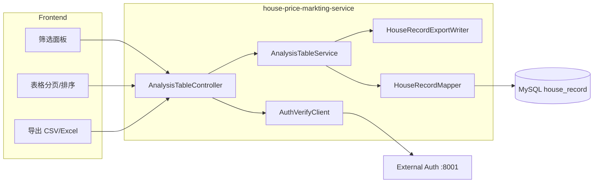
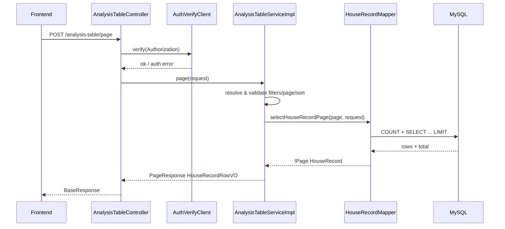
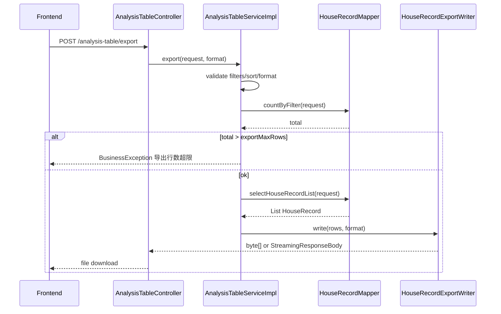
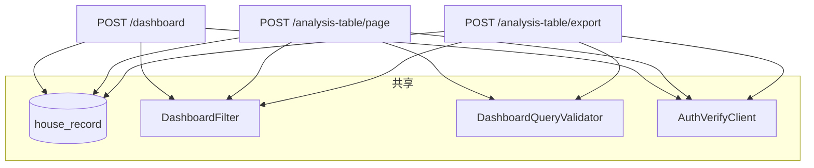

# Analysis Table 后端详细设计

## 1. 设计目标

基于 `requirements/analysis-table.md` 中 Analysis Table 需求，后端需要实现：

1. **列表查询**：对 `house_record` 房屋明细数据支持全字段区间筛选、服务端排序与分页，返回表格行数据。
2. **数据导出**：在相同筛选与排序条件下，将结果导出为 **CSV** 或 **Excel（.xlsx）** 文件供用户下载。

本设计复用 `house_record` 数据表、`DashboardFilter` SQL 片段、`DashboardQueryValidator` 参数校验与 `AuthVerifyClient` 外部 Token 校验，与 Analysis Dashboard / Segments / What-if 保持一致。

数据库表结构见 `docs/spec/dashboard/normalCR/db-design/dashboard-db-design.md`。API 契约建议另见同目录 `../api-design/analysis-table-api-design.md`（实现前可据此联调）。

## 2. 需求范围

### 2.1 功能范围

| 编号 | 需求来源 | 后端职责 |
| --- | --- | --- |
| R1 | 1.2.1 列表查询 | 9 个业务字段均支持 Min/Max 区间筛选；服务端排序；分页返回 |
| R2 | 1.2.2 数据导出 | 相同筛选与排序下导出 CSV / Excel；以文件流响应下载 |

**列表/导出字段（与需求表一致）：**

| 字段 | DB 列 | 类型 | 说明 |
| --- | --- | --- | --- |
| id | id | BIGINT | 主键 |
| square_footage | square_footage | DECIMAL | 面积 Sq.Ft |
| bedrooms | bedrooms | INT | 卧室数 |
| bathrooms | bathrooms | DECIMAL(3,1) | 浴室数 |
| year_built | year_built | INT | 建造年份 |
| lot_size | lot_size | DECIMAL | 土地面积 |
| distance_to_city_center | distance_to_city_center | DECIMAL | 距市中心距离 |
| school_rating | school_rating | DECIMAL | 学校评分 |
| price | price | DECIMAL | 价格 |

### 2.2 非功能范围

1. 本次不包含前端表格 UI、列拖拽、客户端二次排序实现；第 12 节为联调契约。
2. 不新增数据库表；不提供数据导入接口。
3. 导出不做异步任务队列；同步流式写出，超量时返回业务错误。
4. 列表接口返回 JSON（`BaseResponse<PageResponse<HouseRecordRowVO>>`）；导出接口返回 `application/octet-stream` 或对应 MIME，不走 `BaseResponse` 包装。

## 3. 总体架构



| 层级 | 类/接口 | 职责 |
| --- | --- | --- |
| Controller | `AnalysisTableController` | `/analysis-table/page`、`/analysis-table/export` 入口；Token 前置校验 |
| Client | `AuthVerifyClient` | 复用，外部 Token 校验 |
| Service | `AnalysisTableService` | `page(request)`、`export(request, format)` |
| Service Impl | `AnalysisTableServiceImpl` | 参数校验、分页/排序解析、导出行数校验、响应组装 |
| Export | `HouseRecordExportWriter` | 将行数据写为 CSV / xlsx 字节流 |
| Mapper | `HouseRecordMapper` | `selectHouseRecordPage`、`selectHouseRecordList` |
| Request | `AnalysisTableQueryRequest` | 区间筛选 + 分页 + 排序 |
| VO | `HouseRecordRowVO` | 列表行（与 DO 字段一致，不含 createTime/updateTime） |
| Validator | `DashboardQueryValidator` | 复用 `validateFilters` |

## 4. 模块文件设计

建议新增或修改文件：

| 文件 | 操作 | 说明 |
| --- | --- | --- |
| `module/analysistable/controller/AnalysisTableController.java` | 新增 | 分页查询与导出入口 |
| `module/analysistable/service/AnalysisTableService.java` | 新增 | Service 接口 |
| `module/analysistable/service/impl/AnalysisTableServiceImpl.java` | 新增 | Service 实现 |
| `module/analysistable/entity/request/AnalysisTableQueryRequest.java` | 新增 | 筛选 + 分页 + 排序请求 |
| `module/analysistable/entity/enums/ExportFormat.java` | 新增 | `CSV`、`EXCEL` |
| `module/analysistable/entity/vo/HouseRecordRowVO.java` | 新增 | 表格行 VO |
| `module/analysistable/export/HouseRecordExportWriter.java` | 新增 | CSV / Excel 写出 |
| `module/dashboard/mapper/HouseRecordMapper.java` | 修改 | 增加分页列表、全量列表（导出）方法 |
| `src/main/resources/mapper/HouseRecordMapper.xml` | 修改 | 增加 `AnalysisTableOrderBy`、列表 SQL |
| `pom.xml` | 修改 | 增加 EasyExcel 依赖（仅 Excel 导出） |
| 测试类 | 新增 | Service / Mapper / Controller 测试 |

**模块包名建议：** `cn.com.housepriceprediction.module.analysistable`（与 `dashboard`、`segment`、`whatif` 并列）。

**不重复实现：** 区间筛选 SQL、认证客户端、校验规则均在 dashboard 模块复用。

## 5. API 设计（概要）

### 5.1 接口清单

| 接口 | 方法 | 路径 | 响应 | 说明 |
| --- | --- | --- | --- | --- |
| page | POST | `/analysis-table/page` | `BaseResponse<PageResponse<HouseRecordRowVO>>` | 分页列表 |
| export | POST | `/analysis-table/export` | 文件流 | 导出 CSV 或 Excel |

### 5.2 认证

与 Dashboard 一致：必须 `Authorization: Bearer <token>`，**任何** Mapper 查询前调用 `AuthVerifyClient.verify`。

### 5.3 请求体：AnalysisTableQueryRequest

在 `DashboardQueryRequest` 全部 Min/Max 字段基础上，增加分页与排序（与 `UserQueryRequest` / `PageRequest` 对齐）。

#### 5.3.1 区间筛选（与 Dashboard 一致）

| 参数 | 类型 | 说明 |
| --- | --- | --- |
| minId / maxId | Long | ID |
| minSquareFootage / maxSquareFootage | BigDecimal | 面积 |
| minBedrooms / maxBedrooms | Integer | 卧室 |
| minBathrooms / maxBathrooms | BigDecimal | 浴室 |
| minYearBuilt / maxYearBuilt | Integer | 建造年份 |
| minLotSize / maxLotSize | BigDecimal | 土地面积 |
| minDistanceToCityCenter / maxDistanceToCityCenter | BigDecimal | 距市中心 |
| minSchoolRating / maxSchoolRating | BigDecimal | 学校评分 |
| minPrice / maxPrice | BigDecimal | 价格 |
| filters | Object | 嵌套筛选，字段同上 |

**不包含** Dashboard 专有参数：`priceBucketCount`、`scatterLimit`。

筛选语义、参数合并（`resolve`）、校验规则与 `dashboard-detail-design.md` 第 10 节 / `DashboardQueryValidator.validateFilters` **完全一致**。

#### 5.3.2 分页参数

| 参数 | 类型 | 必填 | 默认值 | 说明 |
| --- | --- | --- | --- | --- |
| current | int | 否 | 1 | 当前页，从 1 开始 |
| pageSize | int | 否 | 10 | 每页条数 |

校验：

| 规则 | 说明 |
| --- | --- |
| current | `>= 1` |
| pageSize | 默认 10，范围 `[1, 200]` |

列表接口使用 MyBatis-Plus `Page` 执行 `COUNT` + 分页 `SELECT`。

#### 5.3.3 排序参数

| 参数 | 类型 | 必填 | 默认值 | 说明 |
| --- | --- | --- | --- | --- |
| multipleSort | boolean | 否 | false | 是否多字段排序 |
| sort | Sort | 否 | `{ field: "id", asc: true }` | 单字段排序 |
| sorts | List\<Sort\> | 否 | - | 多字段排序，`multipleSort=true` 时生效 |

`Sort` 结构与 `PageRequest.Sort` 相同：

| 字段 | 类型 | 说明 |
| --- | --- | --- |
| field | String | 排序字段（Java 驼峰，见下表白名单） |
| asc | boolean | true 升序，false 降序 |

**可排序字段白名单（field → DB 列）：**

| field | DB 列 |
| --- | --- |
| id | id |
| squareFootage | square_footage |
| bedrooms | bedrooms |
| bathrooms | bathrooms |
| yearBuilt | year_built |
| lotSize | lot_size |
| distanceToCityCenter | distance_to_city_center |
| schoolRating | school_rating |
| price | price |

规则：

1. `field` 不在白名单内 → `BusinessException(RespCode.ERROR_PARAMETER)`。
2. 未传 `sort` 且 `sorts` 为空 → 默认 `ORDER BY id ASC`（稳定分页）。
3. `multipleSort=false` 时仅使用 `sort`；`multipleSort=true` 时按 `sorts` 顺序拼接 `ORDER BY`。
4. 排序字段名**禁止**直接拼接到 SQL，必须通过白名单映射为列名，防止 SQL 注入。

#### 5.3.4 导出专用参数

导出接口请求体与列表相同，额外增加：

| 参数 | 类型 | 必填 | 说明 |
| --- | --- | --- | --- |
| exportFormat | String | 是 | `csv` 或 `excel`（不区分大小写） |

导出**忽略** `current`、`pageSize`，在相同筛选与排序下导出**全部**匹配行（受导出行数上限约束，见第 9 节）。

#### 5.3.5 请求示例

```json
{
  "minSquareFootage": 1000,
  "maxSquareFootage": 2200,
  "minPrice": 150000,
  "maxPrice": 350000,
  "current": 1,
  "pageSize": 20,
  "sort": {
    "field": "price",
    "asc": false
  }
}
```

导出示例：

```json
{
  "minPrice": 200000,
  "sort": { "field": "yearBuilt", "asc": true },
  "exportFormat": "excel"
}
```

### 5.4 列表响应

**路径：** `POST /analysis-table/page`  
**类型：** `BaseResponse<PageResponse<HouseRecordRowVO>>`

```json
{
  "code": 200,
  "msg": "success",
  "data": {
    "current": 1,
    "pageSize": 20,
    "total": 3,
    "pages": 1,
    "records": [
      {
        "id": 1,
        "squareFootage": 1250.00,
        "bedrooms": 2,
        "bathrooms": 1.0,
        "yearBuilt": 1985,
        "lotSize": 5200.00,
        "distanceToCityCenter": 3.20,
        "schoolRating": 7.10,
        "price": 185000.00
      }
    ]
  }
}
```

筛选后无数据：`total=0`，`records=[]`，仍返回成功。

### 5.5 导出响应

**路径：** `POST /analysis-table/export`

| 项 | CSV | Excel |
| --- | --- | --- |
| Content-Type | `text/csv; charset=UTF-8` | `application/vnd.openxmlformats-officedocument.spreadsheetml.sheet` |
| Content-Disposition | `attachment; filename="house-records-{yyyyMMddHHmmss}.csv"` | `attachment; filename="house-records-{yyyyMMddHHmmss}.xlsx"` |
| Body | UTF-8 带 BOM 可选（建议带 BOM，便于 Excel 打开中文环境） | xlsx 二进制 |

表头（与需求列名一致，英文表头便于国际化扩展时可再配置）：

| 列序 | 表头 |
| --- | --- |
| 1 | id |
| 2 | square_footage |
| 3 | bedrooms |
| 4 | bathrooms |
| 5 | year_built |
| 6 | lot_size |
| 7 | distance_to_city_center |
| 8 | school_rating |
| 9 | price |

数值列按数据库精度输出，不做额外格式化（前端展示层负责千分位等）。

## 6. 核心处理流程

### 6.1 分页列表



### 6.2 导出



### 6.3 Service 伪代码

```java
public PageResponse<HouseRecordRowVO> page(AnalysisTableQueryRequest request) {
    AnalysisTableQueryRequest query = prepare(request);
    validatePage(query);
    IPage<HouseRecord> page = new Page<>(query.getCurrent(), query.getPageSize());
    IPage<HouseRecord> result = houseRecordMapper.selectHouseRecordPage(page, query);
    return PageResponse.to(result, HouseRecordRowVO.class);
}

public void export(AnalysisTableQueryRequest request, ExportFormat format,
                   HttpServletResponse response) {
    AnalysisTableQueryRequest query = prepare(request);
    ExportFormat fmt = ExportFormat.require(request.getExportFormat());
    long total = houseRecordMapper.countForAnalysisTable(query);
    if (total == 0) {
        throw new BusinessException(RespCode.ERROR_PARAMETER, "无符合条件的数据可导出");
    }
    if (total > exportMaxRows) {
        throw new BusinessException(RespCode.ERROR_PARAMETER, "导出行数超过上限");
    }
    List<HouseRecord> rows = houseRecordMapper.selectHouseRecordList(query);
    houseRecordExportWriter.write(response, rows, fmt);
}

private AnalysisTableQueryRequest prepare(AnalysisTableQueryRequest request) {
    AnalysisTableQueryRequest query = Optional.ofNullable(request)
            .orElseGet(AnalysisTableQueryRequest::new);
    dashboardQueryValidator.validateFilters(query);
    query.applyDefaultSort(); // id ASC
    query.resolveSortColumns(); // 白名单映射
    return query;
}
```

## 7. Controller 设计

```java
@RestController
@RequestMapping("/analysis-table")
@RequiredArgsConstructor
public class AnalysisTableController {

    private final AuthVerifyClient authVerifyClient;
    private final AnalysisTableService analysisTableService;

    @PostMapping("/page")
    public BaseResponse<PageResponse<HouseRecordRowVO>> page(
            @RequestHeader(value = "Authorization", required = false) String authorization,
            @RequestBody(required = false) AnalysisTableQueryRequest body,
            @ModelAttribute AnalysisTableQueryRequest queryParams) {
        authVerifyClient.verify(authorization);
        AnalysisTableQueryRequest request = resolve(body, queryParams);
        return Result.success(analysisTableService.page(request));
    }

    @PostMapping("/export")
    public void export(
            @RequestHeader(value = "Authorization", required = false) String authorization,
            @RequestBody(required = false) AnalysisTableQueryRequest body,
            @ModelAttribute AnalysisTableQueryRequest queryParams,
            HttpServletResponse response) throws IOException {
        authVerifyClient.verify(authorization);
        AnalysisTableQueryRequest request = resolve(body, queryParams);
        analysisTableService.export(request, response);
    }

    private static AnalysisTableQueryRequest resolve(
            AnalysisTableQueryRequest body, AnalysisTableQueryRequest queryParams) {
        return Optional.ofNullable(body)
                .orElseGet(AnalysisTableQueryRequest::new)
                .resolve(queryParams);
    }
}
```

说明：

1. `resolve` 需合并：嵌套 `filters`、query 参数、body 中的筛选、分页、排序字段（继承 `DashboardQueryRequest.resolve` 并扩展分页/排序 merge）。
2. 导出方法返回 `void`，直接写 `HttpServletResponse` 输出流。
3. 全局异常处理器对 `BusinessException` 仍返回 JSON；导出前校验失败不应已开始写流。

## 8. AnalysisTableQueryRequest 结构建议

```java
@Data
@EqualsAndHashCode(callSuper = true)
public class AnalysisTableQueryRequest extends DashboardQueryRequest {

    private int current = 1;
    private int pageSize = 10;
    private boolean multipleSort = false;
    private PageRequest.Sort sort;
    private List<PageRequest.Sort> sorts;

    @Schema(description = "导出格式：csv / excel")
    private String exportFormat;

    @Schema(hidden = true)
    @JsonProperty("filters")
    private AnalysisTableQueryRequest filters;

    /** 解析后的 ORDER BY 片段（仅 Service 内部使用，非 API 字段） */
    @JsonIgnore
    private List<OrderColumn> orderColumns;

    @Override
    public AnalysisTableQueryRequest resolve(AnalysisTableQueryRequest queryParams) {
        // 1. super 合并 Dashboard Min/Max
        // 2. 合并 current/pageSize/sort/sorts/exportFormat
    }

    public void applyDefaultSort() { ... }

    public void resolveSortColumns() { ... } // 白名单校验 + 映射
}
```

`OrderColumn` 建议为简单 record：`columnName` + `ascending`。

## 9. Mapper 与 SQL 设计

### 9.1 Mapper 方法

```java
IPage<HouseRecord> selectHouseRecordPage(
        IPage<HouseRecord> page,
        @Param("request") AnalysisTableQueryRequest request);

Long countForAnalysisTable(@Param("request") AnalysisTableQueryRequest request);

List<HouseRecord> selectHouseRecordList(
        @Param("request") AnalysisTableQueryRequest request);
```

`countForAnalysisTable` 可与 What-if 已有 `countByFilter` 复用（参数类型改为 `DashboardQueryRequest` 父类即可），或单独实现以保持 Analysis Table 语义清晰。

### 9.2 列表 SQL

```xml
<sql id="AnalysisTableSelectColumns">
    id, square_footage, bedrooms, bathrooms, year_built, lot_size,
    distance_to_city_center, school_rating, price
</sql>

<sql id="AnalysisTableOrderBy">
    ORDER BY
    <choose>
        <when test="request.orderColumns != null and request.orderColumns.size() > 0">
            <foreach collection="request.orderColumns" item="col" separator=",">
                ${col.columnName} <if test="col.ascending">ASC</if><if test="!col.ascending">DESC</if>
            </foreach>
        </when>
        <otherwise>
            id ASC
        </otherwise>
    </choose>
</sql>

<select id="selectHouseRecordPage" resultType="...HouseRecord">
    SELECT <include refid="AnalysisTableSelectColumns"/>
    FROM house_record
    <include refid="DashboardFilter"/>
    <include refid="AnalysisTableOrderBy"/>
</select>

<select id="selectHouseRecordList" resultType="...HouseRecord">
    SELECT <include refid="AnalysisTableSelectColumns"/>
    FROM house_record
    <include refid="DashboardFilter"/>
    <include refid="AnalysisTableOrderBy"/>
</select>
```

说明：

1. `DashboardFilter` 中 `request` 为 `DashboardQueryRequest`；`AnalysisTableQueryRequest` 继承后可直接传入。
2. `${col.columnName}` 仅允许来自白名单映射后的常量列名，**不得**使用用户传入的原始 `field` 字符串。
3. 分页由 MyBatis-Plus 分页插件自动追加 `LIMIT`。

### 9.3 计数 SQL

```sql
SELECT COUNT(*) FROM house_record
/* include DashboardFilter */
```

## 10. 导出实现设计

### 10.1 依赖

在 `pom.xml` 增加：

```xml
<dependency>
    <groupId>com.alibaba</groupId>
    <artifactId>easyexcel</artifactId>
    <version>4.0.3</version>
</dependency>
```

CSV 优先使用 Hutool `CsvWriter`（项目已有 `hutool-all`），避免重复依赖。

### 10.2 HouseRecordExportWriter

职责：

1. 接收 `List<HouseRecord>` 与 `ExportFormat`。
2. CSV：UTF-8，首行表头，逐行写入；可选 `BOM`（`\uFEFF`）便于 Windows Excel 识别 UTF-8。
3. Excel：使用 EasyExcel `write(outputStream).sheet("house_records").doWrite(data)`；可使用 `@ExcelProperty` 标注 DTO 或 Map 列表。
4. 设置 `Content-Type`、`Content-Disposition`（文件名 URL 编码）。

### 10.3 导出行数上限

| 配置项 | 默认值 | 说明 |
| --- | --- | --- |
| `analysis-table.export-max-rows` | 50000 | 超过则拒绝导出 |

流程：

1. 先 `COUNT(*)`（带筛选）。
2. `total == 0` → 参数错误「无数据可导出」。
3. `total > exportMaxRows` → 参数错误，提示缩小筛选范围。
4. 否则一次性 `SELECT` 全量匹配行并写文件。

当前数据集约 50 条，同步导出即可；后续数据量增大可评估游标查询 + 流式写 Excel。

## 11. 异常与边界处理

| 场景 | 后端行为 |
| --- | --- |
| 缺少 / 无效 Token | 不查库，未授权 |
| Min/Max 区间非法 | `BusinessException(ERROR_PARAMETER)` |
| current / pageSize 非法 | 参数错误 |
| sort.field 不在白名单 | 参数错误 |
| 筛选后无数据（列表） | `total=0`，`records=[]` |
| 筛选后无数据（导出） | 参数错误，不生成空文件（或产品确认可导出仅表头——默认不允许） |
| 导出行数超限 | 参数错误 |
| exportFormat 缺失或非法 | 参数错误 |
| 导出过程中 IO 异常 | 记录日志，若响应未提交则返回 500 |

## 12. 前端联调契约

1. **筛选面板**：与 Dashboard / Segments / What-if 共用 Min/Max 控件；变更筛选时重置 `current=1` 并刷新表格。
2. **分页**：使用 `data.current`、`data.pageSize`、`data.total`、`data.pages` 驱动分页器。
3. **排序**：表头点击切换 `sort.field` / `sort.asc`；多列排序若前端不支持，保持 `multipleSort=false`。
4. **导出**：使用相同筛选与排序请求体，增加 `exportFormat`；通过 `fetch`/`axios` `responseType: 'blob'` 触发浏览器下载。
5. **一致性**：导出结果行集合应与「不分页、相同筛选排序」的列表全量一致。

## 13. 性能与安全

1. Token 校验在 COUNT / SELECT 之前，未授权请求不占库。
2. 列表 `pageSize` 上限 200，避免单次过大 payload。
3. 导出上限 50000 行，防止内存与超时问题。
4. 排序列名白名单 + MyBatis `#{}` 绑定筛选值，禁止拼接用户输入。
5. 不在日志中输出完整 token。
6. 主要筛选列已有索引（见 DB 设计）；高频组合筛选可后续按执行计划加联合索引。

## 14. 测试设计

### 14.1 AnalysisTableServiceImplTest

1. 非法区间（`minPrice > maxPrice`）抛出异常。
2. 非法 `sort.field` 抛出异常。
3. `pageSize=0` 或 `current=0` 抛出异常。
4. 默认排序为 `id ASC`。
5. 导出 `total=0` 抛出异常。
6. 导出 `total > exportMaxRows` 抛出异常。

### 14.2 HouseRecordMapperTest

使用示例数据（id 1–3）：

| 用例 | 断言 |
| --- | --- |
| 无筛选，pageSize=2 | total=3，第 1 页 2 条 |
| minPrice=200000 | total=2 |
| sort price DESC | 首条 id=2（265000） |
| 导出列表与 page 全量一致 | 行数、顺序相同 |

### 14.3 AnalysisTableControllerTest

1. 无 Token 不调用 Service。
2. `/page` 返回 `PageResponse` 结构。
3. `/export` 校验通过时 `Content-Disposition` 含 `attachment`。
4. 非法 exportFormat 返回参数错误。

### 14.4 HouseRecordExportWriterTest

1. CSV 首行为表头，数据行数正确。
2. Excel 可被 POI/EasyExcel 读取，列数为 9。

## 15. 验收标准

1. 存在 `POST /analysis-table/page`，查库前完成 Token 校验。
2. 9 个业务字段均支持 Min/Max 区间筛选，规则与 Dashboard 一致。
3. 支持服务端单字段/多字段排序，默认 `id ASC`。
4. 分页参数合法，返回 `PageResponse` 含 `total` 与 `records`。
5. 存在 `POST /analysis-table/export`，支持 `csv` 与 `excel` 两种格式下载。
6. 导出数据与相同筛选、排序下的全量列表一致，且受行数上限保护。
7. 无数据、非法参数、未授权、导出行数超限等边界符合第 11 节。
8. 单元测试与接口测试通过。

## 16. 与 Dashboard 的关系



Dashboard 提供聚合指标与图表；Analysis Table 在同一数据源与筛选语义下提供**明细行**浏览与导出。前端宜维护一份与 Dashboard 共用的筛选状态对象：列表/导出请求序列化时附带相同 Min/Max，并独立维护分页与排序状态。
