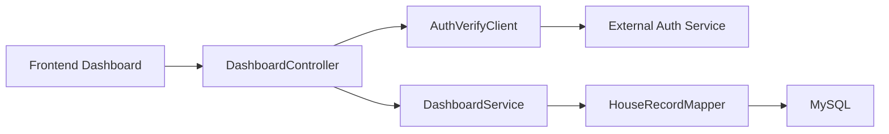
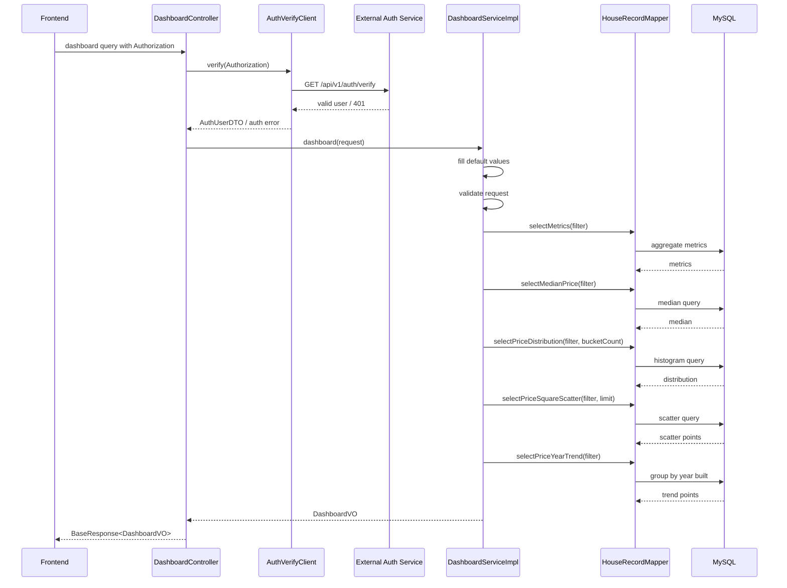

# Analysis Dashboard 后端详细设计

## 1. 设计目标

基于 `requirements/dashboard-requirements.md` 中 Analysis Dashboard 需求，后端需要实现 Dashboard 查询能力：接收筛选条件，完成数据聚合计算，并返回前端所需的数值指标和图表数据。

API 契约见 `../api-design/dashboard-api-design.md`，数据库设计见 `../db-design/dashboard-db-design.md`。本文件只描述后端实现方案。

## 2. 需求范围

### 2.1 功能范围

1. 支持房屋数据字段区间筛选。
2. 返回筛选后的总记录数、平均价格、价格中位数、平均每平方英尺价格。
3. 返回价格区间分布柱状图数据。
4. 返回价格与面积散点图数据。
5. 返回价格与建造年份趋势折线图数据。

### 2.2 非功能范围

1. 本次不包含前端页面设计。
2. 本次不包含数据导入功能，但实现应兼容后续数据导入。
3. 本次不包含用户个性化 Dashboard 保存。

## 3. 总体架构



后端分层职责：

| 层级 | 类/接口 | 职责 |
| --- | --- | --- |
| Controller | `DashboardController` | 接收 Dashboard 查询请求，读取 Authorization，完成 token 前置校验后调用 Service |
| Client | `AuthVerifyClient` | 调用外部 Token 校验接口 |
| Service | `DashboardService` | 定义 Dashboard 查询能力 |
| Service Impl | `DashboardServiceImpl` | 参数校验、默认值填充、统计查询编排、响应组装 |
| Mapper | `HouseRecordMapper` | 执行房屋数据筛选、聚合、图表查询 |
| Entity | `HouseRecord` | 映射房屋记录数据 |
| Request | `DashboardQueryRequest` | 承载区间筛选参数和图表控制参数 |
| VO | `DashboardVO` 等 | 承载 Dashboard 数值指标与图表数据 |

## 4. 模块文件设计

建议新增或修改文件：

| 文件 | 操作 | 说明 |
| --- | --- | --- |
| `src/main/java/cn/com/housepriceprediction/module/dashboard/controller/DashboardController.java` | 新增 | Dashboard 查询入口 |
| `src/main/java/cn/com/housepriceprediction/module/dashboard/client/AuthVerifyClient.java` | 新增 | 外部 Token 校验 HTTP 客户端 |
| `src/main/java/cn/com/housepriceprediction/module/dashboard/entity/dto/AuthVerifyResponse.java` | 新增 | 外部 Token 校验响应 DTO |
| `src/main/java/cn/com/housepriceprediction/module/dashboard/entity/dto/AuthUserDTO.java` | 新增 | 外部 Token 校验用户信息 DTO |
| `src/main/java/cn/com/housepriceprediction/module/dashboard/service/DashboardService.java` | 新增 | Dashboard Service 接口 |
| `src/main/java/cn/com/housepriceprediction/module/dashboard/service/impl/DashboardServiceImpl.java` | 新增 | Dashboard Service 实现 |
| `src/main/java/cn/com/housepriceprediction/module/dashboard/mapper/HouseRecordMapper.java` | 新增 | 房屋数据 Mapper |
| `src/main/java/cn/com/housepriceprediction/module/dashboard/entity/DO/HouseRecord.java` | 新增 | 房屋数据 DO |
| `src/main/java/cn/com/housepriceprediction/module/dashboard/entity/request/DashboardQueryRequest.java` | 新增 | Dashboard 查询请求 |
| `src/main/java/cn/com/housepriceprediction/module/dashboard/entity/vo/DashboardVO.java` | 新增 | Dashboard 聚合响应 |
| `src/main/java/cn/com/housepriceprediction/module/dashboard/entity/vo/DashboardMetricsVO.java` | 新增 | 数值指标响应 |
| `src/main/java/cn/com/housepriceprediction/module/dashboard/entity/vo/PriceDistributionPointVO.java` | 新增 | 价格分布点 |
| `src/main/java/cn/com/housepriceprediction/module/dashboard/entity/vo/PriceSquareScatterPointVO.java` | 新增 | 散点图点 |
| `src/main/java/cn/com/housepriceprediction/module/dashboard/entity/vo/PriceYearTrendPointVO.java` | 新增 | 年份趋势点 |
| `src/main/resources/mapper/HouseRecordMapper.xml` | 新增 | Dashboard 统计查询 |
| `sql/silas_boot_template.sql` | 修改 | 增加房屋记录表和示例数据 |

## 5. 核心处理流程



## 6. Controller 设计

`DashboardController` 负责协议适配和 token 前置校验，不承载 Dashboard 统计计算。

处理逻辑：

1. 从请求头读取 `Authorization`。
2. 若 `Authorization` 为空或不符合 `Bearer <token>` 格式，直接抛出未授权异常，不进入数据查询。
3. 调用 `AuthVerifyClient.verify(authorization)`。
4. 外部 Token 校验通过后，接收 `DashboardQueryRequest` 并调用 `DashboardService.dashboard(request)`。
5. 使用项目统一响应工具 `Result.success(data)` 返回。
6. 参数错误、认证错误、业务错误交由全局异常处理器统一转换响应。

Controller 方法示例：

```java
@PostMapping
public BaseResponse<DashboardVO> dashboard(
        @RequestHeader("Authorization") String authorization,
        @RequestBody DashboardQueryRequest request
) {
    authVerifyClient.verify(authorization);
    return Result.success(dashboardService.dashboard(request));
}
```

## 7. 外部 Token 校验设计

外部接口信息：

| 项 | 值 |
| --- | --- |
| URL | `http://114.67.76.100:8001/api/v1/auth/verify` |
| Method | GET |
| Header | `Authorization: Bearer <token>` |
| 成功状态码 | 200 |
| 失败状态码 | 401 |

`AuthVerifyClient` 职责：

1. 接收 Dashboard 请求中的原始 `Authorization` header。
2. 校验 header 非空且以 `Bearer ` 开头。
3. 使用 HTTP GET 调用外部认证接口，并原样透传 `Authorization` header。
4. 当外部接口返回 HTTP 200 且 `data.valid == true` 时返回用户信息。
5. 当外部接口返回 HTTP 401、`data.valid != true`、响应结构缺失、请求超时或网络异常时，抛出认证相关异常。

建议 DTO：

```java
public class AuthVerifyResponse {
    private Integer code;
    private String msg;
    private AuthUserDTO data;
}

public class AuthUserDTO {
    private Boolean valid;
    @JsonProperty("user_id")
    private Long userId;
    private String username;
    private String email;
}
```

实现建议：

1. 使用 Spring `RestClient` 或 `WebClient` 封装调用，连接超时和读取超时建议设置为 3 秒。
2. 外部认证服务地址通过配置项维护，例如 `auth.verify-url`，默认值为 `http://114.67.76.100:8001/api/v1/auth/verify`。
3. 不在日志中打印完整 token；如需排查，只记录 token 前后少量字符或 requestId。
4. 校验接口必须在任何 Mapper 查询之前调用。

## 8. Service 设计

接口路径：`src/main/java/cn/com/housepriceprediction/module/dashboard/service/DashboardService.java`

```java
public interface DashboardService {

    DashboardVO dashboard(DashboardQueryRequest request);
}
```

实现路径：`src/main/java/cn/com/housepriceprediction/module/dashboard/service/impl/DashboardServiceImpl.java`

处理步骤：

1. 若 `request == null`，初始化空请求对象，表示不过滤。
2. 补充默认参数：`priceBucketCount = 10`、`scatterLimit = 1000`。
3. 校验所有区间参数和默认参数。
4. 调用 `selectMetrics` 查询总量、平均价格、平均每平方英尺价格。
5. 若 `totalRecords == 0`，返回指标为 0、图表数组为空的 `DashboardVO`。
6. 调用 `selectMedianPrice` 查询价格中位数。
7. 调用 `selectPriceDistribution` 查询价格分布，并补齐 `label`。
8. 调用 `selectPriceSquareScatter` 查询散点图。
9. 调用 `selectPriceYearTrend` 查询年份趋势。
10. 组装并返回 `DashboardVO`。

伪代码：

```java
public DashboardVO dashboard(DashboardQueryRequest request) {
    DashboardQueryRequest query = Optional.ofNullable(request).orElseGet(DashboardQueryRequest::new);
    fillDefaultValue(query);
    validate(query);

    DashboardMetricsVO metrics = houseRecordMapper.selectMetrics(query);
    if (metrics == null || metrics.getTotalRecords() == 0) {
        return DashboardVO.empty();
    }

    BigDecimal medianPrice = houseRecordMapper.selectMedianPrice(query);
    metrics.setMedianPrice(defaultZero(medianPrice));

    List<PriceDistributionPointVO> distribution =
            houseRecordMapper.selectPriceDistribution(query, query.getPriceBucketCount());
    fillDistributionLabel(distribution);

    return new DashboardVO()
            .setMetrics(metrics)
            .setPriceDistribution(distribution)
            .setPriceSquareScatter(houseRecordMapper.selectPriceSquareScatter(query, query.getScatterLimit()))
            .setPriceYearTrend(houseRecordMapper.selectPriceYearTrend(query));
}
```

## 9. Mapper 调用设计

Mapper 路径：`src/main/java/cn/com/housepriceprediction/module/dashboard/mapper/HouseRecordMapper.java`

Mapper 方法：

```java
DashboardMetricsVO selectMetrics(@Param("request") DashboardQueryRequest request);

BigDecimal selectMedianPrice(@Param("request") DashboardQueryRequest request);

List<PriceDistributionPointVO> selectPriceDistribution(
        @Param("request") DashboardQueryRequest request,
        @Param("bucketCount") Integer bucketCount
);

List<PriceSquareScatterPointVO> selectPriceSquareScatter(
        @Param("request") DashboardQueryRequest request,
        @Param("limit") Integer limit
);

List<PriceYearTrendPointVO> selectPriceYearTrend(@Param("request") DashboardQueryRequest request);
```

Mapper XML 中应复用公共筛选片段，保证数值指标、价格分布、散点图和趋势图使用同一套筛选条件。具体 SQL 见 DB 设计文档。

## 10. 筛选与参数校验

所有字段均采用区间筛选，前端可只传最小值、只传最大值或同时传最小值和最大值。

筛选规则：

1. `minX != null` 时生成 `x >= minX`。
2. `maxX != null` 时生成 `x <= maxX`。
3. `minX` 和 `maxX` 同时存在时，必须满足 `minX <= maxX`。
4. 数量、面积、价格、评分、距离字段不得小于 0。
5. `yearBuilt` 建议限制在 `[1800, currentYear]`。
6. `priceBucketCount` 默认 10，范围 `[1, 50]`。
7. `scatterLimit` 默认 1000，范围 `[1, 5000]`。

详细校验规则：

| 字段组 | 校验规则 | 错误示例 |
| --- | --- | --- |
| id | `minId >= 1`，`maxId >= 1`，`minId <= maxId` | `minId=10,maxId=1` |
| squareFootage | 值必须 `> 0`，且最小值不大于最大值 | `minSquareFootage=0` |
| bedrooms | 值必须 `>= 0`，且最小值不大于最大值 | `minBedrooms=-1` |
| bathrooms | 值必须 `>= 0`，且最小值不大于最大值 | `minBathrooms=-1` |
| yearBuilt | 值必须在 `[1800, currentYear]` 内，且最小值不大于最大值 | `maxYearBuilt=3000` |
| lotSize | 值必须 `> 0`，且最小值不大于最大值 | `minLotSize=0` |
| distanceToCityCenter | 值必须 `>= 0`，且最小值不大于最大值 | `minDistance=-1` |
| schoolRating | 值必须在 `[0, 10]` 内，且最小值不大于最大值 | `maxSchoolRating=11` |
| price | 值必须 `>= 0`，且最小值不大于最大值 | `minPrice=-1` |
| priceBucketCount | 默认 10，范围 `[1, 50]` | `priceBucketCount=100` |
| scatterLimit | 默认 1000，范围 `[1, 5000]` | `scatterLimit=10000` |

建议在 `DashboardServiceImpl` 中集中校验，校验失败抛出 `BusinessException(RespCode.ERROR_PARAMETER, "...")`。

## 11. 异常与边界处理

| 场景 | 后端行为 |
| --- | --- |
| 缺少 `Authorization` | 不查询数据库，返回未授权错误 |
| `Authorization` 格式非法 | 不查询数据库，返回未授权错误 |
| 外部 Token 校验返回 401 | 不查询数据库，返回未授权错误 |
| 外部 Token 校验返回 200 但 `valid != true` | 不查询数据库，返回未授权错误 |
| 外部 Token 校验超时或网络异常 | 不查询数据库，返回认证服务不可用或统一业务错误 |
| 请求体为空 | 视为无筛选查询 |
| 区间参数非法 | 抛出 `BusinessException(RespCode.ERROR_PARAMETER)` |
| 筛选后无数据 | 返回 `totalRecords=0`，数值指标为 0，图表数组为空 |
| `square_footage` 为 0 的异常脏数据 | 聚合计算中避免除零，数据入库层后续应拦截 |
| 价格全部相同 | 返回单一价格分布 bucket |
| 散点图数据量过大 | 按 `scatterLimit` 限制返回数量 |

## 12. 性能设计

1. Token 校验发生在数据库查询之前，未授权请求不会占用数据库资源。
2. 外部 Token 校验接口需要配置连接和读取超时，避免认证服务异常拖垮 Dashboard 查询线程。
3. 聚合查询均在数据库侧完成，避免将全量数据加载到 JVM。
4. 主要筛选字段建立索引，覆盖价格、面积、建造年份、卧室数、浴室数。
5. `priceDistribution`、`medianPrice` 对价格排序/分桶依赖较强，数据量扩大后优先评估价格索引执行计划。
6. 当前需求不强制缓存，因为筛选条件组合较多，缓存命中率有限。
7. 若后续数据量达到百万级，可增加离线聚合表或基于常用筛选维度的预聚合。

## 13. 安全与权限

1. Dashboard 查询接口必须携带 `Authorization: Bearer <token>`。
2. 后端必须调用 `http://114.67.76.100:8001/api/v1/auth/verify` 完成 token 校验。
3. token 校验通过前不得执行任何 Dashboard 数据库查询。
4. 不在日志、异常消息或响应中输出完整 token。
5. 所有 SQL 参数必须通过 MyBatis 参数绑定传入，不允许字符串拼接筛选值。

## 14. 测试设计

### 14.1 单元测试

测试类：`DashboardServiceImplTest`

覆盖场景：

1. 空请求时补齐默认值。
2. 所有字段最小值大于最大值时抛出异常。
3. 非法负数参数抛出异常。
4. `totalRecords=0` 时返回空 Dashboard。
5. 价格分布 label 拼接正确。

测试类：`AuthVerifyClientTest`

覆盖场景：

1. 缺少 `Authorization` 时抛出未授权异常。
2. `Authorization` 不以 `Bearer ` 开头时抛出未授权异常。
3. 外部接口返回 200 且 `data.valid=true` 时校验通过。
4. 外部接口返回 401 时抛出未授权异常。
5. 外部接口返回 200 但 `data.valid=false` 时抛出未授权异常。
6. 外部接口超时或网络异常时抛出认证服务异常。

### 14.2 Mapper 集成测试

测试类：`HouseRecordMapperTest`

准备数据：

| id | square_footage | bedrooms | bathrooms | year_built | lot_size | distance_to_city_center | school_rating | price |
| --- | --- | --- | --- | --- | --- | --- | --- | --- |
| 1 | 1250 | 2 | 1 | 1985 | 5200 | 3.2 | 7.1 | 185000 |
| 2 | 1850 | 3 | 2 | 1998 | 7500 | 5.6 | 8.2 | 265000 |
| 3 | 1420 | 3 | 2 | 1992 | 6800 | 2.8 | 6.9 | 210000 |

断言：

1. 无筛选时 `totalRecords = 3`。
2. 无筛选时 `avgPrice = 220000.00`。
3. 无筛选时 `medianPrice = 210000.00`。
4. `minPrice=200000` 时 `totalRecords = 2`。
5. 年份趋势按 `yearBuilt` 升序返回。

### 14.3 接口测试

测试类：`DashboardControllerTest`

覆盖场景：

1. 缺少 `Authorization` 时不调用 `DashboardService`。
2. 外部 token 校验失败时不调用 `DashboardService`。
3. 外部 token 校验通过时返回 `BaseResponse<DashboardVO>`。
4. 非法参数返回项目统一错误响应。
5. 合法筛选参数返回完整的 `metrics`、`priceDistribution`、`priceSquareScatter`、`priceYearTrend`。

## 15. 验收标准

1. Dashboard 查询接口在任何数据查询前完成外部 token 校验。
2. 缺少 token、token 无效、token 过期、用户不存在或用户锁定时不执行数据库查询。
3. 接口可按任意字段区间筛选房屋数据。
4. 4 个数值指标均基于筛选后数据计算。
5. 价格分布柱状图数据包含区间起止、展示标签和数量。
6. 价格与面积散点图返回面积和价格坐标。
7. 价格与建造年份趋势图按年份升序返回平均价格。
8. 空数据、非法区间、散点图数量限制等边界场景均有明确处理。
