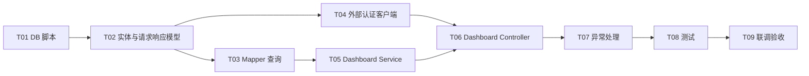

# Analysis Dashboard 后端开发任务拆分

## 1. 任务目标

基于 `requirements`、`api-design`、`db-design`、`detail-design` 中的设计内容，完成 Analysis Dashboard 后端开发。最终交付一个 `POST /dashboard` 接口，接口在查询数据库前先调用外部 Token 校验服务，校验通过后返回 Dashboard 指标和图表数据。

## 2. 开发范围

### 2.1 范围内

1. 新增 `house_record` 数据表建表脚本和初始化数据脚本。
2. 新增 Dashboard 模块请求、响应、DO、DTO、Mapper、Service、Controller。
3. 新增外部 Token 校验客户端，调用 `http://114.67.76.100:8001/api/v1/auth/verify`。
4. 实现字段区间筛选、4 个数值指标和 3 类图表数据查询。
5. 补充单元测试、Mapper 集成测试、Controller 测试。

### 2.2 范围外

1. 前端页面开发。
2. 房屋数据上传导入功能。
3. Dashboard 用户个性化配置保存。
4. 离线预聚合或缓存优化。

## 3. 任务依赖关系

## 4. 任务拆分

### T01 数据库脚本落地

优先级：P0

预计工作量：0.5 人日

涉及文件：

| 文件 | 操作 | 说明 |
| --- | --- | --- |
| `docs/spec/dashboard/normalCR/db-design/dashboard-create-table.sql` | 复核 | 确认建表 SQL 与实现一致 |
| `docs/spec/dashboard/normalCR/db-design/dashboard-init-data.sql` | 复核 | 确认 50 条初始化数据可导入 |
| `sql/silas_boot_template.sql` | 修改 | 合入 `house_record` 建表和初始化数据 |

开发内容：

1. 将 `house_record` 建表 SQL 合并到项目初始化 SQL。
2. 将 50 条初始化数据合并到项目初始化 SQL。
3. 确认 `bathrooms` 使用 `DECIMAL(3, 1)`。
4. 确认索引包含 `idx_price`、`idx_square_footage`、`idx_year_built`、`idx_bedrooms`、`idx_bathrooms`。

验收标准：

1. 本地 MySQL 执行初始化 SQL 成功。
2. `SELECT COUNT(*) FROM house_record;` 返回 50。
3. `bathrooms` 可保存 `1.5`、`2.5`。

### T02 实体、请求、响应模型开发

优先级：P0

预计工作量：1 人日

涉及文件：

| 文件 | 操作 | 说明 |
| --- | --- | --- |
| `src/main/java/cn/com/housepriceprediction/module/dashboard/entity/DO/HouseRecord.java` | 新增 | 房屋记录 DO |
| `src/main/java/cn/com/housepriceprediction/module/dashboard/entity/request/DashboardQueryRequest.java` | 新增 | Dashboard 查询请求 |
| `src/main/java/cn/com/housepriceprediction/module/dashboard/entity/vo/DashboardVO.java` | 新增 | Dashboard 聚合响应 |
| `src/main/java/cn/com/housepriceprediction/module/dashboard/entity/vo/DashboardMetricsVO.java` | 新增 | 数值指标响应 |
| `src/main/java/cn/com/housepriceprediction/module/dashboard/entity/vo/PriceDistributionPointVO.java` | 新增 | 价格分布点 |
| `src/main/java/cn/com/housepriceprediction/module/dashboard/entity/vo/PriceSquareScatterPointVO.java` | 新增 | 散点图点 |
| `src/main/java/cn/com/housepriceprediction/module/dashboard/entity/vo/PriceYearTrendPointVO.java` | 新增 | 年份趋势点 |
| `src/main/java/cn/com/housepriceprediction/module/dashboard/entity/dto/AuthVerifyResponse.java` | 新增 | 外部 Token 校验响应 DTO |
| `src/main/java/cn/com/housepriceprediction/module/dashboard/entity/dto/AuthUserDTO.java` | 新增 | 外部 Token 校验用户信息 DTO |

开发内容：

1. `HouseRecord` 使用 MyBatis-Plus 注解映射 `house_record` 表。
2. 金额、面积、距离、评分、浴室数量使用 `BigDecimal`。
3. `DashboardQueryRequest` 覆盖所有字段区间筛选参数。
4. `DashboardQueryRequest` 增加 `priceBucketCount` 和 `scatterLimit`。
5. `DashboardVO` 提供空数据静态构造方法，便于无数据时返回默认结构。
6. `AuthUserDTO.userId` 使用 `@JsonProperty("user_id")` 映射外部接口字段。

验收标准：

1. 所有模型字段与 API/DB 设计一致。
2. 项目编译通过。
3. 空 Dashboard 响应结构中 `metrics` 不为空，图表列表为空数组。

### T03 Mapper 与 SQL 开发

优先级：P0

预计工作量：1.5 人日

涉及文件：

| 文件 | 操作 | 说明 |
| --- | --- | --- |
| `src/main/java/cn/com/housepriceprediction/module/dashboard/mapper/HouseRecordMapper.java` | 新增 | 房屋数据 Mapper |
| `src/main/resources/mapper/HouseRecordMapper.xml` | 新增 | Dashboard 统计 SQL |

开发内容：

1. 新增 `HouseRecordMapper extends BaseMapper<HouseRecord>`。
2. 实现 `selectMetrics` 查询总数、平均价格、平均每平方英尺价格。
3. 实现 `selectMedianPrice` 查询价格中位数。
4. 实现 `selectPriceDistribution` 查询价格分布。
5. 实现 `selectPriceSquareScatter` 查询价格与面积散点图。
6. 实现 `selectPriceYearTrend` 查询价格与建造年份趋势图。
7. 抽取公共筛选 SQL 片段，保证所有查询使用同一套筛选条件。
8. 对带别名查询提供别名版筛选 SQL，避免价格分布 SQL 字段歧义。

验收标准：

1. 无筛选时 50 条初始化数据可正常聚合。
2. `minPrice=200000` 等筛选条件能影响所有指标和图表。
3. 中位数逻辑同时支持奇数和偶数条记录。
4. 空筛选结果时聚合值可被 Service 转换为 0。

### T04 外部 Token 校验客户端开发

优先级：P0

预计工作量：1 人日

涉及文件：

| 文件 | 操作 | 说明 |
| --- | --- | --- |
| `src/main/java/cn/com/housepriceprediction/module/dashboard/client/AuthVerifyClient.java` | 新增 | 外部认证 HTTP 客户端 |
| `src/main/resources/application.yml` | 修改 | 增加认证服务 URL 和超时配置 |

开发内容：

1. 新增配置项 `auth.verify-url`，默认 `http://114.67.76.100:8001/api/v1/auth/verify`。
2. 新增连接超时、读取超时配置，默认 3 秒。
3. 校验 `Authorization` 非空且以 `Bearer ` 开头。
4. 使用 Spring `RestClient` 或 `WebClient` 调用外部接口。
5. 透传 `Authorization` 请求头。
6. 外部接口返回 HTTP 200 且 `data.valid == true` 时返回 `AuthUserDTO`。
7. HTTP 401、`valid != true`、响应结构缺失、超时或网络异常时抛出认证相关异常。
8. 日志中不得输出完整 token。

验收标准：

1. 缺少 token 时不会发起外部 HTTP 调用。
2. 外部接口返回 401 时抛出未授权异常。
3. 外部接口返回 200 且 `valid=true` 时校验通过。
4. 超时或网络异常不会进入数据库查询。

### T05 Dashboard Service 开发

优先级：P0

预计工作量：1.5 人日

涉及文件：

| 文件 | 操作 | 说明 |
| --- | --- | --- |
| `src/main/java/cn/com/housepriceprediction/module/dashboard/service/DashboardService.java` | 新增 | Dashboard Service 接口 |
| `src/main/java/cn/com/housepriceprediction/module/dashboard/service/impl/DashboardServiceImpl.java` | 新增 | Dashboard Service 实现 |

开发内容：

1. 定义 `DashboardVO dashboard(DashboardQueryRequest request)`。
2. 请求为空时创建空请求对象。
3. 默认 `priceBucketCount = 10`。
4. 默认 `scatterLimit = 1000`。
5. 实现所有区间参数校验。
6. 实现 `priceBucketCount` 范围 `[1, 50]` 校验。
7. 实现 `scatterLimit` 范围 `[1, 5000]` 校验。
8. 按顺序调用 Mapper 查询 metrics、median、priceDistribution、scatter、trend。
9. `totalRecords == 0` 时返回空 Dashboard。
10. 为价格分布补齐 `label`。

验收标准：

1. 非法区间抛出 `RespCode.ERROR_PARAMETER` 对应业务异常。
2. 空请求可以查询全量 Dashboard。
3. 无数据时返回成功响应且图表列表为空。
4. 所有指标和图表均基于同一筛选条件。

### T06 Dashboard Controller 开发

优先级：P0

预计工作量：0.5 人日

涉及文件：

| 文件 | 操作 | 说明 |
| --- | --- | --- |
| `src/main/java/cn/com/housepriceprediction/module/dashboard/controller/DashboardController.java` | 新增 | Dashboard 查询接口 |

开发内容：

1. 新增 `POST /dashboard` 接口。
2. 接收 `Authorization` 请求头。
3. 先调用 `AuthVerifyClient.verify(authorization)`。
4. token 校验通过后调用 `DashboardService.dashboard(request)`。
5. 使用 `Result.success(data)` 返回统一响应。

验收标准：

1. 缺少 `Authorization` 时不调用 Service。
2. token 校验失败时不调用 Service。
3. token 校验通过后返回 Dashboard 数据。
4. 接口路径和方法与 API 设计一致。

### T07 异常处理与响应语义对齐

优先级：P1

预计工作量：0.5 人日

涉及文件：

| 文件 | 操作 | 说明 |
| --- | --- | --- |
| `src/main/java/cn/com/housepriceprediction/common/exception/BusinessException.java` | 复核 | 确认可表达认证和参数错误 |
| `src/main/java/cn/com/housepriceprediction/common/response/RespCode.java` | 复核/修改 | 确认存在未授权或认证失败响应码 |
| `src/main/java/cn/com/housepriceprediction/common/exception/GlobalExceptionHandler.java` | 复核/修改 | 确认异常响应符合统一格式 |

开发内容：

1. 复核项目现有响应码是否已有未授权、参数错误、服务不可用等语义。
2. 若缺失认证失败响应码，补充或复用最接近的响应码。
3. 外部认证失败映射为未授权错误。
4. 外部认证服务超时或网络异常映射为认证服务不可用或统一业务错误。
5. 参数错误映射为 `RespCode.ERROR_PARAMETER`。

验收标准：

1. 参数错误、认证失败、外部认证异常均返回统一响应结构。
2. 响应中不暴露完整 token 或外部接口敏感细节。

### T08 测试开发

优先级：P0

预计工作量：2 人日

涉及文件：

| 文件 | 操作 | 说明 |
| --- | --- | --- |
| `src/test/java/cn/com/housepriceprediction/module/dashboard/service/DashboardServiceImplTest.java` | 新增 | Service 单元测试 |
| `src/test/java/cn/com/housepriceprediction/module/dashboard/client/AuthVerifyClientTest.java` | 新增 | 外部认证客户端测试 |
| `src/test/java/cn/com/housepriceprediction/module/dashboard/mapper/HouseRecordMapperTest.java` | 新增 | Mapper 集成测试 |
| `src/test/java/cn/com/housepriceprediction/module/dashboard/controller/DashboardControllerTest.java` | 新增 | Controller 测试 |

测试内容：

1. `DashboardServiceImplTest`
   - 空请求补齐默认值。
   - 所有字段最小值大于最大值时抛出异常。
   - 非法负数参数抛出异常。
   - `totalRecords=0` 时返回空 Dashboard。
   - 价格分布 label 拼接正确。
2. `AuthVerifyClientTest`
   - 缺少 `Authorization` 时抛出未授权异常。
   - `Authorization` 不以 `Bearer ` 开头时抛出未授权异常。
   - 外部接口返回 200 且 `data.valid=true` 时校验通过。
   - 外部接口返回 401 时抛出未授权异常。
   - 外部接口返回 200 但 `data.valid=false` 时抛出未授权异常。
   - 外部接口超时或网络异常时抛出认证服务异常。
3. `HouseRecordMapperTest`
   - 无筛选时 `totalRecords = 50`。
   - 无筛选时指标不为空。
   - 价格筛选影响统计结果。
   - 年份趋势按 `yearBuilt` 升序返回。
4. `DashboardControllerTest`
   - 缺少 `Authorization` 时不调用 `DashboardService`。
   - 外部 token 校验失败时不调用 `DashboardService`。
   - 外部 token 校验通过时返回 `BaseResponse<DashboardVO>`。

验收标准：

1. 新增测试可稳定运行。
2. `mvn test` 通过。
3. 外部认证调用测试使用 mock，不依赖真实公网服务。

### T09 联调与验收

优先级：P1

预计工作量：0.5 人日

涉及内容：

1. 初始化数据库。
2. 启动后端服务。
3. 使用合法 token 调用 `POST /dashboard`。
4. 使用缺失 token、非法 token、过期 token 验证接口拒绝访问。
5. 使用不同筛选条件验证指标和图表数据变化。

验收标准：

1. token 校验通过前无数据库查询。
2. 合法 token 可获取 Dashboard 数据。
3. 非法 token 返回未授权错误。
4. 空筛选、价格筛选、面积筛选、年份筛选均可正常返回。
5. 返回数据结构与 API 设计一致。

## 5. 推荐开发顺序

1. T01 数据库脚本落地。
2. T02 实体、请求、响应模型开发。
3. T03 Mapper 与 SQL 开发。
4. T04 外部 Token 校验客户端开发。
5. T05 Dashboard Service 开发。
6. T06 Dashboard Controller 开发。
7. T07 异常处理与响应语义对齐。
8. T08 测试开发。
9. T09 联调与验收。

## 6. 风险与注意事项

| 风险 | 影响 | 处理建议 |
| --- | --- | --- |
| 外部认证服务不可用 | Dashboard 接口不可用 | 设置合理超时，返回明确认证服务异常 |
| 外部接口字段为 `user_id` | Java DTO 无法自动映射 | 使用 `@JsonProperty("user_id")` |
| `bathrooms` 存在 1.5/2.5 | 使用整数会丢失数据精度 | DB 和 Java 均使用 `BigDecimal` |
| 价格分布 SQL 使用表别名 | 公共筛选片段可能字段歧义 | 提供带别名筛选片段 |
| 中位数查询依赖窗口函数 | MySQL 版本过低会失败 | 确认 MySQL 8，或改用兼容 SQL |
| 测试依赖真实外部认证服务 | 测试不稳定 | 使用 mock HTTP server 或 mock client |

## 7. 完成定义

1. 所有 P0 任务完成。
2. `POST /dashboard` 按设计完成外部 token 校验和 Dashboard 查询。
3. 数据库初始化后具备 50 条房屋数据。
4. 单元测试、Mapper 集成测试、Controller 测试通过。
5. 文档、代码、SQL 保持一致。
