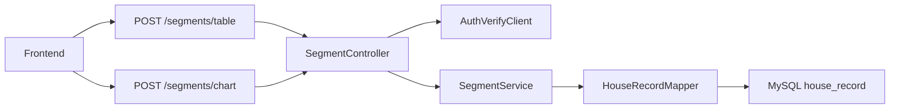
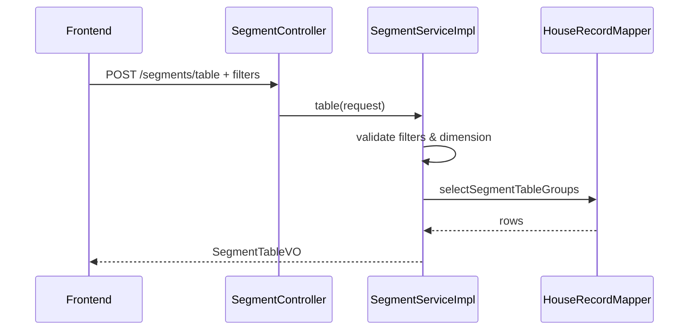
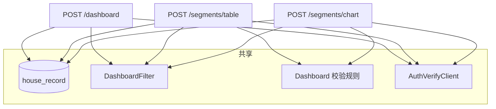

# Segments 分析详细设计

## 1. 设计目标

基于 `requirements/segments-analysis.md` 中 Segments 分析需求，实现按可选维度对房屋数据进行分组聚合。**聚合表（Table）与双轴图（Chart）拆分为两个独立接口**，各自支持与 Analysis Dashboard 相同的 **Min / Max 区间筛选**，在筛选后的数据集上执行 `GROUP BY`。

本设计复用 `house_record` 数据表、`DashboardFilter` SQL 片段、参数校验规则与外部 Token 校验。数据库表结构见 `docs/spec/dashboard/normalCR/db-design/dashboard-db-design.md`。

## 2. 需求范围

### 2.1 功能范围

1. 用户可单选一个分组维度，对**筛选后**的房屋数据执行 `GROUP BY`。
2. 支持维度：`bedrooms`、`bathrooms`、`year_built_decade`、`school_rating_band`、`distance_band`。
3. **Table 接口**：返回聚合表，每行一个分组，列包括 `Group`、`Count`、`Median`、`Mean`、`P25`、`P75`、`Std Dev`。
4. **Chart 接口**：返回双轴条形图数据，每点包含 `group`、`count`、`medianPrice`（左轴 Count、右轴 Median Price）。
5. **两个接口均支持**与 `POST /dashboard` 相同的全部字段 Min / Max 区间筛选（见第 6.3 节）。
6. 前端聚合表支持表头排序（`aria-sort`）、数值列右对齐 `tabular-nums`（前端实现）。

### 2.2 非功能范围

1. 本次不包含前端工程实现；第 13 节为联调契约。
2. 不新增数据库表；不提供合并 Table + Chart 的聚合接口。
3. 不支持多维度同时分组、服务端分页/排序。
4. Table 与 Chart 由前端分别调用；同一筛选条件下两次请求应使用**相同请求体**以保证数据一致。

## 3. 维度与分组规则

### 3.1 维度枚举

| 枚举值 | 请求参数 `segmentDimension` | 说明 |
| --- | --- | --- |
| `BEDROOMS` | `bedrooms` | 按卧室数量原值分组 |
| `BATHROOMS` | `bathrooms` | 按浴室数量原值分组 |
| `YEAR_BUILT_DECADE` | `year_built_decade` | 按建造年份所在年代分组 |
| `SCHOOL_RATING_BAND` | `school_rating_band` | 按学校评分 2 分一档分组 |
| `DISTANCE_BAND` | `distance_band` | 按距市中心距离 2 英里一档分组 |

`segmentDimension` 在两个接口中均为**必填**。

### 3.2 分组键与展示标签

| 维度 | groupKey | group 展示示例 |
| --- | --- | --- |
| bedrooms | `"2"` | `2` |
| bathrooms | `"1.5"` | `1.5` |
| year_built_decade | `"1980"` | `1980s` |
| school_rating_band | `"6"` | `6-8` |
| distance_band | `"2"` | `2-4` |

### 3.3 分桶 SQL 表达式

与初版设计一致，在 `HouseRecordMapper.xml` 中通过 `<choose>` 按 `dimension` 切换 `group_key` / `group_label` 表达式（详见原 3.3 节 SQL 片段，此处不重复）。

默认排序：按 `groupKey` 数值升序。

## 4. 总体架构



| 层级 | 职责 |
| --- | --- |
| `SegmentController` | 两个 POST 入口；Token 校验；参数 resolve |
| `SegmentService` | `table(request)` / `chart(request)` |
| `SegmentServiceImpl` | 校验筛选 + 维度；分别调用 Mapper |
| `HouseRecordMapper` | `selectSegmentTableGroups` / `selectSegmentChartGroups` |
| `SegmentQueryRequest` | 筛选字段 + `segmentDimension`（两个接口共用） |

## 5. 模块文件设计

| 文件 | 操作 | 说明 |
| --- | --- | --- |
| `SegmentController.java` | 新增 | `/segments/table`、`/segments/chart` |
| `SegmentService.java` | 新增 | `table`、`chart` 方法 |
| `SegmentServiceImpl.java` | 新增 | 校验与编排 |
| `SegmentQueryRequest.java` | 新增 | 继承 `DashboardQueryRequest` 并增加 `segmentDimension` |
| `SegmentDimension.java` | 新增 | 维度枚举 |
| `SegmentTableVO.java` | 新增 | Table 响应 |
| `SegmentChartVO.java` | 新增 | Chart 响应 |
| `SegmentGroupRowVO.java` | 新增 | 表行 |
| `SegmentChartPointVO.java` | 新增 | 图点 |
| `HouseRecordMapper.java` / `.xml` | 修改 | 两个查询方法；共用 `DashboardFilter` |
| 测试类 | 新增 | 分别覆盖 table / chart |

**不再使用：** `SegmentAnalysisVO`、`POST /segments/analysis`、单一 `selectSegmentGroups` 合并接口。

筛选校验：抽取 `DashboardQueryValidator`（推荐）或委托 `DashboardServiceImpl` 中已有校验逻辑，保证与 Dashboard **同一套规则**。

## 6. API 设计

### 6.1 接口清单

| 接口 | 方法 | 路径 | 响应类型 | 说明 |
| --- | --- | --- | --- | --- |
| segmentTable | POST | `/segments/table` | `BaseResponse<SegmentTableVO>` | 聚合表 |
| segmentChart | POST | `/segments/chart` | `BaseResponse<SegmentChartVO>` | 双轴图数据 |

### 6.2 认证

与 Dashboard 一致：必须 `Authorization: Bearer <token>`，查库前 `AuthVerifyClient.verify`。

### 6.3 请求体：区间筛选（与 Dashboard 对齐）

两个接口共用 **`SegmentQueryRequest`**，在 `DashboardQueryRequest` 全部 Min / Max 字段基础上增加 `segmentDimension`。

#### 6.3.1 分组维度

| 参数 | 类型 | 必填 | 说明 |
| --- | --- | --- | --- |
| segmentDimension | String | 是 | 见 3.1 |

#### 6.3.2 区间筛选字段（Min / Max）

与 `docs/spec/dashboard/normalCR/api-design/dashboard-api-design.md` 第 3.3 节**完全一致**：

| 参数 | 类型 | 说明 |
| --- | --- | --- |
| minId / maxId | Long | ID 区间 |
| minSquareFootage / maxSquareFootage | BigDecimal | 面积 |
| minBedrooms / maxBedrooms | Integer | 卧室数 |
| minBathrooms / maxBathrooms | BigDecimal | 浴室数 |
| minYearBuilt / maxYearBuilt | Integer | 建造年份 |
| minLotSize / maxLotSize | BigDecimal | 土地面积 |
| minDistanceToCityCenter / maxDistanceToCityCenter | BigDecimal | 距市中心距离 |
| minSchoolRating / maxSchoolRating | BigDecimal | 学校评分 |
| minPrice / maxPrice | BigDecimal | 价格 |
| filters | Object | 嵌套筛选对象，字段同上 |

**不包含** Dashboard 专有参数：`priceBucketCount`、`scatterLimit`（Segments 不使用）。

筛选语义（与 Dashboard 相同）：

1. 仅传 `minX` → `x >= minX`。
2. 仅传 `maxX` → `x <= maxX`。
3. 同时传 Min / Max → `minX <= x <= maxX`。
4. 空请求体或 `{}` 且仅含 `segmentDimension` → 不做字段筛选，对全量数据分组。
5. SQL 复用 `HouseRecordMapper.xml` 中 `<sql id="DashboardFilter">` 片段。

#### 6.3.3 参数合并

与 `DashboardQueryRequest.resolve` 一致：

- `SegmentQueryRequest` 提供 `resolve(SegmentQueryRequest queryParams)`。
- 优先级：**body > query/form > filters**。
- Controller 同时支持 `@RequestBody` 与 `@ModelAttribute`（与 `DashboardController` 相同）。

#### 6.3.4 参数校验

与 Dashboard 第 6 节校验表一致（见 `dashboard-detail-design.md` 第 10 节 / `dashboard-api-design.md` 第 6 节）：

| 参数组 | 规则 |
| --- | --- |
| 同一字段 Min / Max 同时存在 | `min <= max` |
| id | `>= 1` |
| squareFootage、lotSize | `> 0` |
| bedrooms、bathrooms、distance、price | `>= 0` |
| yearBuilt | `[1800, currentYear]` |
| schoolRating | `[0, 10]` |

失败抛出 `BusinessException(RespCode.ERROR_PARAMETER)`。

#### 6.3.5 请求示例（Table / Chart 相同）

```json
{
  "segmentDimension": "bedrooms",
  "minSquareFootage": 1000,
  "maxSquareFootage": 2200,
  "minBedrooms": 2,
  "maxBedrooms": 4,
  "minPrice": 150000,
  "maxPrice": 350000
}
```

### 6.4 Table 接口响应

**路径：** `POST /segments/table`  
**类型：** `BaseResponse<SegmentTableVO>`

```json
{
  "code": 200,
  "msg": "success",
  "data": {
    "segmentDimension": "bedrooms",
    "rows": [
      {
        "group": "2",
        "groupKey": "2",
        "count": 120,
        "median": 210000.00,
        "mean": 215430.50,
        "p25": 195000.00,
        "p75": 235000.00,
        "stdDev": 28450.30
      }
    ]
  }
}
```

| 字段 | 说明 |
| --- | --- |
| segmentDimension | 回显维度 |
| rows | 聚合表行列表 |
| rows[].group | Group 列 |
| rows[].groupKey | 排序键 |
| rows[].count ~ stdDev | Count / Median / Mean / P25 / P75 / Std Dev |

筛选后无分组：`rows: []`。

### 6.5 Chart 接口响应

**路径：** `POST /segments/chart`  
**类型：** `BaseResponse<SegmentChartVO>`

```json
{
  "code": 200,
  "msg": "success",
  "data": {
    "segmentDimension": "bedrooms",
    "points": [
      {
        "group": "2",
        "groupKey": "2",
        "count": 120,
        "medianPrice": 210000.00
      },
      {
        "group": "3",
        "groupKey": "3",
        "count": 85,
        "medianPrice": 265000.00
      }
    ]
  }
}
```

| 字段 | 说明 |
| --- | --- |
| segmentDimension | 回显维度 |
| points | 图表点列表 |
| points[].group | X 轴分类 |
| points[].groupKey | 与 Table 一致的排序键 |
| points[].count | 左轴 Count |
| points[].medianPrice | 右轴 Median Price |

筛选后无分组：`points: []`。

### 6.6 Controller 示例

```java
@RestController
@RequestMapping("/segments")
@RequiredArgsConstructor
public class SegmentController {

    private final AuthVerifyClient authVerifyClient;
    private final SegmentService segmentService;

    @PostMapping("/table")
    public BaseResponse<SegmentTableVO> table(
            @RequestHeader(value = "Authorization", required = false) String authorization,
            @RequestBody(required = false) SegmentQueryRequest body,
            @ModelAttribute SegmentQueryRequest queryParams) {
        authVerifyClient.verify(authorization);
        SegmentQueryRequest request = resolve(body, queryParams);
        return Result.success(segmentService.table(request));
    }

    @PostMapping("/chart")
    public BaseResponse<SegmentChartVO> chart(
            @RequestHeader(value = "Authorization", required = false) String authorization,
            @RequestBody(required = false) SegmentQueryRequest body,
            @ModelAttribute SegmentQueryRequest queryParams) {
        authVerifyClient.verify(authorization);
        SegmentQueryRequest request = resolve(body, queryParams);
        return Result.success(segmentService.chart(request));
    }

    private static SegmentQueryRequest resolve(
            SegmentQueryRequest body, SegmentQueryRequest queryParams) {
        return Optional.ofNullable(body)
                .orElseGet(SegmentQueryRequest::new)
                .resolve(queryParams);
    }
}
```

### 6.7 SegmentQueryRequest 结构建议

```java
@Data
@EqualsAndHashCode(callSuper = true)
public class SegmentQueryRequest extends DashboardQueryRequest {

    @Schema(description = "分组维度", requiredMode = RequiredMode.REQUIRED)
    private String segmentDimension;

    @Schema(hidden = true)
    @JsonProperty("filters")
    private SegmentQueryRequest filters;

    @Override
    public SegmentQueryRequest resolve(SegmentQueryRequest queryParams) {
        // 合并 segmentDimension + 全部 Dashboard Min/Max 字段
        // 优先级：body > queryParams > filters
    }
}
```

## 7. 核心处理流程

### 7.1 Table



### 7.2 Chart


### 7.3 Service 伪代码

```java
public SegmentTableVO table(SegmentQueryRequest request) {
    SegmentQueryRequest query = prepare(request);
    List<SegmentGroupRowVO> rows =
            houseRecordMapper.selectSegmentTableGroups(query, query.getDimension());
    return SegmentTableVO.of(query.getSegmentDimension(), rows);
}

public SegmentChartVO chart(SegmentQueryRequest request) {
    SegmentQueryRequest query = prepare(request);
    List<SegmentChartPointVO> points =
            houseRecordMapper.selectSegmentChartGroups(query, query.getDimension());
    return SegmentChartVO.of(query.getSegmentDimension(), points);
}

private SegmentQueryRequest prepare(SegmentQueryRequest request) {
    SegmentQueryRequest query = Optional.ofNullable(request)
            .orElseGet(SegmentQueryRequest::new);
    SegmentDimension.require(query.getSegmentDimension());
    dashboardQueryValidator.validate(query); // 与 Dashboard 相同
    return query;
}
```

**说明：** Table 与 Chart **不**在服务端互相调用；前端用相同筛选条件分别请求两个接口。Mapper 层可抽取公共 CTE（`filtered` + `ranked`），Table 查询全量指标，Chart 查询仅 `count` + `median`。

## 8. Mapper 与 SQL 设计

### 8.1 Mapper 方法

```java
List<SegmentGroupRowVO> selectSegmentTableGroups(
        @Param("request") SegmentQueryRequest request,
        @Param("dimension") SegmentDimension dimension);

List<SegmentChartPointVO> selectSegmentChartGroups(
        @Param("request") SegmentQueryRequest request,
        @Param("dimension") SegmentDimension dimension);
```

两者均在 `FROM house_record` 后 `<include refid="DashboardFilter"/>`，保证与 Dashboard / 另一 Segments 接口筛选一致。

### 8.2 Table SQL

在分组 CTE 上计算：`count`、`median`、`mean`、`p25`、`p75`、`stdDev`（算法同初版 8.2 节窗口函数方案）。

### 8.3 Chart SQL

复用相同 `filtered` + `ranked` CTE，最终 SELECT 仅：

```sql
SELECT
    group_label AS `group`,
    group_key   AS groupKey,
    cnt         AS count,
    median      AS medianPrice
FROM percentiles
ORDER BY CAST(group_key AS DECIMAL(20, 4)) ASC, group_key ASC;
```

其中 `median` 计算方式与 Table 一致，避免 Chart 与 Table 中位数不一致。

### 8.4 单条分组

组内仅 1 条：`median = mean = p25 = p75 = price`，`stdDev = 0`；Chart 的 `medianPrice` 同上。

## 9. 异常与边界

| 场景 | Table | Chart |
| --- | --- | --- |
| 无效 Token | 不查库，未授权 | 同左 |
| segmentDimension 缺失/非法 | 参数错误 | 同左 |
| Min/Max 区间非法 | 参数错误 | 同左 |
| 筛选后无数据 | `rows: []` | `points: []` |
| 仅 Table 需要 | P25/P75 等为空分组不适用 | Chart 不返回 mean/p25 等 |

## 10. 性能与安全

1. 两个接口独立鉴权、独立查询；前端并行请求时注意连接池。
2. Chart SQL 仅聚合必要列，避免 Table 的额外百分位计算时可拆 CTE 为 `<sql id="SegmentGroupedBase">` 供两者 include。
3. 相同筛选 + 维度下，Table 与 Chart 分组集合应一致（组数相同、`groupKey` 集合相同）。
4. 其余同初版（库内聚合、参数绑定、不记 token）。

## 11. 前端联调契约

1. **筛选面板**：与 Dashboard 共用 Min / Max 控件；变更筛选时**同时**刷新 Table 与 Chart（两次 POST，请求体除路径外相同）。
2. **维度切换**：更新 `segmentDimension` 后同样双请求。
3. **Table**：`aria-sort` 客户端排序；数值列 `tabular-nums` 右对齐。
4. **Chart**：`points[].group` 为 X 轴；左轴 `count`，右轴 `medianPrice`。
5. **一致性**：不以 Table 行推导 Chart；以 Chart 接口为准展示图形，以 Table 接口为准展示统计列。

## 12. 测试设计

### 12.1 SegmentServiceImplTest

1. Table / Chart 均在缺少 `segmentDimension` 时失败。
2. 非法 Min/Max（如 `minBedrooms > maxBedrooms`）两接口均失败。
3. Mapper 返回空 → `rows=[]` / `points=[]`。
4. 相同 request mock 下，Table 与 Chart 的 `groupKey` 集合一致（集成层验证）。

### 12.2 Mapper 测试

对两方法使用相同 `SegmentQueryRequest`：

1. 无筛选 + `bedrooms`：Table 2 行，Chart 2 点，`count` 一致。
2. `minPrice=200000`：仅高价分组出现在两结果中。
3. Chart 点 `medianPrice` 等于 Table 同行 `median`。

### 12.3 SegmentControllerTest

1. `/segments/table`、`/segments/chart` 无 Token 均不调用 Service。
2. 合法筛选返回对应 VO 类型。
3. query 参数与 body 合并行为与 Dashboard 一致。

## 13. 验收标准

1. 存在 `POST /segments/table` 与 `POST /segments/chart`，查库前完成 Token 校验。
2. 两接口均支持 Dashboard 全部 Min / Max 筛选字段及 `filters` 嵌套合并。
3. 五种 `segmentDimension` 分组标签正确。
4. Table 返回完整统计列；Chart 返回 `count` + `medianPrice`。
5. 相同筛选条件下 Table 分组与 Chart 分组一一对应。
6. 无数据、非法参数、单条分组等边界符合第 9 节。
7. 单元测试与接口测试通过。

## 14. 与 Dashboard 的关系



Dashboard 提供全局指标与分布图；Segments Table / Chart 在**同一筛选语义**下提供维度分组对比。前端宜维护一份与 Dashboard 共用的筛选状态对象，序列化后分别调用三个接口。
