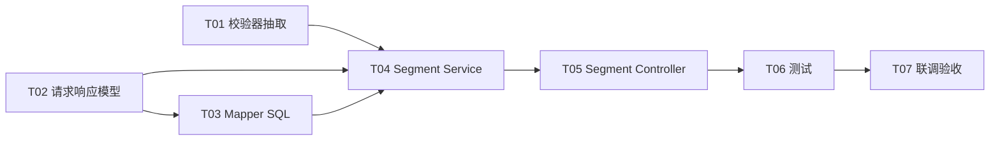

# Segments 分析后端开发任务拆分

## 1. 任务目标

基于以下文档完成 Segments 分析**后端**开发：

| 文档 | 路径 |
| --- | --- |
| 需求 | `requirements/segments-analysis.md` |
| API 设计 | `api-design/segments-api-design.md` |
| DB 设计 | `db-design/segments-db-design.md` |
| 详细设计 | `detail-design/segments-analysis-detail-design.md` |

最终交付两个接口：

1. `POST /segments/table` — 分组聚合表（Group / Count / Median / Mean / P25 / P75 / Std Dev）
2. `POST /segments/chart` — 双轴图数据（`count` + `medianPrice`）

两接口在查库前完成与 Dashboard 相同的外部 Token 校验，并支持与 `POST /dashboard` 一致的 Min / Max 区间筛选。

## 2. 开发范围

### 2.1 范围内

1. 新增 Segments 模块：请求/响应模型、枚举、Service、Controller。
2. 扩展 `HouseRecordMapper`：分组 SQL（五种维度）、Table / Chart 两条查询。
3. 抽取或复用 Dashboard 区间参数校验，保证筛选语义一致。
4. 复用已有 `AuthVerifyClient`、`DashboardFilter` SQL 片段、`house_record` 表。
5. 单元测试、Mapper 集成测试、Controller 测试。

### 2.2 范围外

1. 前端页面（聚合表 `aria-sort`、双轴图、筛选面板为前端实现，见详细设计第 11 节）。
2. 新增数据库表、合并 Table + Chart 的单一接口。
3. 服务端分页/排序、多维度同时分组。
4. Dashboard 专有参数：`priceBucketCount`、`scatterLimit`（Segments 不使用、不校验）。

### 2.3 前置依赖（已完成）

| 能力 | 现状 |
| --- | --- |
| `house_record` 表与初始化数据 | Dashboard 已落地 |
| `DashboardFilter` SQL 片段 | `HouseRecordMapper.xml` 已有 |
| `DashboardQueryRequest` 及 `resolve` | 已有，Segments 继承扩展 |
| `AuthVerifyClient` | `module/dashboard/client` 已有，直接注入复用 |

## 3. 需求与设计对照

| 需求项 | 设计落点 | 任务 |
| --- | --- | --- |
| 单选维度 group by | `segmentDimension` + `SegmentGroupExprs` | T02、T03 |
| 聚合表 7 列统计 | `POST /segments/table` → `SegmentTableVO` | T03、T04、T05 |
| 双轴图 Count + Median | `POST /segments/chart` → `SegmentChartVO` | T03、T04、T05 |
| 与 Dashboard 相同筛选 | `DashboardFilter` + `SegmentQueryRequest` | T01、T02、T03 |
| Token 校验 | `AuthVerifyClient.verify` | T05（复用） |
| Table / Chart 数据一致 | 共用 CTE，`medianPrice` = Table `median` | T03、T08 |

## 4. 任务依赖关系

> **说明：** T01 可与 T02 并行启动；T03 依赖 T02 中的 `SegmentDimension` 枚举；T04 依赖 T01 + T02 + T03。

## 5. 任务拆分

### T01 抽取 Dashboard 区间参数校验器

优先级：P0

预计工作量：0.5 人日

涉及文件：

| 文件 | 操作 | 说明 |
| --- | --- | --- |
| `src/main/java/.../module/dashboard/validation/DashboardQueryValidator.java` | 新增 | 区间筛选校验（从 `DashboardServiceImpl` 抽出） |
| `src/main/java/.../module/dashboard/service/impl/DashboardServiceImpl.java` | 修改 | 委托 `DashboardQueryValidator`，行为不变 |

开发内容：

1. 将 `validate`、`validateLongRange`、`validateIntegerRange`、`validateBigDecimalRange` 等逻辑抽取为独立 `@Component`。
2. 提供 **`validateFilters(DashboardQueryRequest query)`**：仅校验 Min/Max 区间字段（id、面积、卧室、浴室、年份、土地、距离、评分、价格）。
3. 提供 **`validateDashboard(DashboardQueryRequest query)`**：在 `validateFilters` 基础上增加 `priceBucketCount`、`scatterLimit` 校验（供 Dashboard 使用）。
4. `DashboardServiceImpl` 改为调用 `validateDashboard`，确保 Dashboard 回归无行为变化。

验收标准：

1. 现有 `DashboardServiceImplTest` 全部通过（无回归）。
2. Segments 可单独调用 `validateFilters`，不会因未传 `priceBucketCount` 而报错。

---

### T02 Segments 请求、响应与枚举模型

优先级：P0

预计工作量：0.5 人日

涉及文件：

| 文件 | 操作 | 说明 |
| --- | --- | --- |
| `module/segment/entity/enums/SegmentDimension.java` | 新增 | 五种维度枚举 |
| `module/segment/entity/request/SegmentQueryRequest.java` | 新增 | 继承 `DashboardQueryRequest` |
| `module/segment/entity/vo/SegmentTableVO.java` | 新增 | Table 响应 |
| `module/segment/entity/vo/SegmentChartVO.java` | 新增 | Chart 响应 |
| `module/segment/entity/vo/SegmentGroupRowVO.java` | 新增 | 表行 |
| `module/segment/entity/vo/SegmentChartPointVO.java` | 新增 | 图点 |

开发内容：

1. **`SegmentDimension`**：`BEDROOMS`、`BATHROOMS`、`YEAR_BUILT_DECADE`、`SCHOOL_RATING_BAND`、`DISTANCE_BAND`；提供 `fromApiValue(String)` / `require(String)`，非法值抛 `BusinessException(RespCode.ERROR_PARAMETER)`。
2. **`SegmentQueryRequest`**：
   - 字段 `segmentDimension`（必填，Swagger `requiredMode = REQUIRED`）。
   - 嵌套 `filters` 类型为 `SegmentQueryRequest`。
   - 实现 `resolve(SegmentQueryRequest queryParams)`，合并规则与 Dashboard 一致：**body > query/form > filters**，含 `segmentDimension` 与全部 Min/Max 字段。
3. **VO 工厂方法**：`SegmentTableVO.of(dimension, rows)`、`SegmentChartVO.of(dimension, points)`；空数据时 `rows=[]` / `points=[]`。
4. 金额字段使用 `BigDecimal`，与 Dashboard VO 风格一致。

验收标准：

1. 五种 API 字符串（`bedrooms` 等）可正确映射枚举。
2. `resolve` 行为可通过单元测试覆盖（可参考 `DashboardQueryRequestTest`）。
3. 项目编译通过。

---

### T03 Mapper 与分组聚合 SQL

优先级：P0

预计工作量：1.5 人日

涉及文件：

| 文件 | 操作 | 说明 |
| --- | --- | --- |
| `module/dashboard/mapper/HouseRecordMapper.java` | 修改 | 新增两个查询方法 |
| `src/main/resources/mapper/HouseRecordMapper.xml` | 修改 | 分组 SQL 片段与 select |

开发内容：

1. 新增 `<sql id="SegmentGroupExprs">`：按 `dimension.name()` 切换五种 `group_key` / `group_label`（见 `segments-db-design.md` 第 4 节）。
2. 抽取公共 CTE（`filtered` → `ranked` → `percentiles`），Table 与 Chart **共用同一套分组与中位数算法**。
3. **`selectSegmentTableGroups`**：投影 `group`、`groupKey`、`count`、`median`、`mean`、`p25`、`p75`、`stdDev`；`ORDER BY CAST(group_key AS DECIMAL(20,4)) ASC`。
4. **`selectSegmentChartGroups`**：复用 CTE，仅投影 `group`、`groupKey`、`count`、`median AS medianPrice`。
5. 两查询均在 `FROM house_record` 后 `<include refid="DashboardFilter"/>`，`request` 类型为 `SegmentQueryRequest`（继承字段满足 MyBatis `request.minXxx` 判断）。
6. 单条分组：`median = mean = p25 = p75 = price`，`stdDev = 0`（窗口函数方案见 DB 设计第 5 节）。

验收标准：

1. 无筛选 + `bedrooms`：样例 3 条数据返回 2 行（`2` count=1，`3` count=2），median 与 DB 设计第 10 节一致。
2. `minPrice=200000` 后仅保留高价分组。
3. 相同 `request` + `dimension` 下，Chart 的 `groupKey`/`count`/`medianPrice` 与 Table 对应行一致。
4. 筛选后 0 行 → 空列表（非 null）。
5. 五种维度 `group` 展示标签正确（如 `1980s`、`6-8`、`10+`）。

---

### T04 Segment Service 开发

优先级：P0

预计工作量：1 人日

涉及文件：

| 文件 | 操作 | 说明 |
| --- | --- | --- |
| `module/segment/service/SegmentService.java` | 新增 | 接口 |
| `module/segment/service/impl/SegmentServiceImpl.java` | 新增 | 实现 |

开发内容：

1. 定义 `SegmentTableVO table(SegmentQueryRequest request)`、`SegmentChartVO chart(SegmentQueryRequest request)`。
2. 私有 `prepare(request)`：
   - 空请求 → 新 `SegmentQueryRequest`。
   - `SegmentDimension.require(segmentDimension)`。
   - `dashboardQueryValidator.validateFilters(query)`（**不**校验 `priceBucketCount` / `scatterLimit`）。
3. `table`：调用 `selectSegmentTableGroups`，组装 `SegmentTableVO`。
4. `chart`：调用 `selectSegmentChartGroups`，组装 `SegmentChartVO`。
5. **不**在 Service 内互相调用 table/chart；**不**设置 Dashboard 默认值。

验收标准：

1. 缺少或非法 `segmentDimension` → `ERROR_PARAMETER`。
2. `minBedrooms > maxBedrooms` 等非法区间 → `ERROR_PARAMETER`。
3. Mapper 返回空 → 成功响应且 `rows=[]` / `points=[]`。
4. `segmentDimension` 在响应中回显 API 字符串（如 `bedrooms`）。

---

### T05 Segment Controller 开发

优先级：P0

预计工作量：0.5 人日

涉及文件：

| 文件 | 操作 | 说明 |
| --- | --- | --- |
| `module/segment/controller/SegmentController.java` | 新增 | `/segments/table`、`/segments/chart` |

开发内容：

1. `@RequestMapping("/segments")`，注入 `AuthVerifyClient`、`SegmentService`。
2. 两个 `POST` 方法均：
   - 接收 `Authorization`、`@RequestBody` + `@ModelAttribute SegmentQueryRequest`。
   - `authVerifyClient.verify(authorization)` 先于 Service。
   - `resolve(body, queryParams)` 与 `DashboardController` 相同写法。
3. 返回 `Result.success(...)`。

验收标准：

1. 无 Token / 无效 Token 时不调用 `SegmentService`（与 `DashboardControllerTest` 模式一致）。
2. 路径、方法、响应类型与 `segments-api-design.md` 一致。
3. Swagger 可展示 `segmentDimension` 及筛选字段说明。

---

### T06 测试开发

优先级：P0

预计工作量：1.5 人日

涉及文件：

| 文件 | 操作 | 说明 |
| --- | --- | --- |
| `src/test/.../segment/service/SegmentServiceImplTest.java` | 新增 | Service 单元测试（Mock Mapper） |
| `src/test/.../segment/controller/SegmentControllerTest.java` | 新增 | Controller 测试 |
| `src/test/.../dashboard/mapper/HouseRecordMapperTest.java` | 修改 | 追加 Segments Mapper 用例 |
| `src/test/.../segment/entity/request/SegmentQueryRequestTest.java` | 新增 | resolve 合并测试（可选） |

测试内容：

1. **SegmentServiceImplTest**
   - 缺少 `segmentDimension` 时 table/chart 均失败。
   - 非法 `segmentDimension`（如 `city`）失败。
   - `minBedrooms > maxBedrooms` 失败。
   - Mapper 返回空 → `rows=[]` / `points=[]`。
2. **HouseRecordMapperTest**（集成，复用测试库数据）
   - 无筛选 + `bedrooms`：Table 2 行，Chart 2 点，`count` 一致。
   - `minPrice=200000`：仅高价分组。
   - 同一 request：Chart `medianPrice` == Table `median`。
   - `year_built_decade`、`school_rating_band`、`distance_band` 各至少 1 条断言（标签格式）。
3. **SegmentControllerTest**
   - `/segments/table`、`/segments/chart` 无 Token 均不调用 Service。
   - 合法 Token 返回对应 VO。
   - body 与 query 参数合并行为与 Dashboard 一致（可选 1 用例）。

验收标准：

1. `mvn test` 通过。
2. 新增用例不依赖真实外部认证服务（Mock `AuthVerifyClient`）。

---

### T07 联调与验收

优先级：P1

预计工作量：0.5 人日

涉及内容：

1. 启动服务，使用合法 Token 分别调用 `/segments/table`、`/segments/chart`。
2. 使用与 Dashboard 相同的筛选 JSON，验证筛选生效。
3. 切换五种 `segmentDimension`，核对 `group` 展示标签。
4. 对比 Table 与 Chart：`groupKey` 集合、`count`、中位数一致。
5. 边界：无 Token、非法维度、非法区间、筛选后无数据。

验收标准（对齐详细设计第 13 节）：

1. 两接口查库前完成 Token 校验。
2. 支持 Dashboard 全部 Min/Max 及 `filters` 嵌套。
3. Table 返回完整统计列；Chart 返回 `count` + `medianPrice`。
4. 相同筛选条件下 Table 与 Chart 分组一一对应。
5. 文档、代码、SQL 保持一致。

## 6. 推荐开发顺序

| 顺序 | 任务 | 说明 |
| --- | --- | --- |
| 1 | T01 | 校验器抽取，避免 Segments 复制校验逻辑 |
| 2 | T02 | 模型与枚举，解锁 Mapper 参数类型 |
| 3 | T03 | SQL 为核心，可先以 `bedrooms` 跑通再补全五维 |
| 4 | T04 | Service 编排 |
| 5 | T05 | Controller 暴露接口 |
| 6 | T06 | 测试（可与 T04/T05 交错） |
| 7 | T07 | 联调验收 |

**并行建议：** T01 与 T02 可并行；T03 在 T02 的 `SegmentDimension` 就绪后开始。

## 7. 工作量汇总

| 任务 | 优先级 | 人日 |
| --- | --- | --- |
| T01 校验器抽取 | P0 | 0.5 |
| T02 请求响应模型 | P0 | 0.5 |
| T03 Mapper SQL | P0 | 1.5 |
| T04 Segment Service | P0 | 1.0 |
| T05 Segment Controller | P0 | 0.5 |
| T06 测试 | P0 | 1.5 |
| T07 联调验收 | P1 | 0.5 |
| **合计** | | **6.0** |

## 8. 风险与注意事项

| 风险 | 影响 | 处理建议 |
| --- | --- | --- |
| 校验逻辑仍在 `DashboardServiceImpl` 私有方法内 | Segments 重复实现或校验不一致 | 优先完成 T01 |
| Segments 误校验 `priceBucketCount` | 仅传 `segmentDimension` 的请求失败 | Service 只调 `validateFilters` |
| Table / Chart 中位数算法不一致 | 前端双轴图与表不对齐 | 共用 CTE，Chart 直接取 `median` 别名 |
| `DashboardFilter` 与 `request` 字段名不匹配 | 筛选条件不生效 | `SegmentQueryRequest` 必须继承 `DashboardQueryRequest` |
| 窗口函数依赖 MySQL 8 | SQL 执行失败 | 与 Dashboard 保持一致，确认环境版本 |
| 模块包路径不统一 | 代码风格混乱 | 建议 `module/segment`，Mapper 仍放 `dashboard.mapper`（与表同属房屋数据域） |

## 9. 完成定义（Definition of Done）

1. 所有 **P0** 任务（T01–T06）完成。
2. `POST /segments/table`、`POST /segments/chart` 按 API / 详细设计实现。
3. 五种 `segmentDimension` 分组与展示标签正确。
4. 与 Dashboard 相同的筛选语义；**不**新增数据库表。
5. `mvn test` 通过；T07 联调检查项全部满足。
6. 不实现已废弃的 `POST /segments/analysis` 及 `SegmentAnalysisVO`。

## 10. 前端协作说明（非本次后端任务）

供联调参考（详细设计第 11 节）：

1. 筛选面板与 Dashboard 共用 Min/Max 状态；变更时**并行**请求 table + chart，**请求体相同**。
2. 聚合表：客户端 `aria-sort` 排序；数值列 `tabular-nums` 右对齐。
3. 双轴图：X 轴 `group`；左轴 `count`，右轴 `medianPrice`。
4. 不以 Table 推导 Chart 数据，各用对应接口响应。
