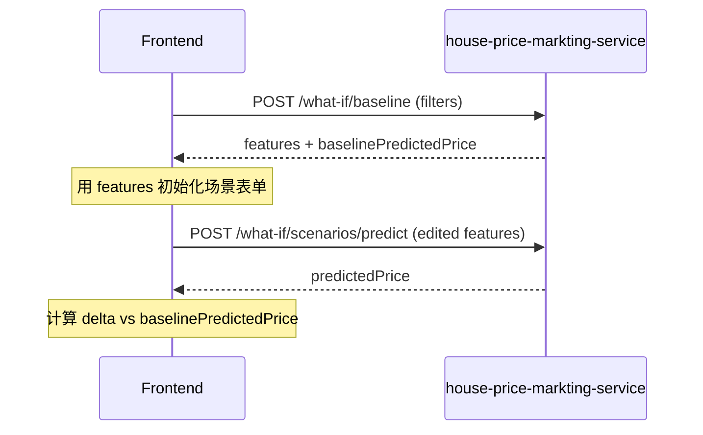

# Scenarios What-if API 设计

## 1. 接口概述

本文档定义 Scenarios What-if 后端接口契约，用于：

1. 按 Dashboard 相同筛选条件计算 **Baseline**（各特征 median + 基准预测价）。
2. 对用户设定的 **场景特征** 调用 prediction-service 返回预测房价。
3. 约定前端完成场景价与 Baseline 价的**对比计算**（后端不返回 diff 字段）。

- 需求：`../requirements/scenarios-what-if.md`
- 详细设计：`../detail-design/scenarios-what-if-detail-design.md`
- 数据与 SQL：`../db-design/scenarios-what-if-db-design.md`
- 区间筛选语义与 `POST /dashboard` 对齐，见 `docs/spec/dashboard/normalCR/api-design/dashboard-api-design.md`

服务部署：`context-path = /api`，端口默认 `8003`。下文路径为 Controller 映射路径；完整 URL 示例：`http://host:8003/api/what-if/baseline`。

## 2. 接口清单

| 接口名称 | 方法 | 路径 | 响应类型 | 说明 |
| --- | --- | --- | --- | --- |
| whatIfBaseline | POST | `/what-if/baseline` | `BaseResponse<BaselineVO>` | 计算 Baseline 特征与基准预测价 |
| scenarioPredict | POST | `/what-if/scenarios/predict` | `BaseResponse<ScenarioPredictVO>` | 场景特征房价预测（单笔/批次） |

## 3. 公共约定

### 3.1 认证

| 项 | 值 |
| --- | --- |
| 请求头 | `Authorization: Bearer <token>` |
| 校验时机 | 任何数据库查询或 prediction-service 调用之前 |
| 外部校验 URL | `http://114.67.76.100:8001/api/v1/auth/verify` |
| 外部校验方法 | GET |

校验规则（与 Dashboard 一致）：

1. 缺少 `Authorization` → 未授权，不查库、不调预测。
2. 外部接口 HTTP 401 → 未授权。
3. 外部接口 HTTP 200 但 `data.valid != true` → 未授权。
4. 外部接口超时或网络异常 → 认证服务不可用或统一业务错误。

### 3.2 Content-Type 与参数来源

| 项 | 值 |
| --- | --- |
| Content-Type | `application/json`（推荐） |
| Body | `@RequestBody`（可选） |
| Query / Form | `@ModelAttribute`（可选） |
| 合并优先级 | **body > query/form > filters** |

仅 **Baseline** 接口支持 `filters` 嵌套与 query 合并；场景预测接口仅使用 JSON Body。

### 3.3 统一响应包装

`BaseResponse<T>`：

| 字段 | 类型 | 说明 |
| --- | --- | --- |
| code | int | 业务状态码；成功为 `0`（`RespCode.SUCCESS`） |
| message | String | 描述信息 |
| data | T | 业务数据 |

### 3.4 外部 prediction-service（本服务代理调用）

Baseline 与场景预测均通过本服务 `PredictClient` 调用：

| 项 | 值 |
| --- | --- |
| URL | `http://114.67.76.100:8001/api/v1/predict` |
| Method | POST |
| Content-Type | application/json |

**单笔请求体（snake_case）：**

```json
{
  "square_footage": 1280,
  "bedrooms": 3,
  "bathrooms": 2,
  "year_built": 2014,
  "lot_size": 3200,
  "distance_to_city_center": 7.8,
  "school_rating": 8.4
}
```

**批次请求体：** 上述对象组成的 JSON 数组。

**单笔成功响应 data：**

```json
{
  "mode": "single",
  "count": 1,
  "prediction": 283958.86372401624,
  "predictions": [283958.86372401624]
}
```

**批次成功响应 data：**

```json
{
  "mode": "batch",
  "count": 2,
  "predictions": [283958.86, 235389.05]
}
```

本服务对外统一将价格 **四舍五入保留 2 位小数**。

## 4. 查询 Baseline

### 4.1 基本信息

| 项 | 值 |
| --- | --- |
| 接口名称 | whatIfBaseline |
| 请求方法 | POST |
| 请求路径 | `/what-if/baseline` |
| 响应类型 | `BaseResponse<BaselineVO>` |

Controller 方法：

```java
@PostMapping("/baseline")
public BaseResponse<BaselineVO> baseline(
        @RequestHeader(value = "Authorization", required = false) String authorization,
        @RequestBody(required = false) WhatIfBaselineQueryRequest body,
        @ModelAttribute WhatIfBaselineQueryRequest queryParams);
```

### 4.2 请求体 WhatIfBaselineQueryRequest

与 `DashboardQueryRequest` 筛选字段一致，**不包含** `priceBucketCount`、`scatterLimit`。

| 参数 | 类型 | 必填 | 说明 |
| --- | --- | --- | --- |
| minId | Long | 否 | ID 最小值 |
| maxId | Long | 否 | ID 最大值 |
| minSquareFootage | BigDecimal | 否 | 面积最小值 |
| maxSquareFootage | BigDecimal | 否 | 面积最大值 |
| minBedrooms | Integer | 否 | 卧室数量最小值 |
| maxBedrooms | Integer | 否 | 卧室数量最大值 |
| minBathrooms | BigDecimal | 否 | 浴室数量最小值 |
| maxBathrooms | BigDecimal | 否 | 浴室数量最大值 |
| minYearBuilt | Integer | 否 | 建造年份最小值 |
| maxYearBuilt | Integer | 否 | 建造年份最大值 |
| minLotSize | BigDecimal | 否 | 土地面积最小值 |
| maxLotSize | BigDecimal | 否 | 土地面积最大值 |
| minDistanceToCityCenter | BigDecimal | 否 | 距市中心最小值 |
| maxDistanceToCityCenter | BigDecimal | 否 | 距市中心最大值 |
| minSchoolRating | BigDecimal | 否 | 学校评分最小值 |
| maxSchoolRating | BigDecimal | 否 | 学校评分最大值 |
| minPrice | BigDecimal | 否 | 价格最小值 |
| maxPrice | BigDecimal | 否 | 价格最大值 |
| filters | Object | 否 | 嵌套筛选；字段与上表相同 |

### 4.3 筛选语义

1. 仅传 `minX` → `column >= minX`。
2. 仅传 `maxX` → `column <= maxX`。
3. 同时传 Min / Max → `minX <= column <= maxX`。
4. 空请求体或 `{}` → 对全量 `house_record` 计算 Baseline。
5. 先筛选得到集合 S，再对 S 的 7 个特征列求 median。

### 4.4 请求示例

```json
{
  "minSquareFootage": 1000,
  "maxSquareFootage": 2200,
  "minBedrooms": 2,
  "maxBedrooms": 4,
  "minPrice": 150000,
  "maxPrice": 350000
}
```

嵌套 `filters`：

```json
{
  "filters": {
    "minBedrooms": 2,
    "maxBedrooms": 4
  }
}
```

### 4.5 成功响应

```json
{
  "code": 0,
  "message": "success",
  "data": {
    "recordCount": 856,
    "features": {
      "squareFootage": 1280.00,
      "bedrooms": 3,
      "bathrooms": 2.0,
      "yearBuilt": 2014,
      "lotSize": 3200.00,
      "distanceToCityCenter": 7.80,
      "schoolRating": 8.40
    },
    "baselinePredictedPrice": 283958.86
  }
}
```

### 4.6 BaselineVO

| 字段 | 类型 | 说明 |
| --- | --- | --- |
| recordCount | Long | 筛选后记录数 \|S\| |
| features | HouseFeaturesVO | 各特征 median 组成的 Baseline |
| baselinePredictedPrice | BigDecimal | 将 `features` 提交 prediction-service 得到的预测价，保留 2 位小数 |

### 4.7 HouseFeaturesVO

| 字段 | 类型 | 说明 |
| --- | --- | --- |
| squareFootage | BigDecimal | 面积 median |
| bedrooms | Integer | 卧室数 median（整数） |
| bathrooms | BigDecimal | 浴室数 median |
| yearBuilt | Integer | 建造年份 median（整数） |
| lotSize | BigDecimal | 土地面积 median |
| distanceToCityCenter | BigDecimal | 距市中心距离 median |
| schoolRating | BigDecimal | 学校评分 median |

### 4.8 空数据响应

筛选后 `recordCount = 0` 时，**不返回成功空 Baseline**，返回业务错误：

```json
{
  "code": 400,
  "message": "筛选后无数据，无法计算 Baseline",
  "data": null
}
```

错误码使用 `RespCode.ERROR_OPERATION`（或与项目统一业务错误码一致）。

## 5. 场景预测

### 5.1 基本信息

| 项 | 值 |
| --- | --- |
| 接口名称 | scenarioPredict |
| 请求方法 | POST |
| 请求路径 | `/what-if/scenarios/predict` |
| 响应类型 | `BaseResponse<ScenarioPredictVO>` |

Controller 方法：

```java
@PostMapping("/scenarios/predict")
public BaseResponse<ScenarioPredictVO> scenarioPredict(
        @RequestHeader(value = "Authorization", required = false) String authorization,
        @RequestBody ScenarioPredictRequest request);
```

### 5.2 请求体 ScenarioPredictRequest

| 参数 | 类型 | 必填 | 说明 |
| --- | --- | --- | --- |
| features | HouseFeaturesVO | 与 featuresList 二选一 | 单笔场景 |
| featuresList | List\<HouseFeaturesVO\> | 与 features 二选一 | 批次场景，建议最多 50 条（可配置） |

**规则：**

1. `features` 与 `featuresList` 必须且只能提供一个。
2. `featuresList` 不得为空数组。
3. 列表中每个元素必须包含全部 7 个特征字段。

### 5.3 特征字段校验

| 字段 | 规则 |
| --- | --- |
| squareFootage | 必须 `> 0` |
| bedrooms | 必须 `>= 0`，整数 |
| bathrooms | 必须 `>= 0` |
| yearBuilt | 必须在 `[1800, currentYear]`，整数 |
| lotSize | 必须 `> 0` |
| distanceToCityCenter | 必须 `>= 0` |
| schoolRating | 必须在 `[0, 10]` |

校验失败返回 `RespCode.ERROR_PARAMETER`。

### 5.4 请求示例

**单笔：**

```json
{
  "features": {
    "squareFootage": 1500,
    "bedrooms": 4,
    "bathrooms": 2.5,
    "yearBuilt": 2018,
    "lotSize": 4000,
    "distanceToCityCenter": 5.0,
    "schoolRating": 9.0
  }
}
```

**批次：**

```json
{
  "featuresList": [
    {
      "squareFootage": 1500,
      "bedrooms": 4,
      "bathrooms": 2.5,
      "yearBuilt": 2018,
      "lotSize": 4000,
      "distanceToCityCenter": 5.0,
      "schoolRating": 9.0
    },
    {
      "squareFootage": 1200,
      "bedrooms": 3,
      "bathrooms": 2.0,
      "yearBuilt": 2010,
      "lotSize": 3000,
      "distanceToCityCenter": 6.0,
      "schoolRating": 8.0
    }
  ]
}
```

### 5.5 成功响应

**单笔：**

```json
{
  "code": 0,
  "message": "success",
  "data": {
    "mode": "single",
    "count": 1,
    "predictedPrice": 315420.50,
    "predictions": [315420.50]
  }
}
```

**批次：**

```json
{
  "code": 0,
  "message": "success",
  "data": {
    "mode": "batch",
    "count": 2,
    "predictions": [315420.50, 298100.00]
  }
}
```

### 5.6 ScenarioPredictVO

| 字段 | 类型 | 说明 |
| --- | --- | --- |
| mode | String | `single` 或 `batch` |
| count | Integer | 预测条数 |
| predictedPrice | BigDecimal | 单笔时等于 `predictions[0]`；批次时可省略或为 `null` |
| predictions | List\<BigDecimal\> | 预测价格列表，顺序与 `featuresList` 一致 |

## 6. Baseline 区间参数校验

与 Dashboard 第 6 节一致：

| 参数组 | 规则 |
| --- | --- |
| 同一字段 Min / Max 同时存在 | `min <= max` |
| id | `>= 1` |
| squareFootage、lotSize | `> 0` |
| bedrooms、bathrooms、distanceToCityCenter、price | `>= 0` |
| yearBuilt | `[1800, currentYear]` |
| schoolRating | `[0, 10]` |

失败返回 `RespCode.ERROR_PARAMETER`。

## 7. 前端对比契约（需求 1.2.3）

后端**不提供** `deltaPrice`、`deltaPercent` 等字段，由前端在拿到 Baseline 与场景预测结果后计算：

| 指标 | 公式 | 说明 |
| --- | --- | --- |
| 价格差额 | `scenarioPredictedPrice - baselinePredictedPrice` | `scenarioPredictedPrice` 取自场景接口 `predictedPrice` 或 `predictions[0]` |
| 价格变化率 | `(scenario - baseline) / baseline * 100` | `baseline == 0` 时展示 `-` 或 `0%` |
| 特征差异（可选） | `scenarioField - baseline.features.field` | 展示用户调整了哪些维度 |

**约定：**

1. `baselinePredictedPrice` 仅来自 `POST /what-if/baseline`。
2. 场景价仅来自 `POST /what-if/scenarios/predict`。
3. 用户未修改场景特征时，场景价与 Baseline 价应一致（允许 ±0.01 误差）。

### 7.1 推荐调用顺序



## 8. 错误响应

### 8.1 未授权

```json
{
  "code": 401,
  "message": "未登录",
  "data": null
}
```

### 8.2 参数错误

```json
{
  "code": 400,
  "message": "参数错误",
  "data": null
}
```

典型场景：区间非法、场景特征缺失、`features` 与 `featuresList` 同时存在或均缺失、批次为空。

### 8.3 业务错误

```json
{
  "code": 400,
  "message": "筛选后无数据，无法计算 Baseline",
  "data": null
}
```

### 8.4 预测服务不可用

```json
{
  "code": 400,
  "message": "预测服务不可用",
  "data": null
}
```

prediction-service 超时、5xx 或本服务无法解析响应时返回；错误码使用 `RespCode.ERROR_OPERATION`。

## 9. 配置项

```yaml
prediction:
  predict-url: http://114.67.76.100:8001/api/v1/predict
  connect-timeout: 5s
  read-timeout: 10s
  batch-max-size: 50
```

| 配置项 | 默认值 | 说明 |
| --- | --- | --- |
| prediction.predict-url | 见上 | prediction-service 地址 |
| prediction.connect-timeout | 5s | 连接超时 |
| prediction.read-timeout | 10s | 读取超时 |
| prediction.batch-max-size | 50 | `featuresList` 最大条数 |

认证配置复用现有 `auth.verify-url` 等项。

## 10. 接口验收点

1. 存在 `POST /what-if/baseline` 与 `POST /what-if/scenarios/predict`。
2. 两个接口均在查库/调预测前完成外部 Token 校验。
3. Baseline 支持 Dashboard 全部 Min / Max 筛选及 `filters` 嵌套、body/query 合并。
4. Baseline 成功响应包含 `recordCount`、`features`（7 维 median）、`baselinePredictedPrice`。
5. 筛选后无数据时 Baseline 返回业务错误，不返回空成功体。
6. 场景预测支持单笔 `features` 与批次 `featuresList`。
7. 场景预测结果与直接调用 prediction-service 一致（本服务统一保留 2 位小数）。
8. 非法参数、预测服务异常、批次超限等边界返回统一错误格式。
9. 前端可按第 7 节公式完成与 Baseline 的对比，无需额外后端字段。
