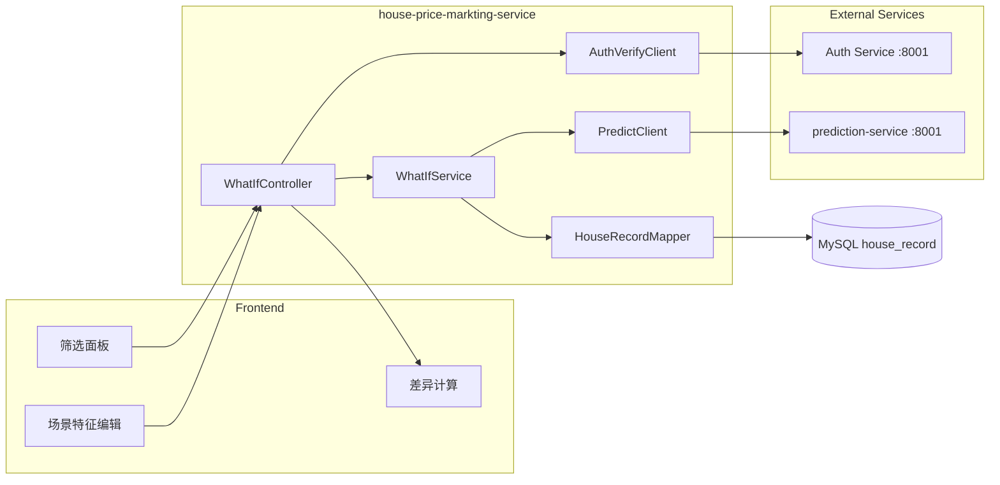
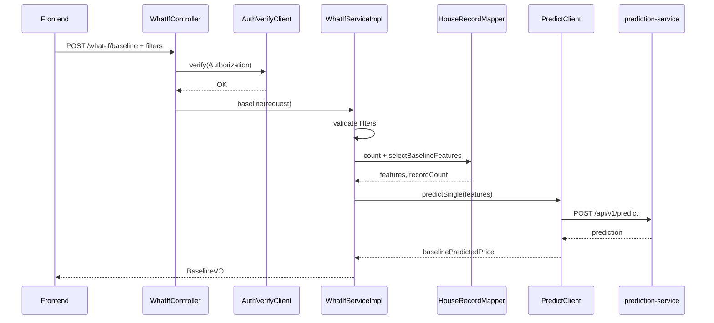
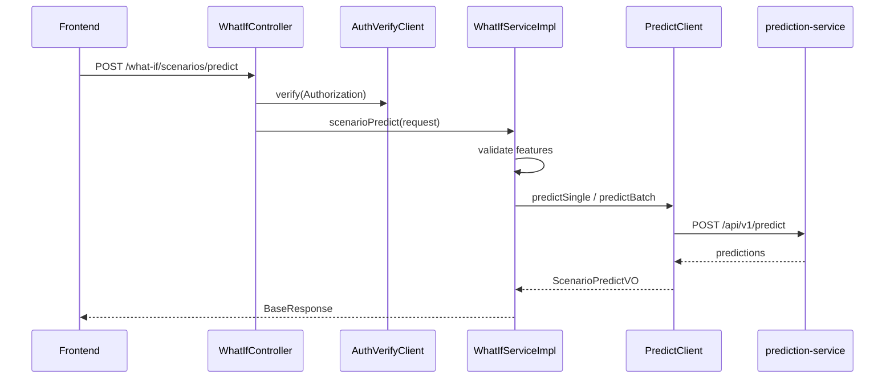
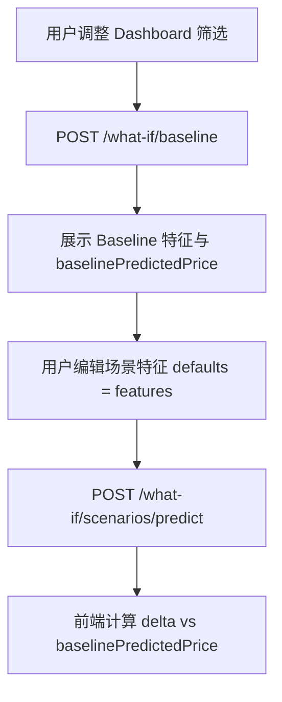
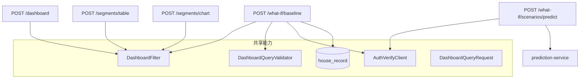

# Scenarios What-if 详细设计

## 1. 设计目标

基于 `requirements/scenarios-what-if.md` 中 What-if 场景分析需求，后端提供：

1. **Baseline**：按当前 Dashboard 筛选条件过滤 `house_record`，对各房屋特征字段求 **中位数（median）**，组装为 `HouseFeatures` 作为分析基准。
2. **Scenarios 预测**：接收用户设定的场景特征（`HouseFeatures`），调用 **prediction-service** `POST /api/v1/predict` 返回预测房价。
3. **与 Baseline 对比**：由**前端**计算场景预测价相对 Baseline 预测价的差异；后端仅返回 Baseline 特征、Baseline 预测价与场景预测价等原始数据。

本设计复用 `house_record` 表、`DashboardFilter` SQL 片段、`DashboardQueryRequest` 筛选语义、`DashboardQueryValidator` 参数校验与 `AuthVerifyClient` 外部 Token 校验，与 Dashboard / Segments 保持一致。

数据库表结构见 `docs/spec/dashboard/normalCR/db-design/dashboard-db-design.md`。

## 2. 需求范围

### 2.1 功能范围

| 编号 | 需求来源 | 后端职责 |
| --- | --- | --- |
| R1 | 1.2.1 Baseline | 按 filter 过滤数据集 S，对 7 个特征字段分别求 median，返回 `HouseFeatures` |
| R2 | 1.2.2 Scenarios | 代理调用 prediction-service，对单笔或批次 `HouseFeatures` 返回预测价 |
| R3 | 1.2.3 对比 | 不在服务端计算 diff；在 API 契约中约定前端计算公式 |

**Baseline 特征字段（与 prediction-service 一致）：**

| 字段 | DB 列 | 类型 | median 后处理 |
| --- | --- | --- | --- |
| square_footage | square_footage | DECIMAL | 保留 2 位小数 |
| bedrooms | bedrooms | INT | 四舍五入为整数 |
| bathrooms | bathrooms | DECIMAL(3,1) | 保留 1 位小数 |
| year_built | year_built | INT | 四舍五入为整数 |
| lot_size | lot_size | DECIMAL | 保留 2 位小数 |
| distance_to_city_center | distance_to_city_center | DECIMAL | 保留 2 位小数 |
| school_rating | school_rating | DECIMAL | 保留 2 位小数 |

### 2.2 非功能范围

1. 本次不包含前端页面与图表实现；第 11 节为联调契约。
2. 不新增数据库表；Baseline median 在查询时实时计算。
3. 不支持 What-if 结果持久化、历史场景版本管理。
4. 不在本服务内训练或部署模型；模型能力完全依赖外部 prediction-service。

## 3. 总体架构



| 层级 | 类/接口 | 职责 |
| --- | --- | --- |
| Controller | `WhatIfController` | `/what-if/baseline`、`/what-if/scenarios/predict` 入口；Token 前置校验 |
| Client | `AuthVerifyClient` | 复用，外部 Token 校验 |
| Client | `PredictClient` | 调用 prediction-service `/api/v1/predict` |
| Service | `WhatIfService` | Baseline 编排、场景预测编排 |
| Service Impl | `WhatIfServiceImpl` | 参数校验、空数据判断、响应组装 |
| Mapper | `HouseRecordMapper` | `selectBaselineFeatures` 聚合 median |
| Request | `WhatIfBaselineQueryRequest` | 继承 `DashboardQueryRequest`，承载筛选 |
| Request | `ScenarioPredictRequest` | 场景 `HouseFeatures`（单笔或批次） |
| VO | `HouseFeaturesVO`、`BaselineVO`、`ScenarioPredictVO` 等 | 对外响应 |

## 4. 模块文件设计

建议新增或修改文件：

| 文件 | 操作 | 说明 |
| --- | --- | --- |
| `module/whatif/controller/WhatIfController.java` | 新增 | What-if 接口入口 |
| `module/whatif/service/WhatIfService.java` | 新增 | Service 接口 |
| `module/whatif/service/impl/WhatIfServiceImpl.java` | 新增 | Service 实现 |
| `module/whatif/client/PredictClient.java` | 新增 | prediction-service HTTP 客户端 |
| `module/whatif/entity/dto/PredictRequest.java` | 新增 | 单笔预测请求（snake_case） |
| `module/whatif/entity/dto/PredictBatchRequest.java` | 新增 | 批次预测（JSON 数组） |
| `module/whatif/entity/dto/PredictResponse.java` | 新增 | 外部预测响应包装 |
| `module/whatif/entity/dto/PredictDataDTO.java` | 新增 | `mode` / `count` / `prediction` / `predictions` |
| `module/whatif/entity/request/WhatIfBaselineQueryRequest.java` | 新增 | Baseline 查询（等同 Dashboard 筛选） |
| `module/whatif/entity/request/ScenarioPredictRequest.java` | 新增 | 场景预测请求 |
| `module/whatif/entity/vo/HouseFeaturesVO.java` | 新增 | 7 维房屋特征 |
| `module/whatif/entity/vo/BaselineVO.java` | 新增 | Baseline 响应 |
| `module/whatif/entity/vo/ScenarioPredictVO.java` | 新增 | 场景预测响应 |
| `module/whatif/entity/vo/ScenarioPredictItemVO.java` | 新增 | 批次中单条结果（可选） |
| `module/dashboard/mapper/HouseRecordMapper.java` | 修改 | 新增 `selectBaselineFeatures` |
| `src/main/resources/mapper/HouseRecordMapper.xml` | 修改 | Baseline median SQL |
| `src/main/resources/application.yml` | 修改 | 增加 `prediction.predict-url` 等配置 |
| `module/whatif/...` 对应测试类 | 新增 | 见第 14 节 |

**复用（不重复实现）：**

- `AuthVerifyClient`、`DashboardQueryValidator`
- `DashboardQueryRequest.resolve` 合并逻辑（Baseline 请求体与之相同）
- `HouseRecordMapper.xml` 中 `<sql id="DashboardFilter">`

## 5. API 设计

### 5.1 接口清单

| 接口 | 方法 | 路径 | 响应类型 | 说明 |
| --- | --- | --- | --- | --- |
| baseline | POST | `/what-if/baseline` | `BaseResponse<BaselineVO>` | 按筛选条件计算 Baseline 特征；可选一并返回 Baseline 预测价 |
| scenarioPredict | POST | `/what-if/scenarios/predict` | `BaseResponse<ScenarioPredictVO>` | 对用户设定场景调用预测服务 |

服务 `context-path` 为 `/api`，完整路径示例：`POST /api/what-if/baseline`。

### 5.2 认证

与 Dashboard / Segments 一致：

| 项 | 值 |
| --- | --- |
| 请求头 | `Authorization: Bearer <token>` |
| 校验时机 | 任何数据库查询或外部预测调用之前 |
| 外部校验 URL | `http://114.67.76.100:8001/api/v1/auth/verify` |
| 外部校验方法 | GET |

### 5.3 Baseline 接口

#### 5.3.1 请求

**路径：** `POST /what-if/baseline`  
**Body：** `WhatIfBaselineQueryRequest`（字段与 `DashboardQueryRequest` 完全一致，**不包含** `priceBucketCount`、`scatterLimit`）

支持与 Dashboard 相同的 `filters` 嵌套及 body / query 合并（`resolve`）。

**请求示例：**

```json
{
  "minSquareFootage": 1000,
  "maxSquareFootage": 2200,
  "minBedrooms": 2,
  "maxBedrooms": 4
}
```

#### 5.3.2 响应

```json
{
  "code": 200,
  "msg": "success",
  "data": {
    "recordCount": 856,
    "features": {
      "squareFootage": 1280.00,
      "bedrooms": 3,
      "bathrooms": 2.0,
      "yearBuilt": 2014,
      "lotSize": 3200.00,
      "distanceToCityCenter": 7.80,
      "schoolRating": 8.40
    },
    "baselinePredictedPrice": 283958.86
  }
}
```

| 字段 | 类型 | 说明 |
| --- | --- | --- |
| recordCount | Long | 筛选后记录数 \|S\| |
| features | HouseFeaturesVO | 各特征 median 组成的 Baseline |
| baselinePredictedPrice | BigDecimal | 将 `features` 送入 prediction-service 得到的预测价；保留 2 位小数 |

**说明：** `baselinePredictedPrice` 便于前端一次拿到「基准价」，避免单独再调场景接口；若实现希望极简，也可拆成仅返回 `features`，由前端再调 predict——**推荐本服务内聚返回**，减少前端往返与字段不一致风险。

筛选后 `recordCount = 0`：不调用预测服务，返回业务错误（见第 10 节）。

#### 5.3.3 Controller 示例

```java
@PostMapping("/baseline")
public BaseResponse<BaselineVO> baseline(
        @RequestHeader(value = "Authorization", required = false) String authorization,
        @RequestBody(required = false) WhatIfBaselineQueryRequest body,
        @ModelAttribute WhatIfBaselineQueryRequest queryParams) {
    authVerifyClient.verify(authorization);
    WhatIfBaselineQueryRequest request = Optional.ofNullable(body)
            .orElseGet(WhatIfBaselineQueryRequest::new)
            .resolve(queryParams);
    return Result.success(whatIfService.baseline(request));
}
```

### 5.4 场景预测接口

#### 5.4.1 请求

**路径：** `POST /what-if/scenarios/predict`  
**Body：** `ScenarioPredictRequest`

**单笔场景：**

```json
{
  "features": {
    "squareFootage": 1500,
    "bedrooms": 4,
    "bathrooms": 2.5,
    "yearBuilt": 2018,
    "lotSize": 4000,
    "distanceToCityCenter": 5.0,
    "schoolRating": 9.0
  }
}
```

**批次场景（可选，用于多方案对比）：**

```json
{
  "featuresList": [
    { "squareFootage": 1500, "bedrooms": 4, "...": "..." },
    { "squareFootage": 1200, "bedrooms": 3, "...": "..." }
  ]
}
```

| 参数 | 类型 | 必填 | 说明 |
| --- | --- | --- | --- |
| features | HouseFeaturesVO | 与 featuresList 二选一 | 单笔场景 |
| featuresList | List\<HouseFeaturesVO\> | 与 features 二选一 | 多场景批次 |

特征校验（调用预测前）：

| 字段 | 规则 |
| --- | --- |
| squareFootage | `> 0` |
| bedrooms | `>= 0` 整数 |
| bathrooms | `>= 0` |
| yearBuilt | `[1800, currentYear]` 整数 |
| lotSize | `> 0` |
| distanceToCityCenter | `>= 0` |
| schoolRating | `[0, 10]` |

#### 5.4.2 响应

**单笔：**

```json
{
  "code": 200,
  "msg": "success",
  "data": {
    "mode": "single",
    "count": 1,
    "predictedPrice": 315420.50,
    "predictions": [315420.50]
  }
}
```

**批次：**

```json
{
  "code": 200,
  "msg": "success",
  "data": {
    "mode": "batch",
    "count": 2,
    "predictions": [315420.50, 298100.00]
  }
}
```

| 字段 | 说明 |
| --- | --- |
| mode | `single` / `batch`，与 prediction-service 一致 |
| count | 预测条数 |
| predictedPrice | 单笔时等于 `predictions[0]`，便于前端读取 |
| predictions | 预测价格列表，与请求顺序一致 |

### 5.5 HouseFeaturesVO 结构

Java 侧 camelCase，调用 prediction-service 时映射为 snake_case：

```java
@Data
@Accessors(chain = true)
public class HouseFeaturesVO implements Serializable {
    private BigDecimal squareFootage;
    private Integer bedrooms;
    private BigDecimal bathrooms;
    private Integer yearBuilt;
    private BigDecimal lotSize;
    private BigDecimal distanceToCityCenter;
    private BigDecimal schoolRating;
}
```

对外 JSON（API 响应）使用 camelCase；`PredictClient` 出站使用 `@JsonProperty`：

| Java | JSON（prediction-service） |
| --- | --- |
| squareFootage | square_footage |
| yearBuilt | year_built |
| lotSize | lot_size |
| distanceToCityCenter | distance_to_city_center |
| schoolRating | school_rating |

## 6. Baseline 计算设计

### 6.1 算法（与需求对齐）

```
输入: DashboardQueryRequest filter
Step 1: S = { row ∈ house_record | row 满足 DashboardFilter(filter) }
Step 2: 若 |S| = 0 → 业务错误
Step 3: 对 S 中每一列计算 median（与 selectMedianPrice 相同窗口算法）
Step 4: 按字段类型舍入 → HouseFeaturesVO
Step 5: 调用 PredictClient.predict(features) → baselinePredictedPrice
Step 6: 返回 BaselineVO(recordCount, features, baselinePredictedPrice)
```

### 6.2 Median SQL 设计

在 `HouseRecordMapper.xml` 新增 `selectBaselineFeatures`，**一次查询**返回 7 个 median，避免 7 次往返。

实现思路：对筛选后的子集，每个数值列复用与 `selectMedianPrice` 相同的 `ROW_NUMBER` 中位数逻辑，用标量子查询或 CTE 聚合。示例结构（实现时可拆为 `BaselineMedian` SQL 片段复用）：

```sql
SELECT
    (SELECT ROUND(AVG(square_footage), 2) FROM (...) t WHERE col = 'square_footage') AS squareFootage,
    (SELECT ROUND(AVG(bedrooms), 0) FROM (...) t WHERE col = 'bedrooms') AS bedrooms,
    ...
FROM house_record
<include refid="DashboardFilter"/>
```

每个 `(...)` 子查询内部：

```sql
SELECT column_value AS val
FROM (
    SELECT column_value,
           ROW_NUMBER() OVER (ORDER BY column_value) AS row_num,
           COUNT(*) OVER () AS total_count
    FROM house_record
    <include refid="DashboardFilter"/>
) ranked
WHERE row_num IN (FLOOR((total_count + 1) / 2), FLOOR((total_count + 2) / 2))
```

| 列 | median 后 ROUND |
| --- | --- |
| square_footage, lot_size, distance_to_city_center, school_rating | 2 位 |
| bathrooms | 1 位 |
| bedrooms, year_built | 0 位（整数） |

### 6.3 Service 伪代码

```java
public BaselineVO baseline(WhatIfBaselineQueryRequest request) {
    WhatIfBaselineQueryRequest query = Optional.ofNullable(request)
            .orElseGet(WhatIfBaselineQueryRequest::new);
    dashboardQueryValidator.validate(query);

    Long recordCount = houseRecordMapper.countByFilter(query);
    if (recordCount == null || recordCount == 0) {
        throw new BusinessException(RespCode.ERROR_OPERATION, "筛选后无数据，无法计算 Baseline");
    }

    HouseFeaturesVO features = houseRecordMapper.selectBaselineFeatures(query);
    BigDecimal baselinePrice = predictClient.predictSingle(features);

    return new BaselineVO()
            .setRecordCount(recordCount)
            .setFeatures(features)
            .setBaselinePredictedPrice(baselinePrice);
}
```

## 7. Scenarios 预测设计（PredictClient）

### 7.1 外部接口契约

已通过联调确认（prediction-service 与 auth 同 host `114.67.76.100:8001`）：

| 项 | 值 |
| --- | --- |
| URL | `http://114.67.76.100:8001/api/v1/predict` |
| Method | POST |
| Content-Type | application/json |
| 单笔 Body | 单个 `HouseFeatures` 对象（snake_case 字段） |
| 批次 Body | `HouseFeatures` 数组 JSON |
| 成功响应 | `{"code":200,"msg":"...","data":{...}}` |

**单笔响应 data：**

```json
{
  "mode": "single",
  "count": 1,
  "prediction": 283958.86372401624,
  "predictions": [283958.86372401624]
}
```

**批次响应 data：**

```json
{
  "mode": "batch",
  "count": 2,
  "predictions": [283958.86, 235389.05]
}
```

### 7.2 PredictClient 职责

1. 将 `HouseFeaturesVO` 转为 snake_case 请求体。
2. 单笔：`POST` 发送对象；批次：`POST` 发送 `List`。
3. 解析 `PredictResponse`，校验 `code == 200`。
4. 将 `prediction` / `predictions` 转为 `BigDecimal`，**对外统一保留 2 位小数**（`HALF_UP`）。
5. 422 参数错误、5xx、超时 → 抛出 `BusinessException`，消息不暴露内部堆栈。

### 7.3 配置项

```yaml
prediction:
  predict-url: http://114.67.76.100:8001/api/v1/predict
  connect-timeout: 5s
  read-timeout: 10s
```

预测耗时可能高于 auth verify，读取超时建议 10 秒。

### 7.4 实现建议

```java
@Component
public class PredictClient {
    public BigDecimal predictSingle(HouseFeaturesVO features) { ... }

    public List<BigDecimal> predictBatch(List<HouseFeaturesVO> featuresList) { ... }
}
```

使用 Spring `RestClient`，风格与 `AuthVerifyClient` 一致。prediction-service **当前联调无需**透传 `Authorization`；若后续要求鉴权，再扩展 header 透传。

## 8. 核心处理流程

### 8.1 Baseline



### 8.2 Scenario Predict



### 8.3 推荐前端工作流



## 9. 前端对比契约（需求 1.2.3）

对比逻辑**不在后端实现**，由前端在拿到价格后计算：

| 指标 | 公式 | 说明 |
| --- | --- | --- |
| 价格差额 | `scenarioPredictedPrice - baselinePredictedPrice` | 绝对值差 |
| 价格变化率 | `(scenario - baseline) / baseline * 100` | `baseline == 0` 时展示 `-` 或 0% |
| 特征差异（可选） | `scenario.features.field - baseline.features.field` | 用于展示用户调整了哪些维度 |

**约定：**

1. `baselinePredictedPrice` 一律来自 **Baseline 接口**（median 特征 → 模型预测），不用历史成交价。
2. 场景价来自 **Scenarios predict 接口**。
3. 用户仅改筛选、未改场景特征时，场景价应等于 Baseline 价（允许小数误差 ±0.01）。

## 10. 异常与边界处理

| 场景 | 后端行为 |
| --- | --- |
| 缺少 / 非法 `Authorization` | 不查库、不调预测，返回未授权 |
| 外部 Token 校验失败 / 超时 | 不查库、不调预测 |
| 筛选区间参数非法 | `BusinessException(ERROR_PARAMETER)` |
| 筛选后 `recordCount = 0` | 不计算 median、不调预测；`ERROR_OPERATION` + 明确文案 |
| 场景请求 features 与 featuresList 均为空 | 参数错误 |
| 场景特征字段缺失或越界 | 参数错误 |
| prediction-service 返回 422 | 透传或包装为参数错误 |
| prediction-service 超时 / 5xx | `ERROR_OPERATION`「预测服务不可用」 |
| 批次 featuresList 为空列表 | 参数错误 |
| 批次 size 过大 | 建议上限 50（可配置），超出返回参数错误 |

## 11. 性能与安全

1. Token 校验先于数据库与 prediction 调用，未授权请求不占用下游资源。
2. Baseline 7 列 median 合并为 **单次 SQL**，避免多次扫描 `house_record`。
3. 筛选字段已有索引（见 dashboard-db-design），与 Dashboard 相同。
4. `PredictClient` 配置合理超时；预测失败快速失败，不无限阻塞 Tomcat 线程。
5. 不在日志中打印完整 token；预测请求可记录 `recordCount`、`mode`、耗时，不记录完整特征向量（可选 debug 级别）。
6. SQL 参数绑定，禁止拼接筛选值。

## 12. 与 Dashboard / Segments 的关系



- **Dashboard**：展示筛选后真实成交价分布与指标。
- **Segments**：按维度分组看价格统计。
- **What-if**：在同一筛选语义下构造「典型房屋」（median 特征）并做反事实价格预测。

前端宜维护**一份与 Dashboard 共用的筛选状态**，变更筛选时同时刷新 Dashboard 与 Baseline。

## 13. 测试设计

### 13.1 WhatIfServiceImplTest

1. 空筛选、有数据 → 返回非空 `features` 与 `baselinePredictedPrice`。
2. 筛选后无数据 → 抛业务异常，不调用 `PredictClient`。
3. 非法 `minBedrooms > maxBedrooms` → 参数错误。
4. `scenarioPredict` 单笔：mock `PredictClient` 返回固定价格。
5. `scenarioPredict` 批次：顺序与 `featuresList` 一致。

### 13.2 PredictClientTest

1. 单笔请求体字段名为 snake_case。
2. 解析 `mode=single` 时 `predictedPrice` 正确。
3. 批次请求为 JSON 数组。
4. 外部 422 / 超时 → 对应业务异常。

### 13.3 HouseRecordMapperTest

准备 3 条已知数据（与 dashboard-detail-design 测试表相同），断言：

1. 无筛选时各 median 与手算一致。
2. `minPrice=200000` 后 `recordCount` 减少，median 变化。
3. 无匹配筛选 → `selectBaselineFeatures` 无行或 count=0。

### 13.4 WhatIfControllerTest

1. 无 Token 不调用 Service。
2. Token 通过后返回 `BaseResponse<BaselineVO>` / `ScenarioPredictVO`。
3. body / query 合并与 Dashboard 行为一致。

## 14. 验收标准

1. 存在 `POST /what-if/baseline`，查库与调预测前完成 Token 校验。
2. Baseline 支持 Dashboard 全部 Min / Max 筛选字段及 `filters` 嵌套。
3. 筛选后非空时，返回 7 维 `features` 为各列 median，且类型/精度符合第 6.2 节。
4. Baseline 响应包含 `baselinePredictedPrice`（median 特征经 prediction-service 预测）。
5. 存在 `POST /what-if/scenarios/predict`，支持单笔与批次场景特征预测。
6. 场景预测结果与直接调用 `http://114.67.76.100:8001/api/v1/predict` 一致（精度统一到 2 位小数）。
7. 筛选后无数据、非法参数、预测服务不可用等边界符合第 10 节。
8. 前端可按第 9 节公式完成与 Baseline 的对比展示。
9. 单元测试与接口测试通过。

## 15. 后续可拆分文档（可选）

实现阶段可另补：

| 文档 | 路径建议 |
| --- | --- |
| API 契约 | `docs/spec/what-if/normalCR/api-design/scenarios-what-if-api-design.md` |
| 实现任务拆解 | `docs/spec/what-if/normalCR/task/scenarios-what-if-backend-task.md` |

本详细设计已包含 API 与实现要点，可直接指导开发；若 API 独立成文，以 API 文档为对外契约准绳，本设计侧重后端实现方案。
