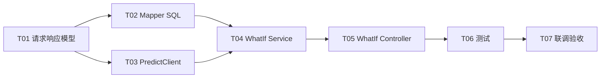

# Scenarios What-if 后端开发任务拆分

## 1. 任务目标

基于以下文档完成 Scenarios What-if **后端**开发：

| 文档 | 路径 |
| --- | --- |
| 需求 | `requirements/scenarios-what-if.md` |
| API 设计 | `api-design/scenarios-what-if-api-design.md` |
| DB 设计 | `db-design/scenarios-what-if-db-design.md` |
| 详细设计 | `detail-design/scenarios-what-if-detail-design.md` |

最终交付两个接口：

1. `POST /what-if/baseline` — 按筛选条件计算 Baseline 特征（7 列 median）及 `baselinePredictedPrice`
2. `POST /what-if/scenarios/predict` — 对用户设定场景特征调用 prediction-service 返回预测价（单笔/批次）

两接口在查库或调预测前完成与 Dashboard 相同的外部 Token 校验；Baseline 支持与 `POST /dashboard` 一致的 Min / Max 区间筛选。

## 2. 开发范围

### 2.1 范围内

1. 新增 What-if 模块：请求/响应模型、DTO、Service、Controller。
2. 新增 `PredictClient`，代理调用 `http://114.67.76.100:8001/api/v1/predict`。
3. 扩展 `HouseRecordMapper`：`countByFilter`、`selectBaselineFeatures`。
4. 复用 `AuthVerifyClient`、`DashboardFilter`、`DashboardQueryValidator`、`house_record` 表。
5. `application.yml` 增加 `prediction.*` 配置项。
6. 单元测试、Mapper 集成测试、Controller 测试。

### 2.2 范围外

1. 前端页面及 Baseline 与场景价的**对比计算**（前端按 API 设计第 7 节实现）。
2. 新增数据库表、What-if 结果持久化、历史场景版本。
3. 模型训练与 prediction-service 本身改造。
4. Baseline / 预测结果缓存（可作为后续优化）。

### 2.3 前置依赖（已完成）

| 能力 | 现状 |
| --- | --- |
| `house_record` 表与初始化数据 | Dashboard 已落地 |
| `DashboardFilter` SQL 片段 | `HouseRecordMapper.xml` 已有 |
| `DashboardQueryRequest` 及 `resolve` | 已有，Baseline 请求继承扩展 |
| `DashboardQueryValidator.validateFilters` | 已有，What-if Baseline 直接复用 |
| `AuthVerifyClient` | `module/dashboard/client` 已有，直接注入复用 |

## 3. 需求与设计对照

| 需求项 | 设计落点 | 任务 |
| --- | --- | --- |
| 1.2.1 按 filter 求 median → HouseFeatures | `selectBaselineFeatures` + `BaselineVO.features` | T02、T04 |
| 1.2.1 Baseline 预测价 | `PredictClient` + `baselinePredictedPrice` | T03、T04 |
| 1.2.2 场景预测 | `POST /what-if/scenarios/predict` | T03、T04、T05 |
| 1.2.3 与 Baseline 对比 | 前端计算，API 文档约定公式 | 不实现后端 diff |
| 与 Dashboard 相同筛选 | `DashboardFilter` + `WhatIfBaselineQueryRequest` | T01、T02、T04 |
| Token 校验 | `AuthVerifyClient.verify` | T05（复用） |
| 筛选后无数据 | `recordCount=0` → 业务错误 | T02、T04 |

## 4. 任务依赖关系



> **说明：** T01 与 T03 可并行；T02 依赖 T01 中的 `HouseFeaturesVO`；T04 依赖 T02 + T03；T05 依赖 T04。

## 5. 任务拆分

### T01 What-if 请求、响应与 DTO 模型

优先级：P0

预计工作量：0.5 人日

涉及文件：

| 文件 | 操作 | 说明 |
| --- | --- | --- |
| `module/whatif/entity/request/WhatIfBaselineQueryRequest.java` | 新增 | 继承 `DashboardQueryRequest` |
| `module/whatif/entity/request/ScenarioPredictRequest.java` | 新增 | 场景预测请求 |
| `module/whatif/entity/vo/HouseFeaturesVO.java` | 新增 | 7 维房屋特征 |
| `module/whatif/entity/vo/BaselineVO.java` | 新增 | Baseline 响应 |
| `module/whatif/entity/vo/ScenarioPredictVO.java` | 新增 | 场景预测响应 |
| `module/whatif/entity/dto/PredictRequest.java` | 新增 | 出站单笔预测（snake_case） |
| `module/whatif/entity/dto/PredictResponse.java` | 新增 | 外部预测响应包装 |
| `module/whatif/entity/dto/PredictDataDTO.java` | 新增 | `mode` / `count` / `prediction` / `predictions` |

开发内容：

1. **`WhatIfBaselineQueryRequest`**：
   - 继承 `DashboardQueryRequest`，不增加 `priceBucketCount`、`scatterLimit`。
   - 嵌套 `filters` 类型为 `WhatIfBaselineQueryRequest`。
   - 实现 `resolve(WhatIfBaselineQueryRequest queryParams)`，合并规则：**body > query/form > filters**。
2. **`ScenarioPredictRequest`**：
   - 字段 `features`（单笔）与 `featuresList`（批次）二选一。
   - Swagger 标注字段说明。
3. **`HouseFeaturesVO`**：7 个特征字段，类型与 API 设计一致；供 Mapper 映射与预测出站复用。
4. **预测 DTO**：
   - `PredictRequest` 使用 `@JsonProperty` 映射 snake_case（`square_footage`、`year_built` 等）。
   - `PredictResponse` 含 `code`、`msg`、`data`；`PredictDataDTO` 含 `mode`、`count`、`prediction`、`predictions`。
5. **`BaselineVO`** / **`ScenarioPredictVO`**：字段与 API 设计一致；金额 `BigDecimal`。

验收标准：

1. 模型字段与 API / DB 设计一致。
2. `WhatIfBaselineQueryRequest.resolve` 行为可通过单元测试覆盖。
3. `PredictRequest` JSON 序列化为 snake_case（单测或 Jackson 测试）。
4. 项目编译通过。

---

### T02 Mapper 与 Baseline SQL 开发

优先级：P0

预计工作量：1 人日

涉及文件：

| 文件 | 操作 | 说明 |
| --- | --- | --- |
| `module/dashboard/mapper/HouseRecordMapper.java` | 修改 | 新增两个查询方法 |
| `src/main/resources/mapper/HouseRecordMapper.xml` | 修改 | Baseline median SQL |

开发内容：

1. **`countByFilter`**：
   ```java
   Long countByFilter(@Param("request") WhatIfBaselineQueryRequest request);
   ```
   ```sql
   SELECT COUNT(*) FROM house_record <include refid="DashboardFilter"/>
   ```
2. **`selectBaselineFeatures`**：
   - 一次 SELECT 返回 7 列 median（见 `scenarios-what-if-db-design.md` 第 6.3 节）。
   - 算法与 `selectMedianPrice` 相同：`ROW_NUMBER` + 中间两行 `AVG`。
   - ROUND：`square_footage`/`lot_size`/`distance`/`school_rating` 2 位；`bathrooms` 1 位；`bedrooms`/`year_built` 0 位。
   - `resultType` 映射 `HouseFeaturesVO`。
3. 两方法均 `<include refid="DashboardFilter"/>`，`request` 为 `WhatIfBaselineQueryRequest`。
4. 列名 `${}` 仅允许 XML 内写死的白名单，禁止用户输入拼接。

验收标准：

1. 无筛选、样例 3 条数据：median 与 DB 设计第 11.1 节期望值一致。
2. `minPrice=200000` 后 `recordCount=2`，median 变化符合第 11.2 节。
3. `minPrice=500000` 时 `countByFilter=0`。
4. 筛选条件与 Dashboard 同一请求体下 `countByFilter` 与 Dashboard `totalRecords` 一致。

---

### T03 PredictClient 与配置开发

优先级：P0

预计工作量：1 人日

涉及文件：

| 文件 | 操作 | 说明 |
| --- | --- | --- |
| `module/whatif/client/PredictClient.java` | 新增 | prediction-service HTTP 客户端 |
| `src/main/resources/application.yml` | 修改 | 增加 `prediction.*` 配置 |

开发内容：

1. **配置项**（默认值见 API 设计第 9 节）：
   - `prediction.predict-url`
   - `prediction.connect-timeout`（5s）
   - `prediction.read-timeout`（10s）
   - `prediction.batch-max-size`（50）
2. **`predictSingle(HouseFeaturesVO)`**：
   - POST 单个 `PredictRequest`（snake_case）。
   - 解析 `code==200`，取 `data.prediction` 或 `data.predictions[0]`。
   - 返回 `BigDecimal`，`HALF_UP` 保留 2 位小数。
3. **`predictBatch(List<HouseFeaturesVO>)`**：
   - 校验列表非空且 `size <= batch-max-size`。
   - POST JSON 数组（非 `{ "items": [...] }`）。
   - 返回与请求顺序一致的 `List<BigDecimal>`。
4. **异常映射**：
   - HTTP 422 → `ERROR_PARAMETER`（可带简要 msg）。
   - 超时 / 5xx / 响应缺失 → `ERROR_OPERATION`「预测服务不可用」。
5. 日志不打印完整特征向量（可选 debug）；风格对齐 `AuthVerifyClient`（`RestClient` + 超时工厂）。

验收标准：

1. 单笔请求体字段为 snake_case（Mock 或 WireMock 断言 body）。
2. 批次请求体为 JSON 数组。
3. 外部返回 `mode=single` / `batch` 均可正确解析。
4. 422、超时、5xx 抛出预期 `BusinessException`。
5. 测试使用 Mock，不依赖公网 prediction-service（联调阶段再验真机）。

---

### T04 WhatIf Service 开发

优先级：P0

预计工作量：1 人日

涉及文件：

| 文件 | 操作 | 说明 |
| --- | --- | --- |
| `module/whatif/service/WhatIfService.java` | 新增 | 接口 |
| `module/whatif/service/impl/WhatIfServiceImpl.java` | 新增 | 实现 |

开发内容：

1. 定义：
   - `BaselineVO baseline(WhatIfBaselineQueryRequest request)`
   - `ScenarioPredictVO scenarioPredict(ScenarioPredictRequest request)`
2. **`baseline`**：
   - 空请求 → 新 `WhatIfBaselineQueryRequest`。
   - `dashboardQueryValidator.validateFilters(query)`（**不**校验 `priceBucketCount` / `scatterLimit`）。
   - `countByFilter`；若为 0 → `BusinessException(ERROR_OPERATION, "筛选后无数据，无法计算 Baseline")`，**不**调 Mapper median、不调预测。
   - `selectBaselineFeatures` → `predictClient.predictSingle(features)`。
   - 组装 `BaselineVO(recordCount, features, baselinePredictedPrice)`。
3. **`scenarioPredict`**：
   - 校验 `features` 与 `featuresList` 二选一且非空。
   - 校验每个 `HouseFeaturesVO` 全部 7 字段及取值范围（见 API 设计第 5.3 节）；可抽私有 `validateFeatures`。
   - 单笔 → `predictSingle`；批次 → `predictBatch`。
   - 组装 `ScenarioPredictVO`：`mode`、`count`、`predictions`；单笔时设置 `predictedPrice=predictions.get(0)`。
4. **不**在 Service 计算 `deltaPrice` / `deltaPercent`。

验收标准：

1. 非法区间 → `ERROR_PARAMETER`。
2. `recordCount=0` → `ERROR_OPERATION`，且未调用 `PredictClient`（Mock 验证）。
3. 合法 Baseline 返回完整 `features` 与 `baselinePredictedPrice`。
4. 场景单笔/批次预测路径正确；批次超限 → `ERROR_PARAMETER`。
5. `features` 与 `featuresList` 同时存在或均缺失 → `ERROR_PARAMETER`。

---

### T05 WhatIf Controller 开发

优先级：P0

预计工作量：0.5 人日

涉及文件：

| 文件 | 操作 | 说明 |
| --- | --- | --- |
| `module/whatif/controller/WhatIfController.java` | 新增 | What-if 接口入口 |

开发内容：

1. `@RequestMapping("/what-if")`，注入 `AuthVerifyClient`、`WhatIfService`。
2. **`POST /baseline`**：
   - `Authorization`、`@RequestBody` + `@ModelAttribute WhatIfBaselineQueryRequest`。
   - `authVerifyClient.verify` 先于 Service。
   - `resolve(body, queryParams)` 写法与 `DashboardController` 一致。
3. **`POST /scenarios/predict`**：
   - `Authorization`、`@RequestBody ScenarioPredictRequest`（必填）。
   - 先 verify，再 `whatIfService.scenarioPredict(request)`。
4. 返回 `Result.success(...)`。

验收标准：

1. 无 Token / 无效 Token 时不调用 `WhatIfService`。
2. 路径、方法、响应类型与 `scenarios-what-if-api-design.md` 一致。
3. Swagger 展示 Baseline 筛选字段与场景特征字段说明。

---

### T06 测试开发

优先级：P0

预计工作量：1.5 人日

涉及文件：

| 文件 | 操作 | 说明 |
| --- | --- | --- |
| `src/test/.../whatif/service/WhatIfServiceImplTest.java` | 新增 | Service 单元测试 |
| `src/test/.../whatif/client/PredictClientTest.java` | 新增 | 预测客户端测试 |
| `src/test/.../whatif/controller/WhatIfControllerTest.java` | 新增 | Controller 测试 |
| `src/test/.../whatif/entity/request/WhatIfBaselineQueryRequestTest.java` | 新增 | resolve 合并测试（可选） |
| `src/test/.../dashboard/mapper/HouseRecordMapperTest.java` | 修改 | 追加 Baseline Mapper 用例 |

测试内容：

1. **WhatIfServiceImplTest**（Mock Mapper + PredictClient）
   - 有数据时返回 `features` 与 `baselinePredictedPrice`。
   - `countByFilter=0` 抛业务异常且不调用 `PredictClient`。
   - `minBedrooms > maxBedrooms` 失败。
   - 场景：`features` 单笔成功；`featuresList` 批次顺序一致。
   - `features` 与 `featuresList` 均空 / 同时存在 → 参数错误。
   - 特征越界（如 `schoolRating=11`）→ 参数错误。
2. **PredictClientTest**（Mock RestClient / MockWebServer）
   - 单笔 body 为 snake_case。
   - 批次 body 为数组。
   - 解析 `mode=single` / `batch`；价格保留 2 位小数。
   - 422、超时、5xx → 对应异常。
3. **HouseRecordMapperTest**（集成）
   - 无筛选：7 列 median 与 DB 设计第 11.1 节一致。
   - `minPrice=200000`：`recordCount=2`，median 符合第 11.2 节。
   - `minPrice=500000`：`countByFilter=0`。
4. **WhatIfControllerTest**
   - `/what-if/baseline`、`/what-if/scenarios/predict` 无 Token 均不调用 Service。
   - 合法 Token 返回对应 VO 类型。
   - Baseline body/query 合并（可选 1 用例）。

验收标准：

1. `mvn test` 通过。
2. 新增用例不依赖真实外部认证与 prediction 服务（Mock）。
3. 现有 Dashboard / Segments 测试无回归。

---

### T07 联调与验收

优先级：P1

预计工作量：0.5 人日

涉及内容：

1. 启动服务，使用合法 Token 调用 `POST /api/what-if/baseline`（无筛选 / 带筛选）。
2. 使用返回的 `features` 调用 `POST /api/what-if/scenarios/predict`（先不改字段，验证与 Baseline 价接近）。
3. 修改场景特征后再次 predict，人工核对价格变化合理。
4. 直接调用 `http://114.67.76.100:8001/api/v1/predict` 与本服务场景接口对比（2 位小数内一致）。
5. 边界：无 Token、非法区间、筛选后无数据、批次空列表、批次超 50 条、prediction 服务不可用（断网模拟）。

验收标准（对齐详细设计第 14 节）：

1. 两接口查库/调预测前完成 Token 校验。
2. Baseline 支持 Dashboard 全部 Min/Max 及 `filters` 嵌套。
3. Baseline 返回 `recordCount`、`features`（7 维 median）、`baselinePredictedPrice`。
4. 筛选后无数据返回业务错误，非空成功体。
5. 场景预测支持单笔与批次；结果与 prediction-service 一致（2 位小数）。
6. 文档、代码、SQL、配置保持一致。

## 6. 推荐开发顺序

| 顺序 | 任务 | 说明 |
| --- | --- | --- |
| 1 | T01 | 模型与 DTO，解锁 Mapper 与 PredictClient |
| 2 | T02 + T03 | 可并行：SQL 与预测客户端 |
| 3 | T04 | Service 编排 Baseline + 场景预测 |
| 4 | T05 | Controller 暴露接口 |
| 5 | T06 | 测试（可与 T04/T05 交错） |
| 6 | T07 | 联调验收 |

**并行建议：** T02 与 T03 在 T01 完成后并行；T06 的 Mapper 用例可在 T02 完成后先写。

## 7. 工作量汇总

| 任务 | 优先级 | 人日 |
| --- | --- | --- |
| T01 请求响应与 DTO 模型 | P0 | 0.5 |
| T02 Mapper Baseline SQL | P0 | 1.0 |
| T03 PredictClient 与配置 | P0 | 1.0 |
| T04 WhatIf Service | P0 | 1.0 |
| T05 WhatIf Controller | P0 | 0.5 |
| T06 测试 | P0 | 1.5 |
| T07 联调验收 | P1 | 0.5 |
| **合计** | | **6.0** |

## 8. 风险与注意事项

| 风险 | 影响 | 处理建议 |
| --- | --- | --- |
| 批次预测 body 格式错误 | 422，场景接口不可用 | 联调确认：数组根节点，非 `items` 包装 |
| 出站 JSON 使用 camelCase | prediction-service 拒收 | `PredictRequest` 必须 `@JsonProperty` snake_case |
| Baseline 误校验 `priceBucketCount` | 仅筛选请求失败 | 只调 `validateFilters` |
| 筛选后无数据仍调预测 | 无意义调用、误导前端 | `countByFilter==0` 短路 |
| 7 次子查询扫描性能差 | 大数据量 Baseline 慢 | 先按 DB 设计实现；数据量大再改 CTE 单次扫描 |
| 窗口函数依赖 MySQL 8 | SQL 失败 | 与 Dashboard 一致，确认环境版本 |
| 测试依赖真实 prediction 服务 | CI 不稳定 | T06 全 Mock；T07 再验公网 |
| `HouseFeaturesVO` 与 Mapper 列别名不一致 | 映射为 null | 别名与 Java 字段名严格对齐 |

## 9. 完成定义（Definition of Done）

1. 所有 **P0** 任务（T01–T06）完成。
2. `POST /what-if/baseline`、`POST /what-if/scenarios/predict` 按 API / 详细设计实现。
3. Baseline 7 维 median 精度与 DB 设计一致；筛选语义与 Dashboard 一致。
4. **不**新增数据库表；**不**实现服务端 diff 字段。
5. `mvn test` 通过；T07 联调检查项全部满足。
6. `application.yml` 含 `prediction.*` 配置且文档一致。

## 10. 前端协作说明（非本次后端任务）

供联调参考（API 设计第 7 节）：

1. 筛选面板与 Dashboard 共用 Min/Max 状态；变更筛选时调用 `POST /what-if/baseline`。
2. 用返回的 `features` 初始化场景表单默认值。
3. 用户编辑后调用 `POST /what-if/scenarios/predict`。
4. 前端计算：
   - `priceDelta = scenarioPredictedPrice - baselinePredictedPrice`
   - `priceDeltaPercent = (scenario - baseline) / baseline * 100`
5. 可选展示各特征字段与 Baseline 的差值；**不要**要求后端增加 diff 字段。
