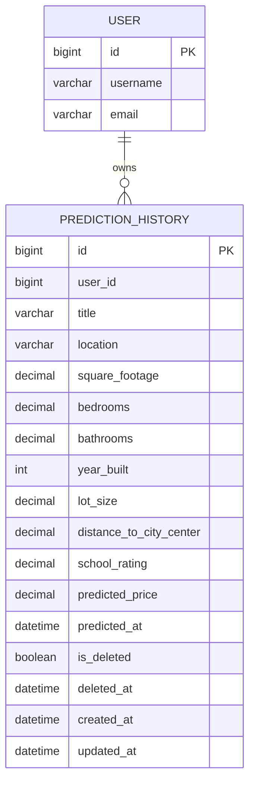

# 房价预测与预测历史功能数据库设计

## 1. 设计目标

本设计支撑房价预测历史记录的持久化、分页查询、编辑、再预测与逻辑删除功能。根据 `docs/spec/predict-history/normalCR/detail-design/price-prediction-detail-design.md`：

- 新增 MySQL 表 `prediction_history` 存储预测实例。
- 复用现有 `user` 表做用户归属，不修改 `user` 表结构。
- 删除采用逻辑删除（`is_deleted` + `deleted_at`）。
- 不新增 Redis Key；预测历史不依赖 Redis。
- 既有 `POST /api/v1/predict` 不落库，本次仅新增持久化表。

## 2. 存储对象概览

| 类型 | 名称 | 用途 | 是否新增 |
| --- | --- | --- | --- |
| MySQL 表 | `user` | 用户账号，提供 `user_id` 归属 | 否（复用） |
| MySQL 表 | `prediction_history` | 存储房价预测实例（特征、标题、位置、预测结果） | 是 |

## 3. MySQL 表设计

### 3.1 `prediction_history` 表（新增）

对应模型：`backend/app/prediction/model/prediction_history.py`

| 字段 | MySQL 类型 | 约束 | 默认值 | 说明 |
| --- | --- | --- | --- | --- |
| `id` | `BIGINT` | 主键、自增、索引 | - | 预测实例 ID |
| `user_id` | `BIGINT` | 非空、索引 | - | 归属用户 ID，对应 `user.id` |
| `title` | `VARCHAR(128)` | 可空 | `NULL` | 用户填写的标题 |
| `location` | `VARCHAR(256)` | 可空 | `NULL` | 房产位置文本（自由填写） |
| `square_footage` | `DECIMAL(12,2)` | 非空 | - | 建筑面积 |
| `bedrooms` | `DECIMAL(5,2)` | 非空 | - | 卧室数 |
| `bathrooms` | `DECIMAL(5,2)` | 非空 | - | 卫生间数 |
| `year_built` | `INT` | 非空 | - | 建成年份 |
| `lot_size` | `DECIMAL(12,2)` | 非空 | - | 占地面积 |
| `distance_to_city_center` | `DECIMAL(10,2)` | 非空 | - | 距市中心距离 |
| `school_rating` | `DECIMAL(5,2)` | 非空 | - | 学区评分 |
| `predicted_price` | `DECIMAL(18,2)` | 可空 | `NULL` | 最近一次预测结果 |
| `predicted_at` | `DATETIME` | 可空 | `NULL` | 最近一次预测时间 |
| `is_deleted` | `TINYINT(1)` / `BOOLEAN` | 非空、索引 | `0` (`false`) | 逻辑删除标记 |
| `deleted_at` | `DATETIME` | 可空 | `NULL` | 逻辑删除时间 |
| `created_at` | `DATETIME` | 非空 | 插入时写入 | 创建时间 |
| `updated_at` | `DATETIME` | 非空 | 更新时刷新 | 更新时间 |

字段设计说明：

| 项 | 说明 |
| --- | --- |
| 特征字段精度 | 7 个特征与 `HouseFeatures` 语义一致；除 `year_built` 为 `INT` 外，其余使用 `DECIMAL` 保留用户输入精度 |
| `predicted_price` | 未预测时为 `NULL`；有预测结果时与 `predicted_at` 成对出现 |
| `location` | 自由文本，不引入区域字典表 |
| 外键 | 不使用数据库外键；`user_id` 在应用层校验 |
| API 不暴露字段 | `user_id`、`is_deleted`、`deleted_at` 不在 API 响应中返回 |

### 3.2 索引与约束

| 名称 | 类型 | 字段 | 说明 |
| --- | --- | --- | --- |
| `PRIMARY` | Primary Key | `id` | 主键 |
| `idx_prediction_history_user_deleted_updated` | 联合索引 | `user_id`, `is_deleted`, `updated_at` | 列表分页主路径：按用户过滤、排除已删除、按更新时间倒序 |
| `idx_prediction_history_user_deleted_created` | 联合索引 | `user_id`, `is_deleted`, `created_at` | 按创建时间搜索/排序的备用路径 |
| `idx_prediction_history_is_deleted` | 普通索引 | `is_deleted` | 逻辑删除过滤 |

`title`、`location` 的模糊搜索（`LIKE`）暂不建索引；数据量增长后可评估全文检索。

Tortoise ORM 模型索引声明：

```python
class Meta:
    table = 'prediction_history'
    indexes = (
        ('user_id', 'is_deleted', 'updated_at'),
        ('user_id', 'is_deleted', 'created_at'),
    )
```

### 3.3 与 `user` 表的关系

复用现有 `user` 表（`backend/app/admin/model/user.py`），不修改结构：

| `prediction_history` 字段 | 关联 | 说明 |
| --- | --- | --- |
| `user_id` | `user.id` | 来自 JWT 认证后的 `current_user.id` |

应用层在所有读写操作中附加 `user_id = current_user.id`，不依赖数据库外键约束。

## 4. 数据写入与更新

### 4.1 创建预测实例

触发接口：`POST /api/v1/predictions`

| 字段 | 写入来源 | 说明 |
| --- | --- | --- |
| `user_id` | `current_user.id` | 服务端写入，不接受客户端传入 |
| `title`, `location` | 请求体 | 可空 |
| 7 个特征字段 | 请求体 | 必填 |
| `predicted_price` | 请求体 | 可空 |
| `predicted_at` | 服务端 | `predicted_price` 非空时设为 `timezone.now()`，否则 `NULL` |
| `is_deleted` | 默认 | `false` |
| `deleted_at` | 默认 | `NULL` |
| `created_at`, `updated_at` | ORM | `auto_now_add` / `auto_now` |

### 4.2 编辑预测实例

触发接口：`PUT /api/v1/predictions/{id}`

| 字段 | 更新规则 |
| --- | --- |
| `title`, `location`, 7 个特征 | 请求体整体覆盖 |
| `predicted_price` | 请求体；传 `NULL` 表示清空 |
| `predicted_at` | 不接受客户端传入；`predicted_price` 清空时同步 `NULL`；`predicted_price` 变更且非空时更新为 `timezone.now()` |
| `updated_at` | ORM `auto_now` 自动刷新 |

### 4.3 再次预测

触发接口：`POST /api/v1/predictions/{id}/predict`

| 字段 | 更新规则 |
| --- | --- |
| `predicted_price` | `PredictionService.predict` 推理结果 |
| `predicted_at` | `timezone.now()` |
| `updated_at` | ORM `auto_now` 自动刷新 |

7 个特征字段读取当前行，不在本接口修改。

### 4.4 逻辑删除

触发接口：`DELETE /api/v1/predictions/{id}`

| 字段 | 更新值 |
| --- | --- |
| `is_deleted` | `true` |
| `deleted_at` | `timezone.now()` |
| `updated_at` | ORM `auto_now` 自动刷新 |

不物理删除行；已删除记录不参与列表、详情、编辑、再预测。

## 5. 数据读取

### 5.1 查询场景

| 场景 | 查询条件 | 读取字段（API 返回子集） |
| --- | --- | --- |
| 分页列表 | `user_id = ? AND is_deleted = false` + 搜索条件 | 除 `user_id`、`is_deleted`、`deleted_at` 外全部业务字段 |
| 详情 | `id = ? AND user_id = ? AND is_deleted = false` | 同上 |
| 编辑前校验 | `id = ? AND user_id = ? AND is_deleted = false` | 全字段（含内部字段，用于 Service 逻辑） |
| 再预测前校验 | 同详情 | 7 个特征 + `predicted_price` |
| 逻辑删除前校验 | `id = ? AND user_id = ? AND is_deleted = false` | `id` |

### 5.2 列表默认排序

```sql
ORDER BY updated_at DESC, id DESC
```

### 5.3 搜索条件映射

| API 查询参数 | SQL 条件（Tortoise 表达式） |
| --- | --- |
| `keyword` | `title ILIKE %keyword% OR location ILIKE %keyword%` |
| `title` | `title ILIKE %title%` |
| `location` | `location ILIKE %location%` |
| `{field}_min` | `{field} >= min` |
| `{field}_max` | `{field} <= max` |
| `has_prediction=true` | `predicted_price IS NOT NULL` |
| `has_prediction=false` | `predicted_price IS NULL` |
| `created_at_start` | `created_at >= start` |
| `created_at_end` | `created_at <= end` |
| `updated_at_start` | `updated_at >= start` |
| `updated_at_end` | `updated_at <= end` |

可搜索字段：`title`、`location`、`square_footage`、`bedrooms`、`bathrooms`、`year_built`、`lot_size`、`distance_to_city_center`、`school_rating`、`predicted_price`、`created_at`、`updated_at`。

## 6. 软删除设计

### 6.1 约定

- 所有读接口默认附加 `is_deleted = false`。
- 删除接口将 `is_deleted` 置为 `true` 并写入 `deleted_at`。
- 对已逻辑删除的记录再次调用 `DELETE` 返回“不存在”（`404`），不返回成功。
- 不提供回收站、物理删除、还原接口。

### 6.2 数据可见性

| 操作 | 已删除记录 |
| --- | --- |
| 列表查询 | 不可见 |
| 详情查询 | `404` |
| 编辑 | `404` |
| 再预测 | `404` |
| 再次删除 | `404` |

## 7. 数据一致性设计

### 7.1 创建一致性

创建成功需保证：

1. `user_id` 来自当前认证用户。
2. 7 个特征字段均已写入。
3. `predicted_price` 与 `predicted_at` 成对：`predicted_price` 非空则 `predicted_at` 非空，否则均为 `NULL`。

### 7.2 预测结果一致性

| 状态 | `predicted_price` | `predicted_at` |
| --- | --- | --- |
| 未预测 | `NULL` | `NULL` |
| 已预测 | 非 `NULL` | 非 `NULL` |

编辑时若清空 `predicted_price`，必须同步清空 `predicted_at`。

### 7.3 用户归属一致性

- 写入时 `user_id` 仅取自 `current_user.id`，忽略客户端传入。
- 读取/更新/删除均附加 `user_id` 条件，防止跨用户访问。

### 7.4 与推理接口的关系

`POST /api/v1/predict` 不产生数据库写入；仅以下路径写入/更新 `prediction_history`：

| 接口 | 数据库操作 |
| --- | --- |
| `POST /api/v1/predictions` | `INSERT` |
| `PUT /api/v1/predictions/{id}` | `UPDATE` |
| `POST /api/v1/predictions/{id}/predict` | `UPDATE`（`predicted_price`, `predicted_at`） |
| `DELETE /api/v1/predictions/{id}` | `UPDATE`（`is_deleted`, `deleted_at`） |

## 8. 模型注册与迁移

### 8.1 Tortoise ORM 模型

文件：`backend/app/prediction/model/prediction_history.py`（新增）

```python
from tortoise import Model, fields


class PredictionHistory(Model):
  id = fields.BigIntField(pk=True, index=True)
  user_id = fields.BigIntField(index=True)
  title = fields.CharField(max_length=128, null=True)
  location = fields.CharField(max_length=256, null=True)
  square_footage = fields.DecimalField(max_digits=12, decimal_places=2)
  bedrooms = fields.DecimalField(max_digits=5, decimal_places=2)
  bathrooms = fields.DecimalField(max_digits=5, decimal_places=2)
  year_built = fields.IntField()
  lot_size = fields.DecimalField(max_digits=12, decimal_places=2)
  distance_to_city_center = fields.DecimalField(max_digits=10, decimal_places=2)
  school_rating = fields.DecimalField(max_digits=5, decimal_places=2)
  predicted_price = fields.DecimalField(max_digits=18, decimal_places=2, null=True)
  predicted_at = fields.DatetimeField(null=True)
  is_deleted = fields.BooleanField(default=False, index=True)
  deleted_at = fields.DatetimeField(null=True)
  created_at = fields.DatetimeField(auto_now_add=True)
  updated_at = fields.DatetimeField(auto_now=True)

  class Meta:
      table = 'prediction_history'
      indexes = (
          ('user_id', 'is_deleted', 'updated_at'),
          ('user_id', 'is_deleted', 'created_at'),
      )
```

### 8.2 模型聚合注册

新增 `backend/app/prediction/model/__init__.py`：

```python
from backend.app.prediction.model import prediction_history

models = [prediction_history]
```

调整 `backend/database/db.py`，合并 admin 与 prediction 模型：

```python
from backend.app.admin.model import models as admin_models
from backend.app.prediction.model import models as prediction_models

mysql_config = {
    ...
    'apps': {
        'ftm': {
            'models': [*admin_models, *prediction_models],
            'default_connection': 'default',
        },
    },
    ...
}
```

### 8.3 DDL 参考（MySQL）

```sql
CREATE TABLE `prediction_history` (
  `id` BIGINT NOT NULL AUTO_INCREMENT,
  `user_id` BIGINT NOT NULL,
  `title` VARCHAR(128) DEFAULT NULL,
  `location` VARCHAR(256) DEFAULT NULL,
  `square_footage` DECIMAL(12,2) NOT NULL,
  `bedrooms` DECIMAL(5,2) NOT NULL,
  `bathrooms` DECIMAL(5,2) NOT NULL,
  `year_built` INT NOT NULL,
  `lot_size` DECIMAL(12,2) NOT NULL,
  `distance_to_city_center` DECIMAL(10,2) NOT NULL,
  `school_rating` DECIMAL(5,2) NOT NULL,
  `predicted_price` DECIMAL(18,2) DEFAULT NULL,
  `predicted_at` DATETIME DEFAULT NULL,
  `is_deleted` TINYINT(1) NOT NULL DEFAULT 0,
  `deleted_at` DATETIME DEFAULT NULL,
  `created_at` DATETIME NOT NULL DEFAULT CURRENT_TIMESTAMP,
  `updated_at` DATETIME NOT NULL DEFAULT CURRENT_TIMESTAMP ON UPDATE CURRENT_TIMESTAMP,
  PRIMARY KEY (`id`),
  KEY `idx_prediction_history_user_deleted_updated` (`user_id`, `is_deleted`, `updated_at`),
  KEY `idx_prediction_history_user_deleted_created` (`user_id`, `is_deleted`, `created_at`),
  KEY `idx_prediction_history_is_deleted` (`is_deleted`)
) ENGINE=InnoDB DEFAULT CHARSET=utf8mb4;
```

建表方式可参考项目现有 `backend/migration.py` 或 Tortoise `generate_schemas` / Aerich 流程。

### 8.4 迁移要求

| 项 | 要求 |
| --- | --- |
| 新增表 | `prediction_history` |
| 修改表 | 无（`user` 表不变） |
| 新增配置 | 无 |
| Redis | 无 |

## 9. 容量与安全设计

### 9.1 容量

- 单用户数据量由业务使用频率决定；联合索引 `(user_id, is_deleted, updated_at)` 支撑列表分页。
- 逻辑删除记录保留在库中，不自动清理；如需归档可在后续 CR 中增加定时任务。
- `title`、`location` 长度上限分别为 128、256 字符，防止超大文本写入。

### 9.2 安全

- `user_id` 由服务端从认证上下文写入，不信任客户端。
- 查询均附加 `user_id` 条件，防止水平越权。
- API 响应不返回 `user_id`、`is_deleted`、`deleted_at`，降低信息泄露风险。
- 跨用户访问与记录不存在统一返回 `404`，不区分原因。

## 10. ER 关系（逻辑）



说明：逻辑 ER 关系为 `USER 1 — N PREDICTION_HISTORY`；数据库层不建外键。

## 11. 验收标准

- 执行迁移后存在 `prediction_history` 表，字段类型、默认值与 §3.1 一致。
- 联合索引 `idx_prediction_history_user_deleted_updated`、`idx_prediction_history_user_deleted_created` 及 `is_deleted` 索引已创建。
- 创建实例后表中存在对应行，`user_id` 等于当前登录用户 ID。
- 含 `predicted_price` 创建时 `predicted_at` 非空；不含时两者均为 `NULL`。
- 逻辑删除后 `is_deleted = true`、`deleted_at` 非空；列表与详情查询不可见。
- 跨用户按 `id` 查询返回 `404`，数据库无越权更新。
- `user` 表结构未变更；不产生 Redis 相关变更。
- Tortoise 模型已在 `backend/database/db.py` 的 `apps.ftm.models` 中注册，应用启动可正常建表/迁移。
