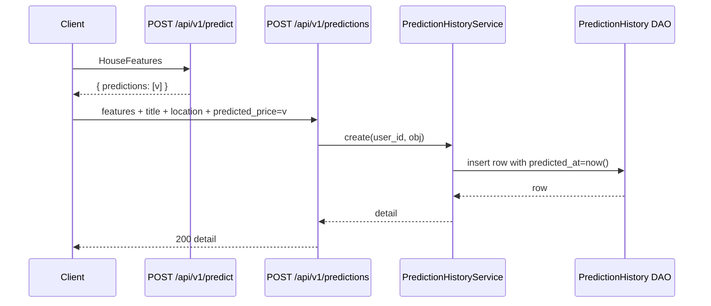
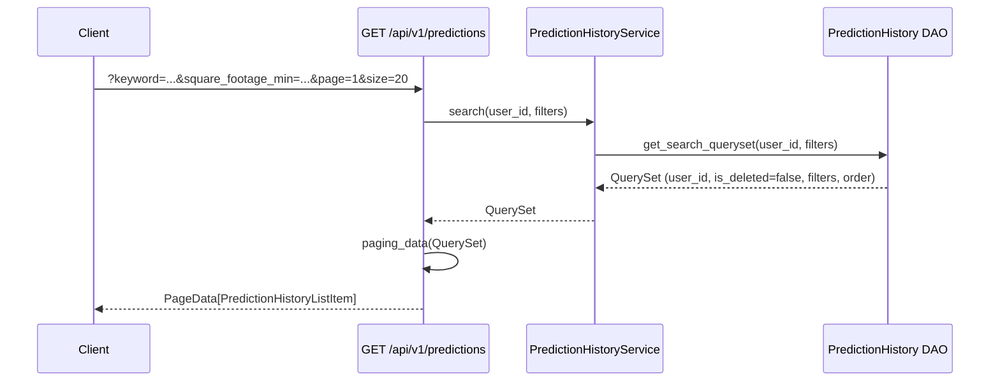
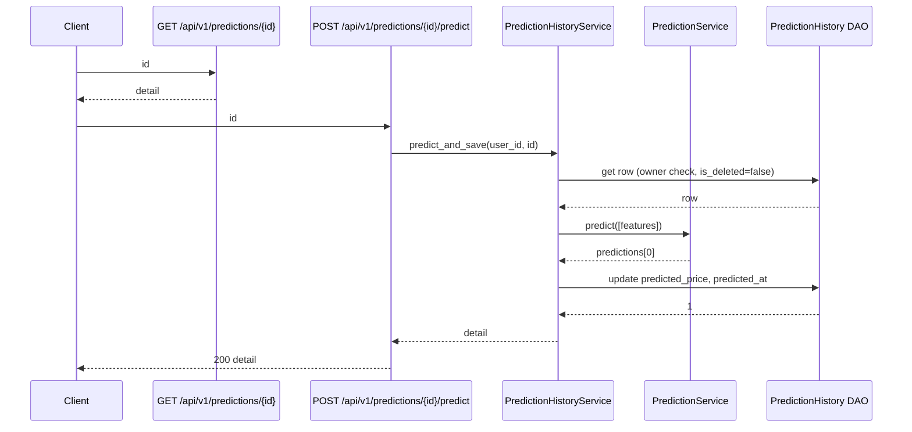
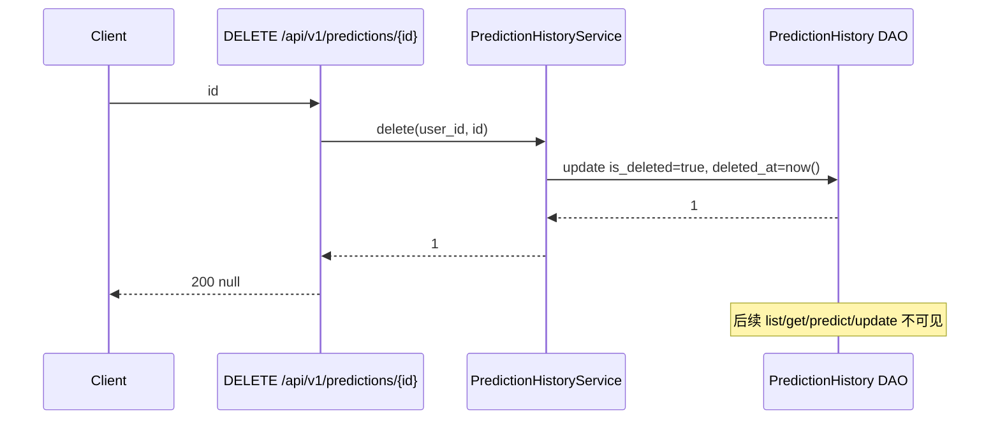

# 房价预测与预测历史功能详细设计

## 1. 背景与目标

根据 `docs/spec/predict-history/requirements/price-prediction.md`，本次需求需要在已有房价预测能力的基础上，提供：

1. 已实现的房价预测接口的持续可用（输入维度 `square_footage`、`bedrooms`、`bathrooms`、`year_built`、`lot_size`、`distance_to_city_center`、`school_rating`）。
2. 创建房价预测实例：可单独保存填写信息，也可“先预测、再保存”。
3. 房价预测历史记录：支持分页查询、按全部字段搜索（含创建/更新时间）、再次编辑、再次预测、逻辑删除。

当前系统已经具备：

- FastAPI + Tortoise ORM + Redis 基础能力。
- 已有 `POST /api/v1/predict` 等预测推理接口（`backend/app/prediction/api/v1/prediction.py`）。
- 已有用户/认证体系（`backend/app/admin/*`），并使用 `Authorization: Bearer <token>` 鉴权（`backend/common/security/jwt.py`）。
- 已有统一响应封装 `ResponseModel` / `ResponseSchemaModel`、分页封装 `PageData[T]` / `DependsPagination`。

本设计以复用现有能力、最小化新增、风格一致为原则：

- 保持已有 `POST /api/v1/predict` 接口契约不变。
- 新增预测实例的持久化存储与 CRUD 接口，归属于当前登录用户。
- 不引入新的鉴权机制，继续使用 `DependsJwtAuth` 与 `CurrentUser`。
- 删除均采用逻辑删除。
- 历史记录列表 + 详情 + 编辑 + 再预测 + 删除均围绕“预测实例”这一聚合根展开。

## 2. 当前系统现状

### 2.1 已有相关接口

| 方法 | 路径 | 说明 |
| --- | --- | --- |
| `POST` | `/api/v1/predict` | 房价预测（单笔与批次） |
| `GET` | `/api/v1/model-info` | 模型信息与效能指标 |
| `GET` | `/api/v1/health` | 模型健康检查 |
| `POST` | `/api/v1/auth/login` | 用户登录（邮箱 + 密码） |
| `POST` | `/api/v1/auth/logout` | 用户登出 |
| `GET` | `/api/v1/users/{username}` | 查询用户信息（需登录） |

### 2.2 已有相关模块

| 模块 | 路径 | 说明 |
| --- | --- | --- |
| 预测路由 | `backend/app/prediction/api/v1/prediction.py` | `/predict`、`/model-info`、`/health` |
| 预测 Schema | `backend/app/prediction/schema/prediction.py` | `HouseFeatures` |
| 预测 Service | `backend/app/prediction/service/prediction_service.py` | 模型加载、预测、模型元数据 |
| 预测路由聚合 | `backend/app/prediction/api/router.py` | 挂载到 `/api/v1` |
| 鉴权依赖 | `backend/common/security/jwt.py` | `CurrentUser`、`DependsJwtAuth` |
| 通用响应 | `backend/common/response/response_schema.py` | `ResponseModel`、`ResponseSchemaModel` |
| 通用分页 | `backend/common/pagination.py` | `PageData[T]`、`DependsPagination`、`paging_data` |
| 通用 CRUD 基类 | `backend/common/crud.py` | `CRUDBase[ModelT]` |
| 数据库注册 | `backend/database/db.py` + `backend/app/admin/model/__init__.py` | 新增 model 必须在此聚合 |

### 2.3 现状与设计差异

| 项 | 现状 | 本次设计 |
| --- | --- | --- |
| `POST /api/v1/predict` | 仅做模型推理、不落库 | 保持不变，本次只新增“预测实例”的存储与 CRUD |
| 预测结果持久化 | 不持久化 | 新增 `prediction_history` 表，记录用户填写的特征、标题、位置与（可选）预测结果 |
| 用户归属 | 预测接口无用户归属 | 历史记录强归属当前登录用户，列表/详情/编辑/删除均限制 `user_id = current_user.id` |
| 删除策略 | - | 逻辑删除，使用 `is_deleted` + `deleted_at` 字段，列表/详情默认过滤 |
| 历史记录搜索 | - | 支持按字段搜索（字符串模糊、数值范围、时间范围） |

## 3. 总体设计

### 3.1 功能边界

本次实现范围：

- 房价预测接口契约维持不变。
- 创建预测实例：支持“仅保存填写内容”和“保存填写内容 + 预测结果”两种保存方式。
- 预测实例分页查询：按当前用户归属，支持多字段搜索，按更新时间倒序。
- 预测实例详情、编辑、再预测、逻辑删除。
- 历史记录搜索：覆盖标题、位置、7 个特征字段、预测结果、创建/更新时间。

不在本次范围：

- 用户注册、登录、登出（已在 `docs/spec/user-login/...` 设计）。
- 模型训练与发布。
- 物理删除、回收站还原。
- 历史记录的多用户共享。
- 前端页面开发（仅约定 API 契约）。

### 3.2 设计原则

- 复用现有 `PredictionService.predict`，不重复实现模型推理逻辑。
- 历史记录是“预测实例”的聚合根，特征、标题、位置、预测结果属于同一行记录。
- 预测结果与特征值在保存时一次性写入；如果实例之后被编辑导致特征变化，应通过“再预测 + 更新”流程同步预测结果，不在 update 接口里隐式触发推理。
- 所有写接口必须经过鉴权；所有读接口默认过滤当前用户且已逻辑删除的记录不可见。
- 路径使用 RESTful 风格 `/api/v1/predictions`，与已有 `/predict` 单数路径区分（一个是推理动作、一个是资源集合）。

## 4. 数据模型设计

### 4.1 新增表 `prediction_history`

对应模型：`backend/app/prediction/model/prediction_history.py`（新增）

| 字段 | 类型 | 约束 | 说明 |
| --- | --- | --- | --- |
| `id` | `BigInt` | 主键、自增 | 预测实例 ID |
| `user_id` | `BigInt` | 索引、非空 | 实例归属用户，来自 `current_user.id` |
| `title` | `VARCHAR(128)` | 可空 | 用户填写的标题，可选 |
| `location` | `VARCHAR(256)` | 可空 | 房产位置文本（自由填写） |
| `square_footage` | `DECIMAL(12,2)` | 非空 | 建筑面积 |
| `bedrooms` | `DECIMAL(5,2)` | 非空 | 卧室数 |
| `bathrooms` | `DECIMAL(5,2)` | 非空 | 卫生间数 |
| `year_built` | `INT` | 非空 | 建成年份 |
| `lot_size` | `DECIMAL(12,2)` | 非空 | 占地面积 |
| `distance_to_city_center` | `DECIMAL(10,2)` | 非空 | 距市中心距离 |
| `school_rating` | `DECIMAL(5,2)` | 非空 | 学区评分 |
| `predicted_price` | `DECIMAL(18,2)` | 可空 | 最近一次预测结果，未预测时为 `null` |
| `predicted_at` | `DATETIME` | 可空 | 最近一次预测时间，未预测时为 `null` |
| `is_deleted` | `BOOLEAN` | 默认 `false`、索引 | 逻辑删除标记 |
| `deleted_at` | `DATETIME` | 可空 | 逻辑删除时间 |
| `created_at` | `DATETIME` | `auto_now_add` | 创建时间 |
| `updated_at` | `DATETIME` | `auto_now` | 更新时间 |

字段类型说明：

- 7 个特征字段：维持与 `HouseFeatures` 一致的语义；数据库使用 `DECIMAL` 以保留用户输入精度，`year_built` 使用 `INT`。
- `location`：本次按“自由文本”处理，避免引入区域字典，前端可在 UI 上自由组织（如“城市 区 街道”），后端只做长度校验。
- 不使用外键约束（沿用项目已有惯例），通过 `user_id` 字段做应用层关联即可。

### 4.2 索引设计

| 字段 | 索引类型 | 说明 |
| --- | --- | --- |
| `id` | Primary Key | 主键 |
| `user_id, is_deleted, updated_at` | 联合索引 | 列表分页主路径：按用户过滤、过滤逻辑删除、按更新时间倒序 |
| `user_id, is_deleted, created_at` | 联合索引 | 按创建时间搜索/排序的备用路径 |
| `is_deleted` | 普通索引 | 列表默认过滤逻辑删除 |

字符串模糊检索（`title`、`location`）暂不建索引，依赖数据量较小时全表 `LIKE`；如后续数据量增长可再评估全文检索。

### 4.3 软删除约定

- 所有写操作在更新前必须先按 `id` + `user_id` + `is_deleted=false` 取出实体；查不到即视为不存在。
- 删除接口设置 `is_deleted=true`、`deleted_at=now()`，不真正删除行。
- 列表、详情、再预测、编辑全部基于 `is_deleted=false`。

### 4.4 与现有用户表的关系

- `user_id` 取值来自 `current_user.id`，与 `backend/app/admin/model/user.py` 的 `User.id` 对应。
- 不新增外键、不修改 `user` 表结构。
- 服务层在所有按 `id` 查询时附加 `user_id == current_user.id` 条件，防止跨用户访问。

### 4.5 模型注册

新增文件 `backend/app/prediction/model/__init__.py`，统一导出本应用下的 model 模块。同时在 `backend/app/admin/model/__init__.py` 的同级位置——也就是 `backend/database/db.py` 引用的 `models` 列表——加入新模型。

由于 `backend/database/db.py` 当前只引用 `backend.app.admin.model.models`，需要扩展为同时包含 `prediction` 应用的 model：

```python
from backend.app.admin.model import models as admin_models
from backend.app.prediction.model import models as prediction_models

mysql_config = {
    ...
    'apps': {
        'ftm': {
            'models': [*admin_models, *prediction_models],
            'default_connection': 'default',
        },
    },
    ...
}
```

`backend/app/prediction/model/__init__.py` 内容示例：

```python
from backend.app.prediction.model import prediction_history

models = [prediction_history]
```

## 5. API 设计

### 5.1 概览

| 方法 | 路径 | 鉴权 | 说明 |
| --- | --- | --- | --- |
| `POST` | `/api/v1/predict` | 不变（按现状） | 房价预测（不落库），保持已有契约 |
| `GET` | `/api/v1/model-info` | 不变 | 模型信息 |
| `GET` | `/api/v1/health` | 不变 | 模型健康检查 |
| `POST` | `/api/v1/predictions` | 需要 | 创建预测实例（可携带预测结果） |
| `GET` | `/api/v1/predictions` | 需要 | 分页查询当前用户预测历史，支持搜索 |
| `GET` | `/api/v1/predictions/{id}` | 需要 | 查看预测实例详情 |
| `PUT` | `/api/v1/predictions/{id}` | 需要 | 编辑预测实例（可同时清空或更新预测结果） |
| `POST` | `/api/v1/predictions/{id}/predict` | 需要 | 对实例当前特征再次预测并回写 |
| `DELETE` | `/api/v1/predictions/{id}` | 需要 | 逻辑删除 |

新接口统一在 `backend/app/prediction/api/v1/prediction_history.py` 中实现，并在 `backend/app/prediction/api/router.py` 中以前缀 `/predictions`、tag `房价预测历史` 挂载。

### 5.2 通用约定

- 鉴权：除 `/api/v1/predict`、`/api/v1/model-info`、`/api/v1/health` 维持现状外，本次新增接口均需要 `Authorization: Bearer <token>`。
- 响应：统一使用 `ResponseModel` / `ResponseSchemaModel[T]`，分页使用 `ResponseSchemaModel[PageData[T]]`。
- 错误：保持现有异常体系，`NotFoundError(msg='Prediction history not found')`、`ForbiddenError`、`RequestError`。

### 5.3 创建预测实例

#### 基本信息

| 项 | 内容 |
| --- | --- |
| 方法 | `POST` |
| 路径 | `/api/v1/predictions` |
| 鉴权 | `DependsJwtAuth` |
| Summary | `创建房价预测实例` |
| Response | `ResponseSchemaModel[PredictionHistoryDetail]` |

#### 请求体

`CreatePredictionHistoryParam`：

| 字段 | 类型 | 必填 | 说明 |
| --- | --- | --- | --- |
| `title` | `str \| null` (最多 128 字符) | 否 | 实例标题 |
| `location` | `str \| null` (最多 256 字符) | 否 | 房产位置文本 |
| `square_footage` | `float` | 是 | 建筑面积 |
| `bedrooms` | `float` | 是 | 卧室数 |
| `bathrooms` | `float` | 是 | 卫生间数 |
| `year_built` | `int` | 是 | 建成年份 |
| `lot_size` | `float` | 是 | 占地面积 |
| `distance_to_city_center` | `float` | 是 | 距市中心距离 |
| `school_rating` | `float` | 是 | 学区评分 |
| `predicted_price` | `float \| null` | 否 | 由前端先调用 `/predict` 拿到的结果；为空表示“只保存、不带预测” |

`predicted_price` 由前端在调用 `/predict` 之后回传以保证“先预测、再保存”的产品流程不需要后端在创建时再次推理；同时也支持“只保存”流程（`predicted_price = null`）。

#### 成功响应

```json
{
  "code": 200,
  "msg": "Request succeeded",
  "data": {
    "id": 12,
    "title": "Test house",
    "location": "Shanghai Pudong",
    "square_footage": 120.0,
    "bedrooms": 3.0,
    "bathrooms": 2.0,
    "year_built": 2015,
    "lot_size": 300.0,
    "distance_to_city_center": 8.5,
    "school_rating": 8.0,
    "predicted_price": 5320000.0,
    "predicted_at": "2026-05-19 10:20:00",
    "created_at": "2026-05-19 10:20:00",
    "updated_at": "2026-05-19 10:20:00"
  }
}
```

#### 失败场景

| 场景 | `code` | `msg` |
| --- | --- | --- |
| 缺字段 / 字段类型非法 | `422` | 字段级错误 |
| 未携带或非法 Token | `401` | `Not Authenticated` / `Invalid token` |

### 5.4 分页查询预测历史

#### 基本信息

| 项 | 内容 |
| --- | --- |
| 方法 | `GET` |
| 路径 | `/api/v1/predictions` |
| 鉴权 | `DependsJwtAuth` + `DependsPagination` |
| Summary | `分页查询当前用户房价预测历史` |
| Response | `ResponseSchemaModel[PageData[PredictionHistoryListItem]]` |

#### 查询参数

分页参数沿用 `DependsPagination`：

| 参数 | 类型 | 默认 | 说明 |
| --- | --- | --- | --- |
| `page` | `int` (≥1) | `1` | 页码 |
| `size` | `int` (1-100) | `20` | 每页条数 |

搜索参数（全部可选，未传即忽略）：

| 参数 | 类型 | 语义 |
| --- | --- | --- |
| `keyword` | `str` | 在 `title`、`location` 上同时做模糊匹配（OR） |
| `title` | `str` | 标题模糊匹配 |
| `location` | `str` | 位置模糊匹配 |
| `square_footage_min`, `square_footage_max` | `float` | 建筑面积区间 |
| `bedrooms_min`, `bedrooms_max` | `float` | 卧室数区间 |
| `bathrooms_min`, `bathrooms_max` | `float` | 卫生间数区间 |
| `year_built_min`, `year_built_max` | `int` | 建成年份区间 |
| `lot_size_min`, `lot_size_max` | `float` | 占地面积区间 |
| `distance_min`, `distance_max` | `float` | 距市中心距离区间 |
| `school_rating_min`, `school_rating_max` | `float` | 学区评分区间 |
| `predicted_price_min`, `predicted_price_max` | `float` | 预测结果区间 |
| `has_prediction` | `bool` | `true` 仅返回 `predicted_price IS NOT NULL`，`false` 仅返回未预测 |
| `created_at_start`, `created_at_end` | `datetime` (`YYYY-MM-DD HH:MM:SS`) | 创建时间区间，闭区间 |
| `updated_at_start`, `updated_at_end` | `datetime` (`YYYY-MM-DD HH:MM:SS`) | 更新时间区间，闭区间 |

排序：默认按 `updated_at DESC, id DESC`。本次不开放排序参数（如需要可在后续 CR 中扩展为 `order_by`）。

过滤：服务端始终强制附加 `user_id = current_user.id AND is_deleted = false`。

#### 成功响应（节选）

```json
{
  "code": 200,
  "msg": "Request succeeded",
  "data": {
    "items": [
      {
        "id": 12,
        "title": "Test house",
        "location": "Shanghai Pudong",
        "square_footage": 120.0,
        "bedrooms": 3.0,
        "bathrooms": 2.0,
        "year_built": 2015,
        "lot_size": 300.0,
        "distance_to_city_center": 8.5,
        "school_rating": 8.0,
        "predicted_price": 5320000.0,
        "predicted_at": "2026-05-19 10:20:00",
        "created_at": "2026-05-19 10:20:00",
        "updated_at": "2026-05-19 10:20:00"
      }
    ],
    "total": 1,
    "page": 1,
    "size": 20,
    "total_pages": 1,
    "links": { "...": "..." }
  }
}
```

### 5.5 查看预测实例详情

| 项 | 内容 |
| --- | --- |
| 方法 | `GET` |
| 路径 | `/api/v1/predictions/{id}` |
| 鉴权 | `DependsJwtAuth` |
| Response | `ResponseSchemaModel[PredictionHistoryDetail]` |

行为：

- 按 `id` + `user_id == current_user.id` + `is_deleted == false` 查询。
- 不存在或不属于当前用户：`404 Prediction history not found`（对外不区分“跨用户访问”与“不存在”，避免泄露 ID 是否存在）。

### 5.6 编辑预测实例

#### 基本信息

| 项 | 内容 |
| --- | --- |
| 方法 | `PUT` |
| 路径 | `/api/v1/predictions/{id}` |
| 鉴权 | `DependsJwtAuth` |
| Response | `ResponseSchemaModel[PredictionHistoryDetail]` |

#### 请求体

`UpdatePredictionHistoryParam`：

字段集合与 `CreatePredictionHistoryParam` 相同。语义上为“整体覆盖”：调用方需要在请求中提供完整的字段集合，避免歧义。

特殊字段：

- `predicted_price`：可显式传 `null` 以清空预测结果（表示编辑后特征已改变、原预测结果失效）；服务端不会基于特征是否变化自动清空，由前端决定。
- `predicted_at`：不接受前端传入，仅在“再预测”接口里由服务端写入。

#### 服务端行为

1. 校验实体存在且归属当前用户。
2. 应用更新；`updated_at` 由 `auto_now` 自动刷新。
3. 返回最新详情。

### 5.7 对实例再次预测

为了支持“打开历史记录再次预测”的产品流程，提供一个绑定到实例的预测接口：

#### 基本信息

| 项 | 内容 |
| --- | --- |
| 方法 | `POST` |
| 路径 | `/api/v1/predictions/{id}/predict` |
| 鉴权 | `DependsJwtAuth` |
| Response | `ResponseSchemaModel[PredictionHistoryDetail]` |

#### 请求体

无（也允许传空对象）。预测使用实例当前已存的特征字段。

#### 服务端行为

1. 取出实例（用户归属 + 未删除）。
2. 调用 `PredictionService.predict([features])`，得到 `predicted_price`。
3. 更新实例的 `predicted_price`、`predicted_at = timezone.now()`。
4. 返回最新详情。

> 说明：如果产品上希望“先在前端改字段、再预测、再保存”，可继续使用 `POST /api/v1/predict` + `PUT /api/v1/predictions/{id}` 的组合，无需调用本接口；本接口适用于“直接对已保存特征再跑一次预测”。

### 5.8 逻辑删除

#### 基本信息

| 项 | 内容 |
| --- | --- |
| 方法 | `DELETE` |
| 路径 | `/api/v1/predictions/{id}` |
| 鉴权 | `DependsJwtAuth` |
| Response | `ResponseModel` |

#### 行为

1. 按 `id` + `user_id` + `is_deleted=false` 查询。
2. 设置 `is_deleted=true`、`deleted_at=timezone.now()`、刷新 `updated_at`。
3. 返回 `response_base.success()`（`data=null`）。
4. 后续列表、详情、再预测、编辑均不可见。

幂等：对已逻辑删除的记录再调用 `DELETE` 返回 `404`，避免误传递“成功”信号导致前端误判。

## 6. Schema 设计

文件：`backend/app/prediction/schema/prediction_history.py`（新增）

### 6.1 输入 Schema

```python
from pydantic import ConfigDict, Field
from backend.common.schema import SchemaBase


class PredictionFeaturesParam(SchemaBase):
    title: str | None = Field(default=None, max_length=128, description='标题')
    location: str | None = Field(default=None, max_length=256, description='房产位置')
    square_footage: float = Field(..., description='建筑面积')
    bedrooms: float = Field(..., description='卧室数')
    bathrooms: float = Field(..., description='卫生间数')
    year_built: int = Field(..., description='建成年份')
    lot_size: float = Field(..., description='占地面积')
    distance_to_city_center: float = Field(..., description='距市中心距离')
    school_rating: float = Field(..., description='学区评分')


class CreatePredictionHistoryParam(PredictionFeaturesParam):
    predicted_price: float | None = Field(default=None, description='预测结果（可选）')


class UpdatePredictionHistoryParam(PredictionFeaturesParam):
    predicted_price: float | None = Field(default=None, description='预测结果（可显式置空）')
```

### 6.2 输出 Schema

```python
from datetime import datetime
from pydantic import ConfigDict, Field
from backend.common.schema import SchemaBase


class PredictionHistoryDetail(SchemaBase):
    model_config = ConfigDict(from_attributes=True)

    id: int = Field(description='预测实例 ID')
    title: str | None = Field(default=None, description='标题')
    location: str | None = Field(default=None, description='房产位置')
    square_footage: float
    bedrooms: float
    bathrooms: float
    year_built: int
    lot_size: float
    distance_to_city_center: float
    school_rating: float
    predicted_price: float | None = Field(default=None, description='预测结果')
    predicted_at: datetime | None = Field(default=None, description='预测时间')
    created_at: datetime = Field(description='创建时间')
    updated_at: datetime = Field(description='更新时间')


class PredictionHistoryListItem(PredictionHistoryDetail):
    """列表项与详情字段一致；保留两个名字以便后续按需差异化。"""
```

`SchemaBase` 已统一了 `datetime` 的序列化格式（`settings.DATETIME_FORMAT`，当前为 `%Y-%m-%d %H:%M:%S`）。

### 6.3 列表查询参数

列表查询使用 FastAPI `Query` 注入，不再单独建一个 Pydantic 模型（与 `backend/app/admin/api/v1/user.py` 的 `get_all_users` 风格保持一致）。

## 7. Model 设计

文件：`backend/app/prediction/model/prediction_history.py`（新增）

```python
from tortoise import Model, fields


class PredictionHistory(Model):
    """房价预测历史记录"""

    id = fields.BigIntField(pk=True, index=True, description='主键')
    user_id = fields.BigIntField(index=True, description='归属用户 ID')

    title = fields.CharField(max_length=128, null=True, description='标题')
    location = fields.CharField(max_length=256, null=True, description='房产位置')

    square_footage = fields.DecimalField(max_digits=12, decimal_places=2, description='建筑面积')
    bedrooms = fields.DecimalField(max_digits=5, decimal_places=2, description='卧室数')
    bathrooms = fields.DecimalField(max_digits=5, decimal_places=2, description='卫生间数')
    year_built = fields.IntField(description='建成年份')
    lot_size = fields.DecimalField(max_digits=12, decimal_places=2, description='占地面积')
    distance_to_city_center = fields.DecimalField(max_digits=10, decimal_places=2, description='距市中心距离')
    school_rating = fields.DecimalField(max_digits=5, decimal_places=2, description='学区评分')

    predicted_price = fields.DecimalField(
        max_digits=18, decimal_places=2, null=True, description='预测结果'
    )
    predicted_at = fields.DatetimeField(null=True, description='预测时间')

    is_deleted = fields.BooleanField(default=False, index=True, description='逻辑删除')
    deleted_at = fields.DatetimeField(null=True, description='逻辑删除时间')

    created_at = fields.DatetimeField(auto_now_add=True, description='创建时间')
    updated_at = fields.DatetimeField(auto_now=True, description='更新时间')

    class Meta:
        table = 'prediction_history'
        indexes = (
            ('user_id', 'is_deleted', 'updated_at'),
            ('user_id', 'is_deleted', 'created_at'),
        )
```

> 备注：响应 Schema 中将 `Decimal` 字段以 `float` 返回；落库使用 `Decimal` 保证精度，序列化时通过 `from_attributes=True` 自动转换，必要时在 Service 层显式 `float(...)`。

## 8. CRUD 设计

文件：`backend/app/prediction/crud/crud_prediction_history.py`（新增；同步新增空 `__init__.py`）。

```python
from datetime import datetime
from typing import Any
from tortoise.expressions import Q
from tortoise.queryset import QuerySet
from tortoise.transactions import atomic

from backend.app.prediction.model.prediction_history import PredictionHistory
from backend.common.crud import CRUDBase
from backend.utils.timezone import timezone


class CRUDPredictionHistory(CRUDBase[PredictionHistory]):
    async def get_by_user(self, pk: int, user_id: int) -> PredictionHistory | None:
        return await self.model.filter(id=pk, user_id=user_id, is_deleted=False).first()

    @atomic()
    async def create(self, user_id: int, data: dict[str, Any]) -> PredictionHistory:
        return await self.model.create(user_id=user_id, **data)

    @atomic()
    async def update_by_id(self, pk: int, user_id: int, data: dict[str, Any]) -> int:
        return await self.model.filter(
            id=pk, user_id=user_id, is_deleted=False
        ).update(**data)

    @atomic()
    async def soft_delete(self, pk: int, user_id: int) -> int:
        return await self.model.filter(
            id=pk, user_id=user_id, is_deleted=False
        ).update(is_deleted=True, deleted_at=timezone.now())

    def get_search_queryset(self, user_id: int, filters: dict[str, Any]) -> QuerySet:
        qs = self.model.filter(user_id=user_id, is_deleted=False)

        keyword = filters.get('keyword')
        if keyword:
            qs = qs.filter(Q(title__icontains=keyword) | Q(location__icontains=keyword))

        if filters.get('title'):
            qs = qs.filter(title__icontains=filters['title'])
        if filters.get('location'):
            qs = qs.filter(location__icontains=filters['location'])

        for field, min_key, max_key in [
            ('square_footage', 'square_footage_min', 'square_footage_max'),
            ('bedrooms', 'bedrooms_min', 'bedrooms_max'),
            ('bathrooms', 'bathrooms_min', 'bathrooms_max'),
            ('year_built', 'year_built_min', 'year_built_max'),
            ('lot_size', 'lot_size_min', 'lot_size_max'),
            ('distance_to_city_center', 'distance_min', 'distance_max'),
            ('school_rating', 'school_rating_min', 'school_rating_max'),
            ('predicted_price', 'predicted_price_min', 'predicted_price_max'),
        ]:
            if filters.get(min_key) is not None:
                qs = qs.filter(**{f'{field}__gte': filters[min_key]})
            if filters.get(max_key) is not None:
                qs = qs.filter(**{f'{field}__lte': filters[max_key]})

        has_prediction = filters.get('has_prediction')
        if has_prediction is True:
            qs = qs.filter(predicted_price__isnull=False)
        elif has_prediction is False:
            qs = qs.filter(predicted_price__isnull=True)

        if filters.get('created_at_start'):
            qs = qs.filter(created_at__gte=filters['created_at_start'])
        if filters.get('created_at_end'):
            qs = qs.filter(created_at__lte=filters['created_at_end'])
        if filters.get('updated_at_start'):
            qs = qs.filter(updated_at__gte=filters['updated_at_start'])
        if filters.get('updated_at_end'):
            qs = qs.filter(updated_at__lte=filters['updated_at_end'])

        return qs.order_by('-updated_at', '-id')


prediction_history_dao = CRUDPredictionHistory(PredictionHistory)
```

## 9. Service 设计

文件：`backend/app/prediction/service/prediction_history_service.py`（新增）

```python
from datetime import datetime
from typing import Any

from tortoise.queryset import QuerySet

from backend.app.prediction.crud.crud_prediction_history import prediction_history_dao
from backend.app.prediction.model.prediction_history import PredictionHistory
from backend.app.prediction.schema.prediction_history import (
    CreatePredictionHistoryParam,
    UpdatePredictionHistoryParam,
)
from backend.app.prediction.service.prediction_service import PredictionService
from backend.common.exception import errors
from backend.utils.timezone import timezone


FEATURE_FIELDS = (
    'square_footage',
    'bedrooms',
    'bathrooms',
    'year_built',
    'lot_size',
    'distance_to_city_center',
    'school_rating',
)


class PredictionHistoryService:
    @staticmethod
    async def create(*, user_id: int, obj: CreatePredictionHistoryParam) -> PredictionHistory:
        data = obj.model_dump()
        if data.get('predicted_price') is not None:
            data['predicted_at'] = timezone.now()
        return await prediction_history_dao.create(user_id=user_id, data=data)

    @staticmethod
    async def get(*, user_id: int, pk: int) -> PredictionHistory:
        instance = await prediction_history_dao.get_by_user(pk=pk, user_id=user_id)
        if not instance:
            raise errors.NotFoundError(msg='Prediction history not found')
        return instance

    @staticmethod
    async def update(
        *, user_id: int, pk: int, obj: UpdatePredictionHistoryParam
    ) -> PredictionHistory:
        instance = await PredictionHistoryService.get(user_id=user_id, pk=pk)
        data = obj.model_dump()
        # predicted_at 仅由“预测”流程写入；本接口不主动写
        data.pop('predicted_at', None)
        if data.get('predicted_price') is None:
            data['predicted_at'] = None
        elif instance.predicted_price != data['predicted_price']:
            data['predicted_at'] = timezone.now()
        await prediction_history_dao.update_by_id(pk=pk, user_id=user_id, data=data)
        return await PredictionHistoryService.get(user_id=user_id, pk=pk)

    @staticmethod
    async def predict_and_save(*, user_id: int, pk: int) -> PredictionHistory:
        instance = await PredictionHistoryService.get(user_id=user_id, pk=pk)
        features = {field: float(getattr(instance, field)) for field in FEATURE_FIELDS}
        result = PredictionService.predict([features])
        predicted_price = float(result['predictions'][0])
        await prediction_history_dao.update_by_id(
            pk=pk,
            user_id=user_id,
            data={'predicted_price': predicted_price, 'predicted_at': timezone.now()},
        )
        return await PredictionHistoryService.get(user_id=user_id, pk=pk)

    @staticmethod
    async def delete(*, user_id: int, pk: int) -> int:
        count = await prediction_history_dao.soft_delete(pk=pk, user_id=user_id)
        if not count:
            raise errors.NotFoundError(msg='Prediction history not found')
        return count

    @staticmethod
    async def search(*, user_id: int, filters: dict[str, Any]) -> QuerySet:
        return prediction_history_dao.get_search_queryset(user_id=user_id, filters=filters)


prediction_history_service = PredictionHistoryService()
```

## 10. Router 设计

文件：`backend/app/prediction/api/v1/prediction_history.py`（新增）

```python
from typing import Annotated
from datetime import datetime
from fastapi import APIRouter, Query

from backend.app.prediction.schema.prediction_history import (
    CreatePredictionHistoryParam,
    PredictionHistoryDetail,
    PredictionHistoryListItem,
    UpdatePredictionHistoryParam,
)
from backend.app.prediction.service.prediction_history_service import (
    prediction_history_service,
)
from backend.common.pagination import DependsPagination, PageData, paging_data
from backend.common.response.response_schema import (
    ResponseModel,
    ResponseSchemaModel,
    response_base,
)
from backend.common.security.jwt import CurrentUser, DependsJwtAuth

router = APIRouter(tags=['房价预测历史'])


@router.post('', summary='创建房价预测实例', dependencies=[DependsJwtAuth])
async def create_history(
    current_user: CurrentUser, obj: CreatePredictionHistoryParam
) -> ResponseSchemaModel[PredictionHistoryDetail]:
    instance = await prediction_history_service.create(user_id=current_user.id, obj=obj)
    return response_base.success(data=instance)


@router.get(
    '',
    summary='分页查询房价预测历史',
    dependencies=[DependsJwtAuth, DependsPagination],
)
async def list_history(
    current_user: CurrentUser,
    keyword: Annotated[str | None, Query()] = None,
    title: Annotated[str | None, Query()] = None,
    location: Annotated[str | None, Query()] = None,
    square_footage_min: Annotated[float | None, Query()] = None,
    square_footage_max: Annotated[float | None, Query()] = None,
    bedrooms_min: Annotated[float | None, Query()] = None,
    bedrooms_max: Annotated[float | None, Query()] = None,
    bathrooms_min: Annotated[float | None, Query()] = None,
    bathrooms_max: Annotated[float | None, Query()] = None,
    year_built_min: Annotated[int | None, Query()] = None,
    year_built_max: Annotated[int | None, Query()] = None,
    lot_size_min: Annotated[float | None, Query()] = None,
    lot_size_max: Annotated[float | None, Query()] = None,
    distance_min: Annotated[float | None, Query()] = None,
    distance_max: Annotated[float | None, Query()] = None,
    school_rating_min: Annotated[float | None, Query()] = None,
    school_rating_max: Annotated[float | None, Query()] = None,
    predicted_price_min: Annotated[float | None, Query()] = None,
    predicted_price_max: Annotated[float | None, Query()] = None,
    has_prediction: Annotated[bool | None, Query()] = None,
    created_at_start: Annotated[datetime | None, Query()] = None,
    created_at_end: Annotated[datetime | None, Query()] = None,
    updated_at_start: Annotated[datetime | None, Query()] = None,
    updated_at_end: Annotated[datetime | None, Query()] = None,
) -> ResponseSchemaModel[PageData[PredictionHistoryListItem]]:
    filters = {
        'keyword': keyword,
        'title': title,
        'location': location,
        'square_footage_min': square_footage_min,
        'square_footage_max': square_footage_max,
        'bedrooms_min': bedrooms_min,
        'bedrooms_max': bedrooms_max,
        'bathrooms_min': bathrooms_min,
        'bathrooms_max': bathrooms_max,
        'year_built_min': year_built_min,
        'year_built_max': year_built_max,
        'lot_size_min': lot_size_min,
        'lot_size_max': lot_size_max,
        'distance_min': distance_min,
        'distance_max': distance_max,
        'school_rating_min': school_rating_min,
        'school_rating_max': school_rating_max,
        'predicted_price_min': predicted_price_min,
        'predicted_price_max': predicted_price_max,
        'has_prediction': has_prediction,
        'created_at_start': created_at_start,
        'created_at_end': created_at_end,
        'updated_at_start': updated_at_start,
        'updated_at_end': updated_at_end,
    }
    queryset = await prediction_history_service.search(user_id=current_user.id, filters=filters)
    page = await paging_data(queryset)
    return response_base.success(data=page)


@router.get('/{pk}', summary='查看房价预测实例详情', dependencies=[DependsJwtAuth])
async def get_history(
    current_user: CurrentUser, pk: int
) -> ResponseSchemaModel[PredictionHistoryDetail]:
    instance = await prediction_history_service.get(user_id=current_user.id, pk=pk)
    return response_base.success(data=instance)


@router.put('/{pk}', summary='编辑房价预测实例', dependencies=[DependsJwtAuth])
async def update_history(
    current_user: CurrentUser, pk: int, obj: UpdatePredictionHistoryParam
) -> ResponseSchemaModel[PredictionHistoryDetail]:
    instance = await prediction_history_service.update(
        user_id=current_user.id, pk=pk, obj=obj
    )
    return response_base.success(data=instance)


@router.post('/{pk}/predict', summary='对房价预测实例再次预测', dependencies=[DependsJwtAuth])
async def predict_history(
    current_user: CurrentUser, pk: int
) -> ResponseSchemaModel[PredictionHistoryDetail]:
    instance = await prediction_history_service.predict_and_save(
        user_id=current_user.id, pk=pk
    )
    return response_base.success(data=instance)


@router.delete('/{pk}', summary='逻辑删除房价预测实例', dependencies=[DependsJwtAuth])
async def delete_history(current_user: CurrentUser, pk: int) -> ResponseModel:
    await prediction_history_service.delete(user_id=current_user.id, pk=pk)
    return response_base.success()
```

更新 `backend/app/prediction/api/router.py`：

```python
from fastapi import APIRouter

from backend.app.prediction.api.v1.prediction import router as prediction_router
from backend.app.prediction.api.v1.prediction_history import router as prediction_history_router
from backend.core.conf import settings

v1 = APIRouter(prefix=settings.FASTAPI_API_V1_PATH)
v1.include_router(prediction_router)
v1.include_router(prediction_history_router, prefix='/predictions')
```

## 11. 关键流程

### 11.1 创建实例（先预测、再保存）



### 11.2 创建实例（只保存、不预测）

调用方不调用 `/predict`，直接 `POST /api/v1/predictions` 携带特征字段、`predicted_price=null`。服务端不会触发推理；`predicted_at` 同步为 `null`。

### 11.3 历史记录搜索



### 11.4 打开历史记录再预测



### 11.5 逻辑删除



## 12. 安全与权限

- 所有写、读接口均强制 `DependsJwtAuth`，未登录返回 `401`。
- 所有查询和更新均必须附加 `user_id == current_user.id` 条件，不允许跨用户访问，即使持有正确 `id` 也只返回 `404`。
- 模型预测结果 `predicted_price` 仅来自 `PredictionService` 实际推理或前端调用 `/predict` 得到的值；不接受前端手填任意数值的“伪造预测”的语义（接口上虽不阻塞，但产品上前端必须从 `/predict` 拿到再回填）。
- 不在响应中暴露 `user_id`、`is_deleted`、`deleted_at` 等内部字段，避免泄露其他用户存在性的信号。
- 字符串字段做长度上限校验，避免大字段写入。

## 13. 与已有预测接口的关系

- 现有 `POST /api/v1/predict` 维持不变，作为“无副作用”的纯推理接口。
- 现有 `GET /api/v1/model-info`、`/health` 维持不变。
- 新接口集中在 `/api/v1/predictions/*`，与 `/predict` 命名上分离：`predict` 是动作、`predictions` 是资源。
- Service 层通过 `PredictionService.predict` 同源调用模型，避免双份推理实现。

## 14. 配置与迁移

### 14.1 配置

本次不新增任何配置项。复用：

- `settings.FASTAPI_API_V1_PATH`：API 前缀。
- `settings.DATETIME_FORMAT`：响应时间格式。
- `settings.MODEL_ARTIFACTS_DIR`：模型工件目录（已存在）。

### 14.2 迁移

新增 MySQL 表 `prediction_history`，需要执行迁移：

- 项目当前使用 Tortoise ORM；建表方式可参考现有 `backend/migration.py` 流程（如使用 `tortoise generate_schemas` 或 `aerich`）。
- 在 `backend/app/prediction/model/__init__.py` 中声明 model，并在 `backend/database/db.py` 的 `apps.ftm.models` 中合并 `prediction` 应用的模型列表（见 §4.5）。
- 现有 `backend/app/admin/model/__init__.py` 的 `models` 列表无需改动。

### 14.3 兼容性

| 项 | 兼容性 |
| --- | --- |
| `POST /api/v1/predict` | 完全兼容，未改动 |
| `GET /api/v1/model-info` | 完全兼容 |
| `GET /api/v1/health` | 完全兼容 |
| 已有用户/认证接口 | 完全兼容 |
| 新增 `/api/v1/predictions/*` | 新增能力，对老调用方无影响 |
| 数据库 | 新增表 `prediction_history`，不修改已有表结构 |

## 15. 测试设计

### 15.1 单元测试

| 对象 | 场景 |
| --- | --- |
| `PredictionHistoryService.create` | 含/不含 `predicted_price`；`predicted_at` 同步设置/置空 |
| `PredictionHistoryService.update` | 编辑保留/更新/清空 `predicted_price`；不允许从请求体写 `predicted_at` |
| `PredictionHistoryService.predict_and_save` | 复用 `PredictionService.predict`，回写 `predicted_price` 与 `predicted_at` |
| `PredictionHistoryService.delete` | 第一次返回成功；第二次返回 `404` |
| `CRUDPredictionHistory.get_search_queryset` | 各类字段单独/组合搜索条件生成的 SQL 正确 |
| 跨用户访问 | 用户 A 持有用户 B 实例 ID 时，所有读写接口返回 `404` |

### 15.2 接口测试

通过 FastAPI TestClient 或 httpx 覆盖：

1. 未登录访问任意 `/api/v1/predictions/*` 返回 `401`。
2. 登录后创建预测实例（含 `predicted_price`），返回 `200` 且响应字段齐全；数据库有对应行。
3. 创建实例（不含 `predicted_price`），`predicted_price` 与 `predicted_at` 为 `null`。
4. 分页查询带 `keyword`、`square_footage_min/max`、`created_at_start/end` 等参数返回正确结果。
5. 详情接口对自己用户 ID 200、对他人 ID 404。
6. 编辑接口可整体覆盖；显式 `predicted_price=null` 后 `predicted_at` 同步置空。
7. 再预测接口调用后 `predicted_price`、`predicted_at` 被刷新；多次调用幂等地刷新结果。
8. 删除接口调用一次成功；再次删除返回 `404`；删除后列表/详情/再预测/编辑均不可见。
9. 列表默认按 `updated_at DESC` 排序；编辑后该记录上浮到首页。
10. 分页字段 `page`、`size`、`total`、`total_pages`、`links` 与 `PageData` 契约一致。

### 15.3 回归测试

确认以下接口未被破坏：

- `POST /api/v1/predict`
- `GET /api/v1/model-info`
- `GET /api/v1/health`
- `POST /api/v1/auth/login`
- `POST /api/v1/auth/logout`
- `GET /api/v1/users/{username}`

## 16. 实施顺序

1. 新增 `backend/app/prediction/model/prediction_history.py` 与 `backend/app/prediction/model/__init__.py`。
2. 调整 `backend/database/db.py` 的 `apps.ftm.models` 加入 `prediction` 应用的 model 列表。
3. 新增 `backend/app/prediction/crud/crud_prediction_history.py` 与对应 `__init__.py`。
4. 新增 `backend/app/prediction/schema/prediction_history.py`。
5. 新增 `backend/app/prediction/service/prediction_history_service.py`。
6. 新增 `backend/app/prediction/api/v1/prediction_history.py`，并在 `backend/app/prediction/api/router.py` 挂载。
7. 生成并执行数据库迁移，创建 `prediction_history` 表与索引。
8. 编写单元测试与接口测试。
9. 本地启动服务，通过 Swagger / httpx 完成“创建→列表→详情→编辑→再预测→删除→搜索”的闭环验证。

## 17. 验收标准

- 登录用户可以在不调用 `/predict` 的情况下创建一个 `predicted_price` 为空的预测实例。
- 登录用户可以在调用 `/predict` 拿到结果后，调用 `POST /api/v1/predictions` 创建包含预测结果的实例。
- 登录用户可以通过 `GET /api/v1/predictions` 分页查询自己的历史记录；分页参数与既有 `PageData[T]` 契约一致。
- 列表查询支持按 `keyword`、`title`、`location`、7 个特征区间、`predicted_price` 区间、`has_prediction`、`created_at` / `updated_at` 区间过滤；结果默认按 `updated_at DESC, id DESC` 排序。
- 用户可以查看、编辑、再预测、逻辑删除自己的历史记录；删除采用逻辑删除（`is_deleted=true`），不再出现在任何读接口中。
- 用户无法访问他人的预测实例：跨用户访问统一返回 `404 Prediction history not found`。
- 已有 `POST /api/v1/predict`、`GET /api/v1/model-info`、`GET /api/v1/health`、登录登出和用户接口契约与行为均保持不变。
- 数据库新增 `prediction_history` 表与设计中的字段、索引一致；不修改 `user` 表结构。
