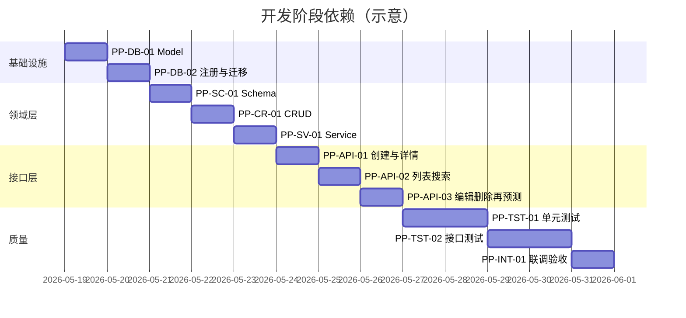

# 房价预测与预测历史 — 开发任务拆分

## 1. 文档说明

### 1.1 目的

本文档将「房价预测 + 预测历史」需求拆分为可独立排期、可验收的开发任务，供后端开发、联调与测试使用。

### 1.2 依据文档

| 文档 | 路径 |
| --- | --- |
| 需求 | `docs/spec/predict-history/normalCR/requirements/price-prediction.md` |
| 详细设计 | `docs/spec/predict-history/normalCR/detail-design/price-prediction-detail-design.md` |
| API 设计 | `docs/spec/predict-history/normalCR/api-design/price-prediction-api-design.md` |
| DB 设计 | `docs/spec/predict-history/normalCR/db-design/price-prediction-db-design.md` |

### 1.3 范围摘要

| 类别 | 内容 |
| --- | --- |
| 保持不变 | `POST /api/v1/predict`、`GET /api/v1/model-info`、`GET /api/v1/health` |
| 新增能力 | `/api/v1/predictions` 资源 CRUD + 再预测 + 逻辑删除 |
| 新增存储 | MySQL 表 `prediction_history` |
| 不在范围 | 前端页面、用户注册/登录改造、模型训练、物理删除/回收站 |

### 1.4 当前代码基线（截至任务编写时）

- 已有：`backend/app/prediction/api/v1/prediction.py`、`prediction_service.py`、`HouseFeatures` Schema。
- 未有：`prediction_history` 相关 Model / CRUD / Service / API；`backend/database/db.py` 仅注册 admin models。
- 测试：项目内尚无 `tests/` 目录，测试任务需新建测试骨架。

### 1.5 任务编号规则

`PP-{阶段}-{序号}`，例如 `PP-DB-01`。优先级：`P0` 阻塞后续，`P1` 核心功能，`P2` 质量与联调。

---

## 2. 任务总览



| 阶段 | 任务数 | 说明 |
| --- | --- | --- |
| Phase 0 — 基线确认 | 1 | 确认既有预测接口无回归需求 |
| Phase 1 — 数据层 | 2 | Model + Tortoise 注册 + 建表迁移 |
| Phase 2 — Schema | 1 | 请求/响应 Pydantic 模型 |
| Phase 3 — CRUD | 1 | 数据访问与搜索 QuerySet |
| Phase 4 — Service | 1 | 业务逻辑与模型推理编排 |
| Phase 5 — API | 3 | 6 个新接口 + 路由挂载 |
| Phase 6 — 测试 | 2 | 单元测试 + 接口测试 |
| Phase 7 — 集成验收 | 1 | 端到端闭环与回归 |

**建议总工时（单人后端）**：约 5–7 个工作日（含测试与联调）。

---

## 3. Phase 0 — 基线确认

### PP-BASE-01 确认既有预测接口契约不变

| 项 | 内容 |
| --- | --- |
| 优先级 | P0 |
| 依赖 | 无 |
| 负责人建议 | 任意开发人员（0.5h） |

**工作内容**

- 阅读并确认 `POST /api/v1/predict` 单笔/批次请求与响应与 API 设计 §4 一致。
- 本地或 Swagger 验证 `GET /api/v1/model-info`、`GET /api/v1/health` 可正常返回。
- 记录基线行为，后续 Phase 7 做回归对照。

**涉及文件（只读）**

- `backend/app/prediction/api/v1/prediction.py`
- `backend/app/prediction/schema/prediction.py`
- `backend/app/prediction/service/prediction_service.py`

**验收标准**

- [ ] 单笔预测返回 `mode=single`、`prediction` 与 `predictions[0]`。
- [ ] 批次预测返回 `mode=batch`、`predictions` 数组。
- [ ] 本阶段**不修改**上述文件（除非发现与设计严重不符的 bug，需单独开缺陷任务）。

---

## 4. Phase 1 — 数据层（DB）

### PP-DB-01 新增 PredictionHistory Tortoise 模型

| 项 | 内容 |
| --- | --- |
| 优先级 | P0 |
| 依赖 | PP-BASE-01 |
| 预估 | 2–3h |

**工作内容**

1. 新建 `backend/app/prediction/model/prediction_history.py`，实现 `PredictionHistory` 模型。
2. 字段、类型、`Meta.table`、`Meta.indexes` 与 DB 设计 §3.1、§3.2 一致。
3. 新建 `backend/app/prediction/model/__init__.py`，导出 `models = [prediction_history]`。

**新增文件**

| 文件 | 说明 |
| --- | --- |
| `backend/app/prediction/model/prediction_history.py` | ORM 模型 |
| `backend/app/prediction/model/__init__.py` | 模型聚合 |

**字段清单（实现时逐项核对）**

| 字段 | Tortoise 类型 | 约束要点 |
| --- | --- | --- |
| `id` | `BigIntField(pk=True)` | 自增主键 |
| `user_id` | `BigIntField(index=True)` | 非空，应用层写入 |
| `title` | `CharField(128, null=True)` | 可空 |
| `location` | `CharField(256, null=True)` | 可空 |
| `square_footage` … `school_rating` | `DecimalField` / `IntField` | 7 特征，非空 |
| `predicted_price` | `DecimalField(18,2, null=True)` | 可空 |
| `predicted_at` | `DatetimeField(null=True)` | 可空 |
| `is_deleted` | `BooleanField(default=False, index=True)` | 逻辑删除 |
| `deleted_at` | `DatetimeField(null=True)` | 可空 |
| `created_at` / `updated_at` | `auto_now_add` / `auto_now` | 时间戳 |

**联合索引**

- `(user_id, is_deleted, updated_at)`
- `(user_id, is_deleted, created_at)`

**验收标准**

- [ ] 模型类可 import，字段名与 DB 设计文档一致。
- [ ] `Meta.table == 'prediction_history'`。
- [ ] 不添加数据库外键。

---

### PP-DB-02 注册模型并执行数据库迁移

| 项 | 内容 |
| --- | --- |
| 优先级 | P0 |
| 依赖 | PP-DB-01 |
| 预估 | 1–2h |

**工作内容**

1. 修改 `backend/database/db.py`：合并 `admin_models` 与 `prediction_models` 到 `apps.ftm.models`（见详细设计 §4.5）。
2. 使用项目既有迁移方式（`backend/migration.py` + Tortoise `generate_schemas` 或 Aerich）在目标环境创建 `prediction_history` 表。
3. 在 MySQL 中核对表结构、主键、三个索引与 DB 设计 §3.3 DDL 一致。

**修改文件**

| 文件 | 变更 |
| --- | --- |
| `backend/database/db.py` | `from backend.app.prediction.model import models as prediction_models`，`models: [*admin_models, *prediction_models]` |

**验收标准**

- [ ] 应用启动无 Tortoise 模型注册错误。
- [ ] 库中存在 `prediction_history` 表，16 个业务字段齐全。
- [ ] 存在索引：`PRIMARY`、`(user_id, is_deleted, updated_at)`、`(user_id, is_deleted, created_at)`、`is_deleted`。
- [ ] `user` 表结构未变更。

---

## 5. Phase 2 — Schema 层

### PP-SC-01 新增预测历史 Pydantic Schema

| 项 | 内容 |
| --- | --- |
| 优先级 | P0 |
| 依赖 | PP-DB-02 |
| 预估 | 1–2h |

**工作内容**

新建 `backend/app/prediction/schema/prediction_history.py`，实现：

| Schema | 用途 |
| --- | --- |
| `PredictionFeaturesParam` | 特征 + `title` + `location` 基类 |
| `CreatePredictionHistoryParam` | 创建请求（含可选 `predicted_price`） |
| `UpdatePredictionHistoryParam` | 编辑请求（含可置空 `predicted_price`） |
| `PredictionHistoryDetail` | 详情/创建/编辑/再预测响应 |
| `PredictionHistoryListItem` | 列表项（当前与 Detail 字段一致） |

**约定**

- 继承 `backend.common.schema.SchemaBase`。
- `title` max_length=128，`location` max_length=256。
- `PredictionHistoryDetail` 使用 `ConfigDict(from_attributes=True)`。
- **不包含** `user_id`、`is_deleted`、`deleted_at`、`predicted_at` 入参（`predicted_at` 仅输出）。

**验收标准**

- [ ] 缺少必填特征字段时 Pydantic 校验失败（422）。
- [ ] `CreatePredictionHistoryParam` / `UpdatePredictionHistoryParam` 字段与 API 设计 §7、§10 一致。
- [ ] 响应 Schema 字段与 API 设计 §7.3 一致。

---

## 6. Phase 3 — CRUD 层

### PP-CR-01 实现 CRUDPredictionHistory

| 项 | 内容 |
| --- | --- |
| 优先级 | P0 |
| 依赖 | PP-SC-01 |
| 预估 | 3–4h |

**工作内容**

1. 新建 `backend/app/prediction/crud/__init__.py`（空包即可）。
2. 新建 `backend/app/prediction/crud/crud_prediction_history.py`，继承 `CRUDBase[PredictionHistory]`。

**需实现方法**

| 方法 | 行为 |
| --- | --- |
| `get_by_user(pk, user_id)` | `id` + `user_id` + `is_deleted=False`，返回单条或 `None` |
| `create(user_id, data)` | `@atomic()` 插入，`user_id` 由 Service 传入 |
| `update_by_id(pk, user_id, data)` | `@atomic()` 条件更新，返回影响行数 |
| `soft_delete(pk, user_id)` | 设置 `is_deleted=True`、`deleted_at=timezone.now()` |
| `get_search_queryset(user_id, filters)` | 构建带搜索条件的 QuerySet，默认 `order_by('-updated_at', '-id')` |

**搜索 filters 映射（与 DB 设计 §5.3 一致）**

| filter key | 条件 |
| --- | --- |
| `keyword` | `title` OR `location` icontains |
| `title` / `location` | 各自 icontains |
| `square_footage_min/max` … `predicted_price_min/max` | `__gte` / `__lte` |
| `distance_min/max` | 映射字段 `distance_to_city_center` |
| `has_prediction` | `True` → `predicted_price__isnull=False`；`False` → 反之为空 |
| `created_at_*` / `updated_at_*` | 时间闭区间 |

**模块导出**

```python
prediction_history_dao = CRUDPredictionHistory(PredictionHistory)
```

**验收标准**

- [ ] 所有写方法带 `@atomic()`。
- [ ] 默认查询均含 `user_id` + `is_deleted=False`。
- [ ] `get_search_queryset` 在无 filter 时仅按用户 + 未删除 + 排序返回。
- [ ] 联合索引覆盖的排序字段为 `updated_at DESC, id DESC`。

---

## 7. Phase 4 — Service 层

### PP-SV-01 实现 PredictionHistoryService

| 项 | 内容 |
| --- | --- |
| 优先级 | P0 |
| 依赖 | PP-CR-01 |
| 预估 | 4–5h |

**工作内容**

新建 `backend/app/prediction/service/prediction_history_service.py`，实现：

| 方法 | 业务规则 |
| --- | --- |
| `create(user_id, obj)` | `predicted_price` 非空 → `predicted_at=timezone.now()`；否则两者均为空 |
| `get(user_id, pk)` | 不存在 → `NotFoundError('Prediction history not found')` |
| `update(user_id, pk, obj)` | 整体覆盖；`predicted_price=None` → `predicted_at=None`；`predicted_price` 变更且非空 → 刷新 `predicted_at`；忽略请求中的 `predicted_at` |
| `predict_and_save(user_id, pk)` | 读 7 特征 → `PredictionService.predict([features])` → 回写 `predicted_price`、`predicted_at` |
| `delete(user_id, pk)` | 软删除；影响行数 0 → `404` |
| `search(user_id, filters)` | 委托 CRUD 返回 QuerySet |

**常量**

```python
FEATURE_FIELDS = (
    'square_footage', 'bedrooms', 'bathrooms', 'year_built',
    'lot_size', 'distance_to_city_center', 'school_rating',
)
```

**重要约束**

- **不在** `update` 中隐式调用模型推理。
- `predict_and_save` **必须**复用 `PredictionService.predict`，不重复实现推理。
- `user_id` 仅来自 `current_user.id`，不信任客户端。

**验收标准**

- [ ] 创建「只保存」实例：`predicted_price`、`predicted_at` 均为 `NULL`。
- [ ] 创建「带预测结果」实例：两者均非空。
- [ ] 跨用户 `get/update/delete/predict` 统一 `404`。
- [ ] 已软删除记录再次 `delete` 返回 `404`。

---

## 8. Phase 5 — API 层

### PP-API-01 创建实例 + 查看详情

| 项 | 内容 |
| --- | --- |
| 优先级 | P0 |
| 依赖 | PP-SV-01 |
| 预估 | 2–3h |

**工作内容**

1. 新建 `backend/app/prediction/api/v1/prediction_history.py`。
2. 实现以下路由（均需 `DependsJwtAuth` + `CurrentUser`）：

| 方法 | 路径 | Handler | 响应 |
| --- | --- | --- | --- |
| `POST` | `''` | `create_history` | `ResponseSchemaModel[PredictionHistoryDetail]` |
| `GET` | `/{pk}` | `get_history` | `ResponseSchemaModel[PredictionHistoryDetail]` |

3. 修改 `backend/app/prediction/api/router.py`：挂载 `prediction_history_router`，`prefix='/predictions'`，tag `房价预测历史`。

**验收标准**

- [ ] Swagger 可见 `POST /api/v1/predictions`、`GET /api/v1/predictions/{id}`。
- [ ] 未登录返回 `401`。
- [ ] 登录后创建成功返回完整 `PredictionHistoryDetail`（无内部字段）。
- [ ] 详情对他人 `id` 或已删除 `id` 返回 `404`。

---

### PP-API-02 分页列表与多字段搜索

| 项 | 内容 |
| --- | --- |
| 优先级 | P0 |
| 依赖 | PP-API-01 |
| 预估 | 3–4h |

**工作内容**

在 `prediction_history.py` 增加：

| 方法 | 路径 | 依赖 | 说明 |
| --- | --- | --- | --- |
| `GET` | `''` | `DependsJwtAuth` + `DependsPagination` | 分页列表 |

**Query 参数（全部可选，与 API 设计 §8.2 一致）**

- 分页：`page`、`size`
- 搜索：`keyword`、`title`、`location`
- 区间：`square_footage_min/max`、`bedrooms_min/max`、`bathrooms_min/max`、`year_built_min/max`、`lot_size_min/max`、`distance_min/max`、`school_rating_min/max`、`predicted_price_min/max`
- 状态：`has_prediction`
- 时间：`created_at_start/end`、`updated_at_start/end`

**处理流程**

1. 组装 `filters` dict。
2. `prediction_history_service.search(user_id, filters)`。
3. `paging_data(queryset)` → `ResponseSchemaModel[PageData[PredictionHistoryListItem]]`。

**验收标准**

- [ ] 仅返回当前用户且 `is_deleted=false` 的记录。
- [ ] 默认排序 `updated_at DESC, id DESC`；编辑后记录在列表靠前。
- [ ] `keyword` 同时匹配 `title` 与 `location`（OR）。
- [ ] 分页响应含 `items`、`total`、`page`、`size`、`total_pages`、`links`。
- [ ] 非法 `page`/`size` 返回 `422`。

---

### PP-API-03 编辑、再预测、逻辑删除

| 项 | 内容 |
| --- | --- |
| 优先级 | P0 |
| 依赖 | PP-API-02 |
| 预估 | 3–4h |

**工作内容**

在 `prediction_history.py` 增加：

| 方法 | 路径 | 请求体 | 响应 |
| --- | --- | --- | --- |
| `PUT` | `/{pk}` | `UpdatePredictionHistoryParam` | `PredictionHistoryDetail` |
| `POST` | `/{pk}/predict` | 无 | `PredictionHistoryDetail` |
| `DELETE` | `/{pk}` | 无 | `ResponseModel`（`data=null`） |

**路由顺序注意**

- FastAPI 中 `POST /{pk}/predict` 与 `GET /{pk}` 不冲突；确保 `/{pk}/predict` 路径字面量正确注册。

**验收标准**

- [ ] `PUT` 整体覆盖；`predicted_price=null` 时响应中 `predicted_at=null`。
- [ ] `POST .../predict` 回写最新 `predicted_price` 与 `predicted_at`；多次调用可刷新结果。
- [ ] `DELETE` 成功返回 `200`、`data=null`；重复删除 `404`。
- [ ] 删除后 `GET` 列表/详情、`PUT`、`POST .../predict` 均 `404`。
- [ ] 模型工件缺失时，再预测接口错误码与既有 `/predict` 行为一致（400/500）。

---

## 9. Phase 6 — 测试

### PP-TST-01 单元测试（Service + CRUD）

| 项 | 内容 |
| --- | --- |
| 优先级 | P1 |
| 依赖 | PP-API-03 |
| 预估 | 1–2 天 |

**工作内容**

1. 建立测试目录（建议 `backend/tests/` 或项目根 `tests/`），配置 pytest + 异步 DB fixture（与现有 Tortoise 配置一致）。
2. 覆盖下表场景：

| 被测对象 | 场景 |
| --- | --- |
| `PredictionHistoryService.create` | 含/不含 `predicted_price`；`predicted_at` 成对 |
| `PredictionHistoryService.update` | 保留/更新/清空 `predicted_price` |
| `PredictionHistoryService.predict_and_save` | mock 或真实 `PredictionService.predict` |
| `PredictionHistoryService.delete` | 首次成功、二次 `404` |
| `CRUDPredictionHistory.get_search_queryset` | 单条件与组合条件 |
| 跨用户 | 用户 A 无法操作用户 B 的 `pk` |

**验收标准**

- [ ] 本地 `pytest` 通过。
- [ ] 覆盖详细设计 §15.1 所列核心场景。

---

### PP-TST-02 接口测试（HTTP / TestClient）

| 项 | 内容 |
| --- | --- |
| 优先级 | P1 |
| 依赖 | PP-TST-01 |
| 预估 | 1–2 天 |

**工作内容**

使用 FastAPI `TestClient` 或 `httpx`：

1. 先 `POST /api/v1/auth/login` 获取 Token。
2. 按 API 设计 §17 与详细设计 §15.2 执行下表用例：

| # | 场景 | 期望 |
| --- | --- | --- |
| 1 | 未登录访问任意 `/predictions/*` | `401` |
| 2 | 创建含 `predicted_price` | `200`，DB 有成对时间 |
| 3 | 创建不含 `predicted_price` | `200`，预测字段为 null |
| 4 | 列表带多种搜索参数 | 结果符合条件 |
| 5 | 详情：本人 `200`，他人 `404` | 数据隔离 |
| 6 | 编辑 + 清空预测 | `predicted_at` 同步 null |
| 7 | 再预测 | 价格与时间刷新 |
| 8 | 删除 + 重复删除 + 删除后读写 | `404` |
| 9 | 列表排序 | 编辑后 `updated_at` 上浮 |

**回归（详细设计 §15.3）**

- [ ] `POST /api/v1/predict`
- [ ] `GET /api/v1/model-info`、`/health`
- [ ] `POST /api/v1/auth/login`、`logout`
- [ ] `GET /api/v1/users/{username}`

**验收标准**

- [ ] 接口测试套件 CI 可运行（如接入现有 GitHub Actions）。

---

## 10. Phase 7 — 集成验收

### PP-INT-01 端到端闭环与文档对齐

| 项 | 内容 |
| --- | --- |
| 优先级 | P1 |
| 依赖 | PP-TST-02 |
| 预估 | 0.5–1 天 |

**工作内容**

1. 本地启动服务，通过 Swagger 或 httpx 完成产品主流程：

```text
登录 → 创建(只保存) → 列表 → 详情 → 编辑 → POST /predict → PUT(带价格) → 列表搜索
     → POST /predictions/{id}/predict → 删除 → 确认不可见
```

2. 交叉核对 API / DB / 详细设计三份文档与实现无歧义。
3. 填写下方「发布检查清单」。

**发布检查清单**

| 检查项 | 状态 |
| --- | --- |
| `prediction_history` 表与索引已部署到目标环境 | ☐ |
| 6 个 `/predictions` 接口在 Swagger 展示且行为符合 API 设计 | ☐ |
| 既有 `/predict`、`/model-info`、`/health` 回归通过 | ☐ |
| 跨用户访问统一 `404` | ☐ |
| 响应不含 `user_id`、`is_deleted`、`deleted_at` | ☐ |
| 单元测试 + 接口测试通过 | ☐ |

**验收标准**

- [ ] 满足详细设计 §17 全部验收条目。
- [ ] 满足 API 设计 §17、DB 设计 §11 验收条目。

---

## 11. 接口与任务映射表

便于测试按接口拆分用例：

| API | 任务 | Service 方法 |
| --- | --- | --- |
| `POST /api/v1/predictions` | PP-API-01 | `create` |
| `GET /api/v1/predictions` | PP-API-02 | `search` + `paging_data` |
| `GET /api/v1/predictions/{id}` | PP-API-01 | `get` |
| `PUT /api/v1/predictions/{id}` | PP-API-03 | `update` |
| `POST /api/v1/predictions/{id}/predict` | PP-API-03 | `predict_and_save` |
| `DELETE /api/v1/predictions/{id}` | PP-API-03 | `delete` |
| `POST /api/v1/predict`（既有） | PP-BASE-01 / PP-INT-01 回归 | `PredictionService.predict` |

---

## 12. 文件清单（新增/修改）

| 操作 | 路径 |
| --- | --- |
| 新增 | `backend/app/prediction/model/prediction_history.py` |
| 新增 | `backend/app/prediction/model/__init__.py` |
| 修改 | `backend/database/db.py` |
| 新增 | `backend/app/prediction/schema/prediction_history.py` |
| 新增 | `backend/app/prediction/crud/__init__.py` |
| 新增 | `backend/app/prediction/crud/crud_prediction_history.py` |
| 新增 | `backend/app/prediction/service/prediction_history_service.py` |
| 新增 | `backend/app/prediction/api/v1/prediction_history.py` |
| 修改 | `backend/app/prediction/api/router.py` |
| 新增（测试） | `tests/` 或 `backend/tests/` 下对应用例文件 |

**不修改（除非缺陷）**：`backend/app/prediction/api/v1/prediction.py`、`prediction_service.py`（推理逻辑）、`backend/app/admin/*`（用户认证）。

---

## 13. 风险与依赖

| 风险 | 缓解 |
| --- | --- |
| Tortoise 迁移与生产 DDL 不一致 | 以 DB 设计 §3.3 DDL 为对照，在 staging 先执行并 `SHOW CREATE TABLE` |
| `Decimal` 与 API `float` 序列化精度 | 响应 Schema 使用 `float`；必要时 Service 层 `float()` 显式转换 |
| 列表 Query 参数过多导致 OpenAPI 臃肿 | 与 `user.py` 风格保持一致，后续 CR 可抽 `Depends` 工厂 |
| 无现有测试基建 | PP-TST-01 预留时间搭建 fixture |
| 前端「先 predict 再 save」流程 | 联调时明确：`predicted_price` 由前端从 `/predict` 回填，后端创建时不二次推理 |

**外部依赖**

- 用户登录能力已就绪（`POST /api/v1/auth/login`）。
- MySQL、Redis（预测历史不依赖 Redis）可用。
- 模型工件目录 `MODEL_ARTIFACTS_DIR` 配置正确（再预测依赖）。

---

## 14. 建议排期（单人）

| 顺序 | 任务 ID | 累计工作日 |
| --- | --- | --- |
| 1 | PP-BASE-01 | 0.5 |
| 2 | PP-DB-01 → PP-DB-02 | 1 |
| 3 | PP-SC-01 → PP-CR-01 → PP-SV-01 | 2 |
| 4 | PP-API-01 → PP-API-02 → PP-API-03 | 2 |
| 5 | PP-TST-01 → PP-TST-02 | 2 |
| 6 | PP-INT-01 | 0.5 |

两人并行时：完成 PP-DB-02 后，一人可推进 PP-API-*，另一人可提前编写 PP-TST-* 的 fixture 与用例骨架。

---

## 15. 需求追溯矩阵

| 需求（requirements） | 设计章节 | 开发任务 |
| --- | --- | --- |
| 1.2.1 房价预测（既有接口） | API §4 | PP-BASE-01、PP-INT-01 回归 |
| 1.2.2 创建预测实例（保存 / 先预测再保存） | API §7、Detail §5.3 | PP-API-01、PP-SV-01 `create` |
| 1.2.3 历史分页、搜索、编辑、再预测、逻辑删除 | API §8–12、DB §5–6 | PP-API-02/03、PP-CR-01、PP-SV-01 |
| 每字段可搜索（含创建/更新时间） | DB §5.3、API §8.2 | PP-CR-01 `get_search_queryset`、PP-API-02 |
| 用户数据隔离 | Detail §12、DB §9.2 | PP-SV-01、PP-TST-01/02 |
| 逻辑删除 | DB §6 | PP-CR-01 `soft_delete`、PP-API-03 |

---

## 16. 修订记录

| 版本 | 日期 | 说明 |
| --- | --- | --- |
| v1.0 | 2026-05-19 | 初版：基于 normalCR 需求/详细设计/API/DB 四份文档拆分 |
