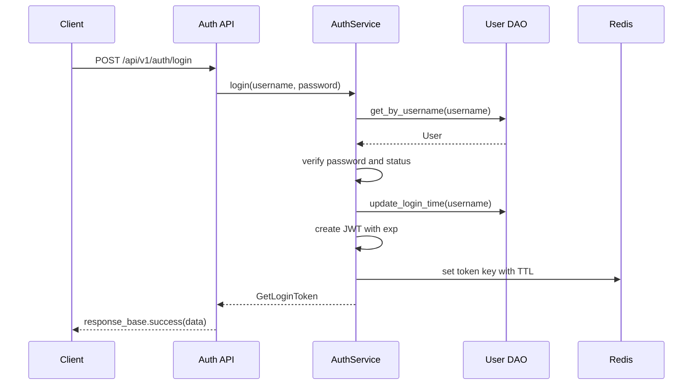
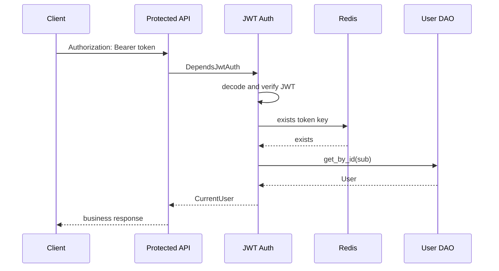
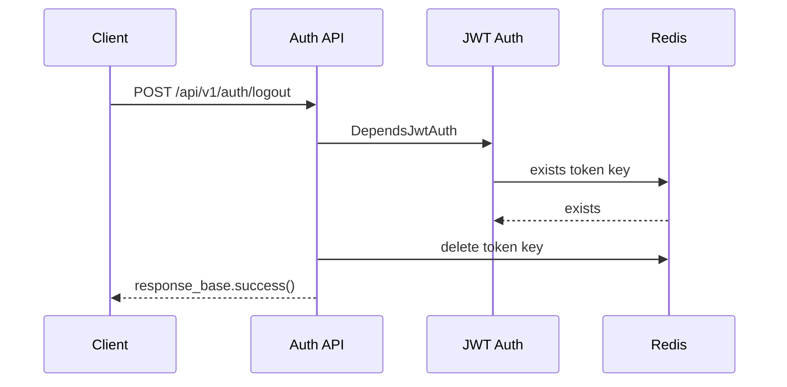

# 用户登录登出与用户信息功能详细设计

## 1. 背景与目标

根据 `docs/spec/user-login/normalCR/requirements/user-login-logout.md`，本次需求需要提供简单的用户登录、登出和用户信息查询能力，不实现用户注册。登录后返回 Token，Token 登录态使用 Redis 管理。

当前系统已经存在 FastAPI + Tortoise ORM + Redis 的基础能力，也已有 `backend/app/admin` 下的用户、认证相关代码。本设计以复用现有实现和 API 风格为原则，做最小必要补齐：

- 保留现有统一响应结构：`{"code": int, "msg": string, "data": any}`。
- 保留现有认证请求头：`Authorization: Bearer <token>`。
- 保留现有用户表 `user`，不新增注册流程和用户主数据表。
- 补齐 Token 的 Redis 缓存、校验和登出失效能力。
- 提供当前登录用户信息接口，仅返回需求要求的用户名、用户邮箱，并可兼容现有用户详情结构。

## 2. 当前系统现状

### 2.1 技术与模块现状

- Web 框架：FastAPI。
- 数据库 ORM：Tortoise ORM，模型集中在 `backend/app/admin/model`。
- Redis 客户端：`backend/database/redis.py` 中的 `redis_client`。
- 统一响应：`backend/common/response/response_schema.py`。
- 认证工具：`backend/common/security/jwt.py`。
- 路由聚合：
  - `backend/app/router.py` 聚合 admin 与 prediction 路由。
  - `backend/app/admin/api/router.py` 使用 `settings.FASTAPI_API_V1_PATH`，当前为 `/api/v1`。

### 2.2 现有相关接口

当前已有接口雏形：

| 方法 | 路径 | 当前说明 |
| --- | --- | --- |
| `GET` | `/api/v1/auth/captcha` | 既有验证码接口，本需求登录流程不再依赖 |
| `POST` | `/api/v1/auth/login` | 用户登录 |
| `POST` | `/api/v1/auth/logout` | 用户登出，但当前只返回成功，不会失效 Token |
| `POST` | `/api/v1/auth/login/swagger` | Swagger 调试登录 |
| `GET` | `/api/v1/users/{username}` | 按用户名查询用户详情，需要登录 |
| `GET` | `/api/v1/users` | 分页查询用户，需要登录 |

说明：`backend/app/admin/api/v1/auth/__init__.py` 已为认证路由设置 `/auth` 前缀，因此登录登出实际路径为 `/api/v1/auth/login`、`/api/v1/auth/logout`。

### 2.3 现有问题

| 问题 | 影响 | 设计处理 |
| --- | --- | --- |
| `create_access_token` 只写入 `sub`，未写入过期时间 | Token 自身无法按配置过期 | 增加 `exp` 和 `iat` |
| 登录后未缓存 Token 到 Redis | 不满足需求的 Redis 管理登录态 | 登录成功后写入 Redis |
| `get_current_user` 只校验 JWT 和数据库用户，不校验 Redis | 登出后旧 Token 仍可用 | 认证依赖增加 Redis Token 存在性校验 |
| `/logout` 当前没有获取当前 Token | 无法删除 Redis Token | 登出接口从请求头解析 Token 后删除 |
| 用户信息接口按 path username 查询 | 不适合前端获取“当前登录用户信息” | 新增 `/api/v1/users/me` |

## 3. 总体设计

### 3.1 功能边界

本次实现范围：

- 用户登录：用户名、密码校验成功后签发 Token。
- Token 缓存：登录成功后将 Token 写入 Redis，并设置 TTL。
- 登录态校验：受保护接口同时校验 JWT 与 Redis 中的 Token。
- 用户登出：删除当前 Token 对应 Redis Key。
- 当前用户信息：提供当前登录用户的用户名和邮箱。

不在本次范围：

- 用户注册。
- 刷新 Token。
- 多因子认证。
- 角色权限体系扩展。
- 前端页面开发。
- 用户密码找回流程。

### 3.2 设计原则

- API 风格保持现状：继续使用 FastAPI router、Pydantic schema、service、dao 分层。
- 响应结构保持现状：所有业务接口返回 `ResponseModel` 或 `ResponseSchemaModel[T]`。
- 登录态以 Redis 为准：JWT 只作为可验证载体，Redis Key 存在才表示 Token 当前有效。
- 登出幂等：合法 Token 调用登出后删除缓存；重复调用时如果 Token 已失效，应按未认证处理。
- 最小字段暴露：`/users/me` 只返回需求中的 `username`、`email`，避免泄露 `status`、`is_superuser` 等管理字段。

## 4. API 设计

### 4.1 登录

#### 基本信息

| 项目 | 内容 |
| --- | --- |
| 方法 | `POST` |
| 路径 | `/api/v1/auth/login` |
| 鉴权 | 不需要 |
| Summary | `用户登录` |

#### 请求体

调整现有 `AuthLoginParam`，登录请求体不再包含验证码字段：

```json
{
  "username": "admin",
  "password": "password"
}
```

#### 成功响应

沿用并修正现有 `GetLoginToken`：

```json
{
  "code": 200,
  "msg": "请求成功",
  "data": {
    "access_token": "jwt-token",
    "token_type": "Bearer",
    "expires_in": 86400,
    "user": {
      "username": "admin",
      "email": "admin@example.com"
    }
  }
}
```

字段说明：

| 字段 | 类型 | 说明 |
| --- | --- | --- |
| `access_token` | string | JWT Token |
| `token_type` | string | 固定为 `Bearer` |
| `expires_in` | int | Token 有效期，单位秒，取 `settings.TOKEN_EXPIRE_SECONDS` |
| `user.username` | string | 用户名 |
| `user.email` | string | 用户邮箱 |

#### 失败场景

| 场景 | 响应 |
| --- | --- |
| 用户不存在或密码错误 | `401`，`用户名或密码有误` |
| 用户被锁定 | `401`，`用户已被锁定, 请联系统管理员` |

### 4.2 登出

#### 基本信息

| 项目 | 内容 |
| --- | --- |
| 方法 | `POST` |
| 路径 | `/api/v1/auth/logout` |
| 鉴权 | 需要 `Authorization: Bearer <token>` |
| Summary | `用户登出` |

#### 请求体

无。

#### 成功响应

```json
{
  "code": 200,
  "msg": "请求成功",
  "data": null
}
```

#### 行为

- 从请求头解析 Bearer Token。
- 校验 JWT 与 Redis 登录态。
- 删除 Redis Token Key。
- 返回成功。

### 4.3 当前用户信息

#### 基本信息

| 项目 | 内容 |
| --- | --- |
| 方法 | `GET` |
| 路径 | `/api/v1/users/me` |
| 鉴权 | 需要 `Authorization: Bearer <token>` |
| Summary | `获取当前用户信息` |

#### 成功响应

```json
{
  "code": 200,
  "msg": "请求成功",
  "data": {
    "username": "admin",
    "email": "admin@example.com"
  }
}
```

#### 失败场景

| 场景 | 响应 |
| --- | --- |
| 未携带 Token | `401`，`Not Authenticated` 或 `Token 无效` |
| Token 解析失败 | `401`，`Token 无效` |
| Token 已过期 | `401`，`Token 已过期` |
| Redis 中不存在该 Token | `401`，`Token 已失效` |
| 用户不存在 | `401`，`Token 无效` |
| 用户被锁定 | `401`，`用户已被锁定，请联系系统管理员` |

## 5. Redis 登录态设计

### 5.1 Key 设计

新增配置：

```python
TOKEN_REDIS_PREFIX: str = 'fba:login:token'
```

Redis Key：

```text
fba:login:token:{user_id}:{token_digest}
```

说明：

- `user_id` 来自 JWT `sub`。
- `token_digest` 为 Token 的 SHA-256 摘要，避免完整 Token 直接作为 Redis Key 的一部分。
- 同一用户允许多端登录，每个 Token 独立缓存与登出。

### 5.2 Value 设计

Value 使用 JSON 字符串：

```json
{
  "user_id": 1,
  "username": "admin",
  "login_time": "2026-05-19 10:00:00"
}
```

TTL：

```text
settings.TOKEN_EXPIRE_SECONDS
```

### 5.3 登录写入

登录成功后：

1. 更新 `user.last_login_time`。
2. 调用 `create_access_token(str(user.id))` 生成 JWT。
3. 计算 `token_digest`。
4. 写入 Redis Key，并设置 `ex=settings.TOKEN_EXPIRE_SECONDS`。
5. 返回 Token 和用户信息。

### 5.4 认证校验

受保护接口认证流程：

1. 从 `Authorization` 请求头获取 Bearer Token。
2. 解码 JWT，校验签名、`exp`、`sub`。
3. 根据 `sub` 和 Token 摘要检查 Redis Key 是否存在。
4. 查询数据库用户，确认用户存在且未锁定。
5. 返回 `CurrentUser`。

### 5.5 登出删除

登出流程：

1. 复用认证依赖确认当前 Token 有效。
2. 删除当前 Token 对应 Redis Key。
3. 返回统一成功响应。

## 6. 数据模型设计

本次不新增数据库表，不修改 `user` 表结构。

复用当前 `backend/app/admin/model/user.py`：

| 字段 | 用途 |
| --- | --- |
| `id` | JWT `sub` 和 Redis Key 用户 ID |
| `username` | 登录账号，用户信息返回字段 |
| `password` | 密码哈希 |
| `salt` | 密码盐 |
| `email` | 用户信息返回字段 |
| `status` | 用户是否可登录 |
| `last_login_time` | 登录成功后更新 |

## 7. 代码改动设计

### 7.1 配置

文件：`backend/core/conf.py`

新增：

```python
TOKEN_REDIS_PREFIX: str = 'fba:login:token'
```

保留并使用：

```python
TOKEN_EXPIRE_SECONDS: int = 60 * 60 * 24 * 1
```

### 7.2 Token Schema

文件：`backend/app/admin/schema/token.py`

调整 `GetLoginToken`：

- 保留 `access_token`。
- 保留 `token_type = 'Bearer'`。
- 新增 `expires_in: int`。
- `user` 使用只包含 `username`、`email` 的轻量 schema。

建议新增：

```python
class GetLoginUserInfo(SchemaBase):
    username: str
    email: EmailStr
```

```python
class GetLoginToken(SchemaBase):
    access_token: str
    token_type: str = 'Bearer'
    expires_in: int
    user: GetLoginUserInfo
```

兼容说明：当前 `GetLoginToken` 同时存在 `token_type` 与 `access_token_type`，建议删除 `access_token_type`，统一使用 OAuth2 常见字段 `token_type`。

### 7.3 用户 Schema

文件：`backend/app/admin/schema/user.py`

新增当前用户信息返回结构：

```python
class GetCurrentUserInfo(SchemaBase):
    model_config = ConfigDict(from_attributes=True)

    username: str = Field(description='用户名')
    email: EmailStr = Field(description='邮箱')
```

### 7.4 JWT 与 Redis 登录态工具

文件：`backend/common/security/jwt.py`

新增或调整函数：

| 函数 | 说明 |
| --- | --- |
| `create_access_token(sub: str) -> str` | 增加 `iat`、`exp` |
| `get_token(request: Request) -> str` | 继续负责从 Header 获取 Bearer Token |
| `get_token_cache_key(user_id: int, token: str) -> str` | 生成 Redis Key |
| `check_token_in_redis(user_id: int, token: str) -> None` | 不存在则抛 `TokenError(msg='Token 已失效')` |
| `get_current_user(request: Request) -> User` | 改为从 request 取 token，并校验 Redis |

`get_current_user` 当前依赖 `OAuth2PasswordBearer` 获取 token。为了登出接口能复用同一份 Header 解析逻辑，并让 Swagger 仍可使用 Bearer 认证，可保留 `OAuth2PasswordBearer` 用于 OpenAPI，同时在函数内接收 `Request`：

```python
async def get_current_user(request: Request, token: str = Depends(oauth2_schema)) -> User:
    user_id = jwt_decode(token)
    await check_token_in_redis(user_id, token)
    ...
```

### 7.5 AuthService

文件：`backend/app/admin/service/auth_service.py`

新增职责：

| 方法 | 说明 |
| --- | --- |
| `cache_login_token(user: User, token: str) -> None` | 登录成功后写入 Redis |
| `logout(token: str) -> None` | 删除 Redis Token Key |

调整 `login`：

1. 用户名密码验证。
2. 更新登录时间。
3. 生成 Token。
4. 缓存 Token 到 Redis。
5. 返回 `GetLoginToken(access_token=token, token_type='Bearer', expires_in=settings.TOKEN_EXPIRE_SECONDS, user=user)`。

调整 `swagger_login`：

- 为保持 Swagger 调试与真实登录一致，也应缓存 Token 到 Redis。
- 返回结构可继续保持 `GetSwaggerToken`，但 Token 必须进入 Redis，否则 Swagger 获取的 Token 无法访问受保护接口。

### 7.6 Auth Router

文件：`backend/app/admin/api/v1/auth/auth.py`

调整：

| 接口 | 设计 |
| --- | --- |
| `POST /login` | Summary 调整为 `用户登录`，请求体移除 `captcha` |
| `POST /logout` | 注入 `Request` 和 `CurrentUser` 或 `DependsJwtAuth`，调用 `auth_service.logout(token)` |

登出伪代码：

```python
@router.post('/logout', summary='用户登出', dependencies=[DependsJwtAuth])
async def user_logout(request: Request) -> ResponseModel:
    token = get_token(request)
    await auth_service.logout(token=token)
    return response_base.success()
```

### 7.7 User Router

文件：`backend/app/admin/api/v1/user.py`

新增接口，必须放在 `/{username}` 路由之前，避免 `me` 被解析成 username：

```python
@router.get('/me', summary='获取当前用户信息', dependencies=[DependsJwtAuth])
async def get_current_userinfo(current_user: CurrentUser) -> ResponseSchemaModel[GetCurrentUserInfo]:
    return response_base.success(data=current_user)
```

保留现有 `GET /users/{username}` 以兼容后台管理能力。

## 8. 关键流程

### 8.1 登录流程



### 8.2 受保护接口认证流程



### 8.3 登出流程



## 9. 安全设计

- 密码校验继续使用当前 `pwdlib` + `bcrypt` 方案。
- JWT 增加 `exp`，过期时间统一使用 `settings.TOKEN_EXPIRE_SECONDS`。
- Token 必须同时满足 JWT 有效和 Redis Key 存在，避免登出后继续使用。
- Redis Key 使用 Token 摘要，不在 Key 中暴露完整 Token。
- 用户信息接口只返回 `username`、`email`。
- 登录失败错误信息继续保持“用户名或密码有误”，避免泄露用户是否存在。
- 登录流程不再校验验证码；既有验证码接口如无其他调用方，可在后续变更中评估废弃。

## 10. 兼容性与注意事项

### 10.1 路径兼容

当前登录登出路径实际为：

- `/api/v1/auth/login`
- `/api/v1/auth/logout`

`TOKEN_URL_SWAGGER` 当前配置为 `/api/v1/auth/login/swagger`，与实际路由一致，建议保持：

```python
TOKEN_URL_SWAGGER: str = f'{FASTAPI_API_V1_PATH}/auth/login/swagger'
```

本次设计不调整认证接口路径，避免破坏已有调用方。

### 10.2 验证码接口兼容说明

当前系统存在 `/api/v1/auth/captcha` 接口，但本需求的登录流程已移除验证码字段，不再读取 `request.app.state.captcha_uuid`，也不再校验验证码 Redis Key。该接口是否继续保留取决于是否存在其他调用方；本次设计不要求删除既有接口。

### 10.3 多端登录

本设计允许同一用户存在多个有效 Token。用户登出只失效当前 Token，不影响同账号其他设备。

如需“单用户单 Token”，可在登录前执行：

```text
redis_client.delete_prefix(f'{settings.TOKEN_REDIS_PREFIX}:{user.id}:')
```

本次不采用该策略，避免影响多端登录体验。

## 11. 测试设计

### 11.1 单元测试

建议覆盖：

| 测试对象 | 场景 |
| --- | --- |
| `create_access_token` / `jwt_decode` | 正常解析 `sub`、过期 Token 抛错、非法 Token 抛错 |
| Token Redis Key | 同一 Token Key 稳定生成，不同 Token Key 不同 |
| `AuthService.login` | 登录成功写入 Redis，密码错误失败 |
| `AuthService.logout` | 删除当前 Token Key |
| `get_current_user` | Redis 有 Key 通过，无 Key 抛 `Token 已失效` |

### 11.2 接口测试

建议使用 FastAPI TestClient 或 httpx async client 覆盖：

1. 使用用户名和密码登录成功，返回 `access_token`、`token_type`、`expires_in`、`user.username`、`user.email`。
2. 登录请求体不携带 `captcha` 字段也可以完成登录。
3. 携带 Token 访问 `/api/v1/users/me` 成功。
4. 调用 `/api/v1/auth/logout` 成功。
5. 再次携带同一 Token 访问 `/api/v1/users/me` 返回 `401`。
6. 未携带 Token 访问 `/api/v1/users/me` 返回 `401`。

### 11.3 回归测试

确认以下既有接口不被破坏：

- `/api/v1/auth/login/swagger`
- `/api/v1/users/{username}`
- `/api/v1/users`
- `/api/v1/predict`
- `/api/v1/model-info`
- `/api/v1/health`

## 12. 实施顺序

1. 增加配置 `TOKEN_REDIS_PREFIX`，确认 `TOKEN_URL_SWAGGER` 与实际路由一致。
2. 新增轻量用户信息 schema 和登录返回 schema。
3. 改造 `jwt.py`：增加 `exp`、Redis Key 工具、Redis 登录态校验。
4. 改造 `AuthService.login/swagger_login/logout`。
5. 改造 `/logout` 接口。
6. 新增 `/users/me` 接口，并确保位于 `/{username}` 之前。
7. 补充或调整接口测试。
8. 本地启动服务，通过 Swagger 或 httpx 验证登录、用户信息、登出闭环。

## 13. 验收标准

- 用户可以使用用户名、密码登录，并获得 Bearer Token。
- 登录成功后 Redis 中存在对应 Token Key，TTL 等于 `TOKEN_EXPIRE_SECONDS`。
- 携带有效 Token 可以访问 `/api/v1/users/me`，返回用户名和邮箱。
- 调用 `/api/v1/auth/logout` 后 Redis Token Key 被删除。
- 登出后的 Token 无法继续访问受保护接口。
- 不新增用户注册能力。
- 统一响应结构与当前项目保持一致。
