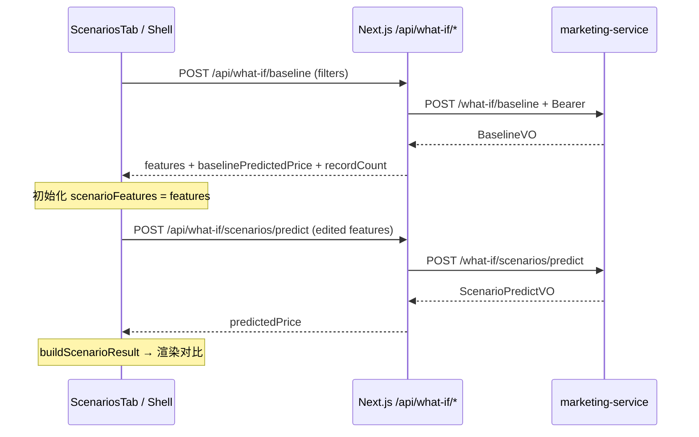

# Scenarios What-if 详细设计（normalCR · 前端）

## 1. 文档目标

基于以下输入，输出 Scenarios What-if（情景假设分析）**前端**可实施详细设计，作为开发、联调、测试与验收依据：

- 需求文档：`docs/spec/scenarios-what-if/normalCR/requirements/scenarios-what-if.md`
- API 设计：`docs/spec/scenarios-what-if/normalCR/api-design/scenarios-what-if-api-design.md`
- 全局设计约束：`docs/global-info/deisgn.md`
- 全局技术约束：`docs/global-info/techo-design.md`
- Dashboard 区间筛选语义：`docs/spec/dashboard/normalCR/api-design/dashboard-api-design.md`（若存在）
- 当前前端实现基线：
  - `app/analysis/page.tsx`
  - `app/components/analysis/analysis-shell.tsx`
  - `app/components/analysis/scenarios/scenarios-tab.tsx`
  - `app/components/analysis/scenarios/scenario-feature-form.tsx`
  - `app/components/analysis/scenarios/scenario-result-panel.tsx`
  - `lib/analysis/scenarios.ts`
  - `lib/analysis/services.ts`（`runScenario`）
  - `lib/analysis/types.ts`（`ScenarioBaseline` / `ScenarioResult`）
  - `lib/analysis/dashboard-api.ts`（`toDashboardQueryRequest` 筛选映射参考）
  - `lib/analysis/segments-api.ts`、`app/api/segments/*`（BFF 代理模式参考）

后端实现、DB/SQL 见 API 文档引用的 `../db-design/scenarios-what-if-db-design.md`（规划）；本文档仅在前端边界内描述契约与联调要点。

## 2. 范围定义

### 2.1 本次范围（In Scope）

- Market Analysis 应用内 **Scenarios** 子页（`/analysis?tab=scenarios`）。
- 与 **Analysis Filter Bar** 共享筛选条件；筛选语义与 Dashboard **Min/Max 区间**一致。
- 调用 `POST /what-if/baseline`：按当前筛选计算 7 维特征 **median** 与 `baselinePredictedPrice`。
- 用户编辑场景特征后调用 `POST /what-if/scenarios/predict`（单笔 `features`）。
- 前端计算场景价与 Baseline 的**价格差额、变化率、特征差异表**（API 不提供 diff 字段）。
- Baseline 摘要区：记录数、基准价、来源说明。
- 场景特征表单：7 字段滑块 + 数字输入、校验、Reset、Run Scenario。
- 结果对比区：Baseline vs Scenario 价格卡片、差额文案、特征 diff 表。
- Next.js BFF：`/api/what-if/baseline`、`/api/what-if/scenarios/predict` 代理至 marketing 服务。
- 状态：baseline loading、scenario loading、skeleton/文案、error + retry。
- 基础响应式与 WCAG 基线。
- Data Table 行操作 **Use as baseline** 调整为「带入记录特征到 Scenarios 表单」（见 §7.4）。

### 2.2 非范围（Out of Scope）

- 批次场景 `featuresList`（UI 首版仅单笔；API 已支持，可二期做多场景对比表）。
- 后端 median SQL、prediction-service 部署与运维。
- 将单条 prediction record 的 `predictedPrice` 作为官方 Baseline（与 API 契约不符）。
- Segments / Dashboard / Data Table 其他 Tab 行为变更（除 Scenarios 相关文案修正）。
- 场景历史保存、分享链接、导出 PDF。
- 模型训练与特征工程。

## 3. 需求与设计基线

### 3.1 需求要点（scenarios-what-if.md）

| 编号 | 需求 | 设计落点 |
| --- | --- | --- |
| R1 | Baseline：按 filter 过滤 → 各特征 median → HouseFeatures | `POST /what-if/baseline` → `BaselineVO.features` |
| R2 | Baseline 预测价 | 同接口 `baselinePredictedPrice`（经本服务调 prediction-service） |
| R3 | 场景预测 | `POST /what-if/scenarios/predict` + 用户编辑的 `features` |
| R4 | 与 Baseline 对比 | 前端 `buildScenarioResult` / `buildFeatureDiffRows`（§9.5） |

### 3.2 业务语义

1. **Baseline 唯一权威来源**：当前 Analysis 筛选条件下的 median 特征 + 对该特征向量的一次预测，**不是**客户端对 `predictedPrice` 求平均，也**不是**单条 listing 的价格。
2. **筛选为空集**：`recordCount = 0` 时后端返回业务错误（`code: 400`，文案如「筛选后无数据，无法计算 Baseline」），前端展示 error，不展示空 Baseline。
3. **场景价**：仅来自场景预测接口；未改特征时场景价应与 Baseline 价一致（允许 ±0.01 舍入误差）。
4. **对比计算**：差额与百分比由前端完成；`baseline == 0` 时百分比展示 `-` 或 `0%`（与 API §7 一致）。

### 3.3 全局约束

- 技术栈：Next.js App Router + React + Tailwind CSS + Shadcn/现有 valuation 样式 + 无图表依赖。
- 视觉：IBM Carbon 倾向（0 圆角、1px 边框、主色 `#0f62fe`）；复用 `analysis-scenarios-*`、`valuation-*` 类名。
- 认证：BFF 从 cookie 注入 `Authorization: Bearer <token>`；401 与全站一致（跳转登录或 Not Authenticated）。

## 4. 信息架构与路由设计

```text
Market Analysis (/analysis)
├─ Dashboard        (?tab=dashboard)
├─ Segments           (?tab=segments)
├─ Scenarios          (?tab=scenarios)    ← 本文档
└─ Data Table         (?tab=data)

Scenarios Tab
├─ Page Header（标题 Scenarios + 说明）
├─ Filter Bar（与全站共享，AnalysisShell 顶栏）
├─ Baseline 区（摘要 + 可选 Refresh）
├─ Scenario Feature Form（7 维编辑）
└─ Scenario Result Panel（价格对比 + 特征 diff）
```

### 4.1 路由规则

| 项 | 值 |
| --- | --- |
| 页面路由 | `/analysis` |
| Scenarios Tab | `/analysis?tab=scenarios` |
| 筛选参数 | 与 Dashboard 共用 URL query（`squareFootageMin`、`priceMin` 等） |
| 场景特征 | **不写入 URL**（仅内存状态；避免 URL 过长与敏感漂移） |

进入 Scenarios Tab 时：

- 保留当前 URL 筛选参数。
- 自动请求 Baseline（§7.1）。
- 用返回的 `features` 初始化/覆盖 `scenarioFeatures`（若用户未锁定编辑，见 §8.2）。

### 4.2 导航规则

- `AnalysisSidenav` 中 `Scenarios` 在 `tab=scenarios` 时 `aria-current="page"`。
- 切换 Tab 时 `router.replace` 更新 `tab`，不丢失筛选 query。
- `AnalysisPageHeader` 的 `scenarios` 文案修正为：`title: "Scenarios"`，`subtitle` 说明 median baseline 与 what-if 预测（见 §11.2）。

## 5. 页面结构详细设计

### 5.1 Page Header

| 元素 | 说明 |
| --- | --- |
| 标题 | `Scenarios`（`h1#analysis-page-title`，经 `AnalysisPageHeader`） |
| 描述 | 说明：在当前筛选下以 **median 特征** 为基准，调整特征查看预测价变化 |

### 5.2 Baseline 区

替换现网「From dataset average / From a prediction record」双按钮模式。

| 元素 | 说明 |
| --- | --- |
| 区域标题 | `h2`：`Baseline`（`id="analysis-scenarios-baseline-title"`） |
| 辅助操作 | `Refresh baseline`（`valuation-btn-secondary`）：手动重拉 `POST /what-if/baseline` |
| 摘要（成功） | `role="status"`，`aria-live="polite"` |
| 文案模板 | `Baseline from {recordCount} filtered records (median features).` |
| 基准价 | `Baseline predicted price: {formatUsd(baselinePredictedPrice)}` |
| 加载 | `Loading baseline...` |
| 无数据/错误 | `role="alert"` + 后端 `message` + `Retry` |
| 未加载 | 进入 Tab 前不展示表单可编辑态 |

**移除或降级：**

| 现网 | 目标 |
| --- | --- |
| `From dataset average`（客户端 mean） | 删除；由 API median baseline 替代 |
| `From a prediction record` 作为 Baseline 源 | 删除作为 Baseline；改为 §7.4「从记录带入场景特征」 |
| `baseline.source === "datasetAverage" \| "predictionRecord"` | 统一为 `source: "filterMedian"`；可选保留 `recordId` 仅表示场景特征来源 |

### 5.3 场景特征表单（ScenarioFeatureForm）

保持现网双控件（range + number）布局，校验规则与 API §5.3 对齐。

| 字段 | UI 标签 | API 校验 | 表单 step 建议 |
| --- | --- | --- | --- |
| squareFootage | Square Footage | `> 0` | 50 |
| bedrooms | Bedrooms | `>= 0`，整数 | 1 |
| bathrooms | Bathrooms | `>= 0` | 0.5 |
| yearBuilt | Year Built | `[1800, currentYear]` 整数 | 1 |
| lotSize | Lot Size | `> 0` | 100 |
| distanceToCityCenter | Distance to City Center | `>= 0` | 0.5 |
| schoolRating | School Rating | `[0, 10]` | 0.5 |

交互：

| 行为 | 说明 |
| --- | --- |
| Reset to Baseline | 将表单重置为当前 `baseline.features` |
| Run Scenario | `POST /what-if/scenarios/predict`；提交前 `validateScenarioFeatures` |
| 禁用 | 无 baseline 或 baseline/scenario loading 时 `disabled` |

`SCENARIO_FIELD_LIMITS` 调整：`lotSize.min` 由 `0` 改为 `1`（与 API `> 0` 一致）；其余与 API 边界对齐。

### 5.4 结果对比区（ScenarioResultPanel）

| 区块 | 说明 |
| --- | --- |
| 价格卡片 | 左 Baseline、右 Scenario；`formatUsd` |
| 差额摘要 | `Scenario price is {formatDeltaUsd(delta)} higher/lower than baseline ({formatPercent(deltaPercent)}).` |
| `deltaPercent` 展示 | `baseline.predictedPrice === 0` → 显示 `-` 或 `0%`（不用 `formatPercent` 除零） |
| 特征表 | 复用 `buildFeatureDiffRows`；列 Feature / Baseline / Scenario / Diff |
| 样式 | 涨：`analysis-kpi-delta-up`；跌：`analysis-kpi-delta-down` |
| Loading | `Running scenario...` |
| Empty | 未 Run 前提示调整特征并运行 |
| Error | `role="alert"` + Retry |

### 5.5 Loading / Empty / Error 矩阵

| 状态 | Baseline 区 | 表单 | 结果区 |
| --- | --- | --- | --- |
| baselineLoading | Loading 文案 | disabled | 空态提示 |
| baselineError | alert + Retry | disabled | - |
| baselineReady | 摘要 | enabled | 空态或上次结果 |
| scenarioLoading | 摘要保持 | disabled | Running... |
| scenarioError | 摘要保持 | enabled | alert + Retry |
| scenarioReady | 摘要保持 | enabled | 对比结果 |

## 6. 与 Baseline 的对比计算（前端契约）

与 API 设计 §7 一致，在 `lib/analysis/scenarios.ts` 集中实现：

```ts
export function buildScenarioResult(
  baseline: ScenarioBaseline,
  scenarioFeatures: ValuationFeatureInput,
  scenarioPrice: number,
): ScenarioResult {
  const delta = scenarioPrice - baseline.predictedPrice;
  const deltaPercent =
    baseline.predictedPrice === 0
      ? null // UI 展示 "-"
      : (delta / baseline.predictedPrice) * 100;
  return { baseline, scenarioFeatures, scenarioPrice, delta, deltaPercent };
}
```

| 指标 | 公式 | UI |
| --- | --- | --- |
| 价格差额 | `scenarioPrice - baseline.predictedPrice` | `formatDeltaUsd` |
| 价格变化率 | `(scenario - baseline) / baseline * 100` | `formatPercent` 或 `-` |
| 特征差异 | `scenario[key] - baseline.features[key]` | 表格 Diff 列，正数带 `+` |

**约束：**

- `baseline.predictedPrice` 必须来自 `BaselineVO.baselinePredictedPrice`，不得用客户端聚合价替代。
- `scenarioPrice` 来自 `ScenarioPredictVO.predictedPrice`（单笔）或 `predictions[0]`。

## 7. 交互流程设计

### 7.1 主流程（筛选驱动 Baseline）



```text
进入 /analysis?tab=scenarios
  -> 读取 URL filters
  -> POST baseline（filters）
  -> 成功：setBaseline + setScenarioFeatures(features)
  -> 用户调整特征 -> Run Scenario -> POST predict
  -> 前端计算 delta -> 展示 ScenarioResultPanel

Filter Bar Apply（tab 仍为 scenarios）
  -> 更新 URL
  -> 重新 POST baseline
  -> 清空 scenarioResult（避免旧结果与新区间错位）
  -> 表单重置为新 baseline.features
```

### 7.2 Run Scenario 流程

```text
用户点击 Run Scenario
  -> validateScenarioFeatures（本地）
  -> POST /what-if/scenarios/predict { features }
  -> predictedPrice
  -> buildScenarioResult(currentBaseline, features, price)
  -> setScenarioResult
```

### 7.3 Refresh baseline

```text
用户点击 Refresh baseline
  -> 与 7.1 相同请求
  -> 可选：若 scenarioResult 存在且 features 未变，可自动重跑 predict（首版不自动，仅 Refresh baseline）
```

### 7.4 Data Table「Use as baseline」

现网：`buildRecordBaseline` + 跳转 scenarios，以**记录价**为 baseline。

目标行为：

```text
Data Table 行 -> Use as scenario starting point（文案可保留 Use as baseline 或改 Copy）
  -> router.replace(?tab=scenarios&...)
  -> 若 baseline 已加载：仅 setScenarioFeatures(record.features)
  -> 若 baseline 未加载：先等 baseline 完成再覆盖 features（或并行：baseline 用 filters，features 用 record）
  -> 不清除 filter-derived baseline.predictedPrice
  -> 清空 scenarioResult
```

**说明：** 记录特征仅作为场景起点；对比仍针对 **filter median baseline 价**，避免与 API 双轨。

### 7.5 可选：从记录选择（二期或简化保留）

若产品需保留「从列表选一条」入口：

- 按钮文案改为 `Start from a record`。
- 打开 `ComparisonSelectionDialog`，选中后将 `record.features` 写入表单。
- **不**调用 `buildRecordBaseline` 更新 `predictedPrice`。

## 8. 状态机与数据流

### 8.1 AnalysisShell 状态

```ts
type ScenariosPageState = {
  baseline: ScenarioBaseline | null;
  baselineLoading: boolean;
  baselineError: string | null;
  scenarioFeatures: ValuationFeatureInput;
  scenarioResult: ScenarioResult | null;
  scenarioLoading: boolean;
  scenarioError: string | null;
  /** 用户手动改过表单后，filter 变更是否仍强制覆盖 features */
  featuresDirty: boolean;
};
```

`ScenarioBaseline` 类型演进：

```ts
export type ScenarioBaseline = {
  source: "filterMedian";
  recordCount: number;
  features: ValuationFeatureInput;
  predictedPrice: number; // = baselinePredictedPrice
  /** 若从记录带入场景特征，仅作展示 */
  scenarioSeedRecordId?: string;
};
```

加载策略：

| 触发 | 动作 |
| --- | --- |
| `currentTab === "scenarios"` 且 filters 变化 | `loadBaseline()` |
| 进入 scenarios Tab | `loadBaseline()` |
| `loadBaseline` 成功且 `!featuresDirty` | `setScenarioFeatures(baseline.features)` |
| `loadBaseline` 成功 | `setScenarioResult(null)` |
| Filter Apply | `featuresDirty = false`（强制跟新 baseline） |
| `onFeaturesChange` | `featuresDirty = true` |

### 8.2 ScenariosTab 职责

| 职责 | 归属 |
| --- | --- |
| 展示 baseline 摘要、Refresh | `ScenariosTab` |
| 表单、结果 | 子组件 |
| baseline/scenario 请求 | `AnalysisShell`（与 segments 一致，数据在 Shell） |

Props 调整（相对现网）：

```ts
type ScenariosTabProps = {
  baseline: ScenarioBaseline | null;
  baselineLoading: boolean;
  baselineError: string | null;
  features: ValuationFeatureInput;
  result: ScenarioResult | null;
  scenarioLoading: boolean;
  scenarioError: string | null;
  onFeaturesChange: (features: ValuationFeatureInput) => void;
  onRefreshBaseline: () => void;
  onRun: () => void;
  onRetryBaseline: () => void;
  onRetryScenario: () => void;
};
```

移除：`records`、`filters`、`onBaselineChange`、客户端 `buildDatasetAverageBaseline` / `buildRecordBaseline`（记录选择逻辑上移到 Shell 或保留 dialog 仅写 features）。

### 8.3 错误处理

| 场景 | HTTP / code | UI |
| --- | --- | --- |
| 未登录 | 401 | 与 Dashboard/Segments 一致 |
| 筛选无数据 | 400 + message | Baseline 区 alert，文案透传 |
| 参数错误 | 400 | alert；表单字段级错误以本地校验为主 |
| 预测服务不可用 | 400 / 502 | `预测服务不可用` 或 BFF 统一文案 + Retry |
| 网络失败 | - | `Failed to load baseline.` / `Failed to run scenario.` + Retry |

成功码：后端 `code === 0`；BFF 对外可统一为 `200`（与现有 `readApiResponse` + `isDashboardApiSuccess` 兼容 `0 | 200`）。

## 9. 数据模型与接口契约

### 9.1 与 API 对齐的 TypeScript 类型

```ts
/** 与 WhatIfBaselineQueryRequest 一致（无 priceBucketCount / scatterLimit） */
export type WhatIfBaselineQueryRequest = {
  minId?: number;
  maxId?: number;
  minSquareFootage?: number;
  maxSquareFootage?: number;
  minBedrooms?: number;
  maxBedrooms?: number;
  minBathrooms?: number;
  maxBathrooms?: number;
  minYearBuilt?: number;
  maxYearBuilt?: number;
  minLotSize?: number;
  maxLotSize?: number;
  minDistanceToCityCenter?: number;
  maxDistanceToCityCenter?: number;
  minSchoolRating?: number;
  maxSchoolRating?: number;
  minPrice?: number;
  maxPrice?: number;
  filters?: Partial<WhatIfBaselineQueryRequest>;
};

export type HouseFeaturesVO = {
  squareFootage: number;
  bedrooms: number;
  bathrooms: number;
  yearBuilt: number;
  lotSize: number;
  distanceToCityCenter: number;
  schoolRating: number;
};

export type BaselineVO = {
  recordCount: number;
  features: HouseFeaturesVO;
  baselinePredictedPrice: number;
};

export type ScenarioPredictRequest = {
  features?: HouseFeaturesVO;
  featuresList?: HouseFeaturesVO[];
};

export type ScenarioPredictVO = {
  mode: "single" | "batch";
  count: number;
  predictedPrice?: number | null;
  predictions: number[];
};
```

`HouseFeaturesVO` 与 `ValuationFeatureInput` 字段名一致，可直接互用。

### 9.2 AnalysisFilterInput → WhatIfBaselineQueryRequest

```ts
export function toWhatIfBaselineQueryRequest(
  filters: AnalysisFilterInput,
): WhatIfBaselineQueryRequest {
  const dashboard = toDashboardQueryRequest(filters);
  const {
    priceBucketCount: _pb,
    scatterLimit: _sl,
    ...range
  } = dashboard;
  return range;
}
```

| AnalysisFilterInput | WhatIfBaselineQueryRequest |
| --- | --- |
| `squareFootageMin` / `Max` | `minSquareFootage` / `maxSquareFootage` |
| `bedroomsMin` / `Max` | `minBedrooms` / `maxBedrooms` |
| `bathroomsMin` / `Max` | `minBathrooms` / `maxBathrooms` |
| `yearBuiltMin` / `Max` | `minYearBuilt` / `maxYearBuilt` |
| `lotSizeMin` / `Max` | `minLotSize` / `maxLotSize` |
| `distanceToCityCenterMin` / `Max` | `minDistanceToCityCenter` / `maxDistanceToCityCenter` |
| `schoolRatingMin` / `Max` | `minSchoolRating` / `maxSchoolRating` |
| `priceMin` / `Max` | `minPrice` / `maxPrice` |

**不映射：** `keyword`、`region`、`propertyType`、`sort`、`order`、`page`、`size`、`highlightId`、`activeDimensions`（与 Segments 相同：仅区间字段进入后端）。

### 9.3 BFF / Next.js 路由代理

| 路径 | 方法 | 转发 |
| --- | --- | --- |
| `/api/what-if/baseline` | POST | `{WHAT_IF_API_BASE}/api/what-if/baseline` |
| `/api/what-if/scenarios/predict` | POST | `{WHAT_IF_API_BASE}/api/what-if/scenarios/predict` |

建议新增：

```text
lib/analysis/
├─ what-if-api.ts           # 类型、sanitize、normalize VO、toWhatIfBaselineQueryRequest
├─ what-if-config.ts        # WHAT_IF_API_BASE_URL（默认同 SEGMENTS：8003）
└─ what-if-route-utils.ts   # 鉴权、转发、错误映射（照 segments-route-utils）

app/api/what-if/
├─ baseline/route.ts
└─ scenarios/predict/route.ts
```

代理职责：

1. `getAuthTokenFromCookies` → `Authorization: Bearer`。
2. `sanitizeWhatIfBaselineQueryRequest` / `sanitizeScenarioPredictRequest` 白名单字段。
3. 透传 `message` / `msg`；成功 `data` 归一化数字类型。

环境变量：

```bash
WHAT_IF_API_BASE_URL=http://114.67.76.100:8003   # 与 segments 同 host 时可复用 SEGMENTS_API_BASE_URL
```

### 9.4 前端服务 API

```ts
export async function fetchWhatIfBaseline(
  filters: AnalysisFilterInput,
): Promise<ScenarioBaseline> {
  const body = toWhatIfBaselineQueryRequest(filters);
  const response = await fetch("/api/what-if/baseline", {
    method: "POST",
    headers: { "Content-Type": "application/json" },
    body: JSON.stringify(body),
    cache: "no-store",
  });
  // 解析 BaseResponse<BaselineVO> → map to ScenarioBaseline
}

export async function predictScenario(
  features: ValuationFeatureInput,
): Promise<number> {
  const response = await fetch("/api/what-if/scenarios/predict", {
    method: "POST",
    headers: { "Content-Type": "application/json" },
    body: JSON.stringify({ features }),
    cache: "no-store",
  });
  // 返回 predictedPrice ?? predictions[0]
}

export async function runScenario(
  baseline: ScenarioBaseline,
  features: ValuationFeatureInput,
): Promise<ScenarioResult> {
  const scenarioPrice = await predictScenario(features);
  return buildScenarioResult(baseline, features, scenarioPrice);
}
```

**迁移策略：**

1. 首选 BFF + marketing-service。
2. BFF 404 时：开发环境可回退 `predictValuationPrice`（仅场景预测）；Baseline **无**可靠客户端 median+统一预测回退，应展示「Baseline 服务不可用」而非静默用 mean（避免与需求 R1 不一致）。

### 9.5 VO → UI 映射

```ts
export function mapBaselineVoToScenarioBaseline(vo: BaselineVO): ScenarioBaseline {
  return {
    source: "filterMedian",
    recordCount: vo.recordCount,
    features: { ...vo.features },
    predictedPrice: vo.baselinePredictedPrice,
  };
}
```

## 10. 与现网实现差异清单

| 项 | 现网 | 目标 |
| --- | --- | --- |
| Baseline 特征 | 客户端 **平均值** `averageFeatures` | 后端 **median** |
| Baseline 价格 | 筛选记录 `predictedPrice` 均值 | `baselinePredictedPrice`（prediction-service） |
| Baseline 来源 | dataset average / 单条 record | 仅 filter median API |
| 场景预测 | 直接 `predictValuationPrice` | `POST /what-if/scenarios/predict` |
| 筛选变更 | 不自动刷新 baseline | 自动 `loadBaseline` |
| `ScenarioBaseline.source` | `datasetAverage` \| `predictionRecord` | `filterMedian` |
| Page header | scenarios 仍显示 Dashboard 标题 | Scenarios 专用 copy |
| lotSize 校验 min | 0 | 1（API > 0） |

## 11. 前端实现设计

### 11.1 文件规划

```text
lib/analysis/
├─ what-if-api.ts
├─ what-if-config.ts
├─ what-if-route-utils.ts
├─ scenarios.ts              # 保留 buildScenarioResult、validate、diff；删除 averageFeatures 等
└─ services.ts               # fetchWhatIfBaseline、runScenario 改调 BFF

app/api/what-if/
├─ baseline/route.ts
└─ scenarios/predict/route.ts

app/components/analysis/
├─ analysis-shell.tsx        # baseline 加载、featuresDirty、filter 联动
├─ analysis-page-header.tsx  # scenarios 文案
└─ scenarios/
    ├─ scenarios-tab.tsx
    ├─ scenario-feature-form.tsx
    └─ scenario-result-panel.tsx  # deltaPercent null → "-"
```

### 11.2 组件职责

| 组件 | 职责 |
| --- | --- |
| `AnalysisShell` | `loadBaseline`、`handleRunScenario`、`featuresDirty`、Filter 联动、Data Table 带入特征 |
| `ScenariosTab` | Baseline 摘要、Refresh、组合表单与结果 |
| `ScenarioFeatureForm` | 7 维输入与校验 |
| `ScenarioResultPanel` | 价格与特征对比展示 |
| `AnalysisFilterBar` | 无 Scenarios 专有逻辑 |

### 11.3 `scenarios.ts` 保留与删除

| 保留 | 删除或迁出 |
| --- | --- |
| `buildScenarioResult` | `averageFeatures` |
| `buildFeatureDiffRows` | `buildDatasetAverageBaseline` |
| `validateScenarioFeatures` | `buildRecordBaseline`（或迁至仅 Data Table 用的 seed  helper） |
| `SCENARIO_FIELD_LIMITS`（边界对齐 API） | |

## 12. 视觉与样式设计

- 复用 `analysis-scenarios-tab`、`analysis-scenarios-head`、`analysis-baseline-summary`、`analysis-scenario-form`、`analysis-scenario-compare-grid` 等现有类。
- 新增（若需要）：`analysis-baseline-meta` 展示 `recordCount` 次要文字色。
- 按钮：Primary = Run Scenario；Secondary = Reset / Refresh baseline。
- 不新增图表；以表格与价格卡片为主。

## 13. 可访问性设计

| 项 | 要求 |
| --- | --- |
| 区域 | `section[aria-label="What-if scenarios"]` |
| Baseline 加载/成功 | `aria-live="polite"` |
| 错误 | `role="alert"` |
| 表单 | 每个字段 `label` + `htmlFor`；`aria-invalid` |
| 结果表 | `caption.sr-only`：`Feature differences` |
| 价格对比 | 结果区 `role="status"` 或 `aria-live="polite"`（Run 完成后） |
| 键盘 | Run、Reset、Retry、Refresh 可 Tab 聚焦；表单 Enter 提交 |

## 14. 响应式设计

| 断点 | 行为 |
| --- | --- |
| lg | 表单单列或双列网格（与现网 `analysis-scenario-form` grid 一致） |
| md/sm | 价格对比卡片纵向堆叠；表单 range+number 纵向 |

## 15. 安全与鲁棒性

- BFF 仅转发白名单 JSON 字段。
- 不在 URL 持久化特征值。
- 并行：baseline 请求进行中若 filters 再变，使用 **request id / AbortController** 丢弃过期响应（建议与 segments 同等级实现）。
- 展示后端 `message` 时走 React 文本节点，防 XSS。

## 16. 测试设计

### 16.1 接口 / BFF

| # | 用例 |
| --- | --- |
| 1 | 无 Token → 401 |
| 2 | `{}` baseline → 全量 median |
| 3 | 筛选无数据 → 400，前端 alert |
| 4 | 合法 `features` predict → `predictedPrice` 两位小数 |
| 5 | 非法 features（lotSize=0）→ 400 |
| 6 | baseline 与 predict 特征相同 → 价差 &lt; 0.01 |

### 16.2 前端单元

| # | 用例 |
| --- | --- |
| 1 | `toWhatIfBaselineQueryRequest` 映射与剔除 chart 字段 |
| 2 | `buildScenarioResult` delta / deltaPercent / baseline=0 |
| 3 | `validateScenarioFeatures` 边界 |
| 4 | `mapBaselineVoToScenarioBaseline` |

### 16.3 前端手工

| # | 用例 |
| --- | --- |
| 1 | `/analysis?tab=scenarios` 自动加载 baseline |
| 2 | Apply Filter 后 baseline 与表单更新、旧 scenario 清空 |
| 3 | 改特征 Run → 结果区差额正确 |
| 4 | Reset 恢复 baseline.features |
| 5 | 筛选无数据错误态 + Retry |
| 6 | Data Table Use → scenarios 且表单为记录特征、baseline 价仍为 median |
| 7 | 401 与全站一致 |

## 17. 验收标准

- [ ] Scenarios Tab 在有效 Token 下根据当前 Filter 自动加载 Baseline（median + `baselinePredictedPrice`）。
- [ ] 筛选后无数据时展示明确错误，不提供假 Baseline。
- [ ] 用户可编辑 7 维特征并 Run Scenario，场景价来自 `/what-if/scenarios/predict`。
- [ ] 结果区展示 Baseline vs Scenario 价格、差额、变化率及特征 diff 表。
- [ ] 未修改特征时场景价与 Baseline 价一致（±0.01）。
- [ ] 区间筛选语义与 Dashboard 一致；`toWhatIfBaselineQueryRequest` 不含 chart 专有参数。
- [ ] BFF 路由 `/api/what-if/baseline` 与 `/api/what-if/scenarios/predict` 可用。
- [ ] 移除客户端 mean baseline；Page header 显示 Scenarios 正确标题。
- [ ] `npm run lint` 通过。

## 18. 实施顺序建议

1. 新增 `what-if-api.ts`、`what-if-config.ts`、`what-if-route-utils.ts` 与 `app/api/what-if/*`。
2. 实现 `fetchWhatIfBaseline`、`predictScenario`；改造 `runScenario`。
3. `AnalysisShell`：baseline 加载、`featuresDirty`、filter 联动。
4. 重构 `ScenariosTab`（去掉客户端 baseline 按钮，加 Refresh）。
5. 对齐 `validateScenarioFeatures` / `SCENARIO_FIELD_LIMITS`。
6. 调整 Data Table `handleUseBaseline` 为仅 seed features。
7. 修正 `AnalysisPageHeader` scenarios 文案。
8. 联调、补单测、更新需求文档 Summary（requirements §1.1 TBD）。

## 19. 风险与待确认项

| # | 项 | 建议 |
| --- | --- | --- |
| 1 | marketing-service 与 Segments 是否同 host:8003 | 默认共用 `SEGMENTS_API_BASE_URL`；可单独 `WHAT_IF_API_BASE_URL` |
| 2 | BFF 对外 `code` 用 0 还是 200 | 与 `isDashboardApiSuccess` 统一 |
| 3 | 是否完全移除「从记录选 Baseline」 | 产品确认；设计推荐仅 seed 场景特征 |
| 4 | 批次 `featuresList` 多场景对比 | 二期；API 已预留 |
| 5 | `db-design/scenarios-what-if-db-design.md` 未落盘 | 后端实现前补齐；前端不依赖 |
| 6 | requirements §1.1 Summary 为 TBD | 产品补全后同步 §3.1 |

## 20. 文档修订记录

| 版本 | 日期 | 说明 |
| --- | --- | --- |
| 1.0 | 2026-05-20 | 初版：基于 scenarios-what-if 需求与 API 设计，对齐现网 Scenarios 组件与 Segments BFF 模式 |
